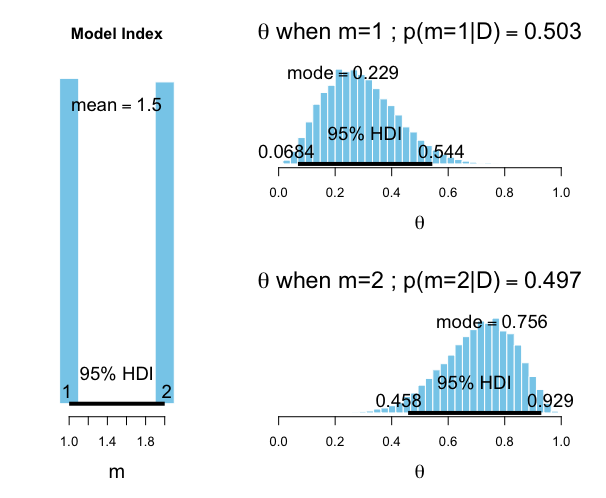
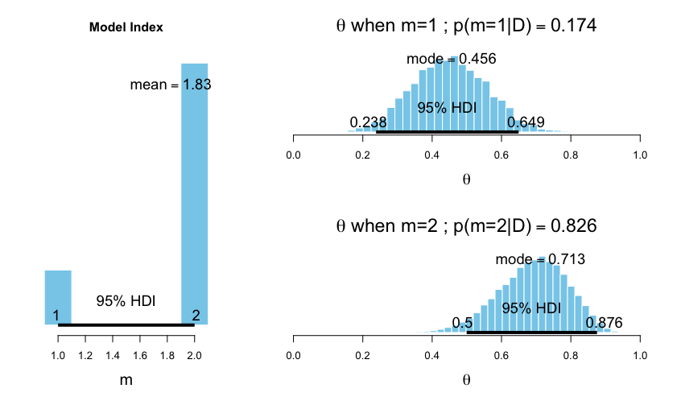
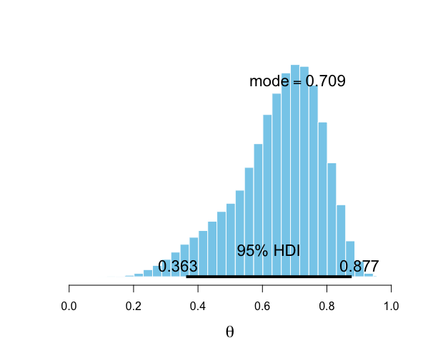
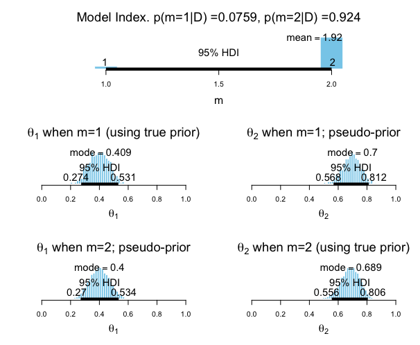
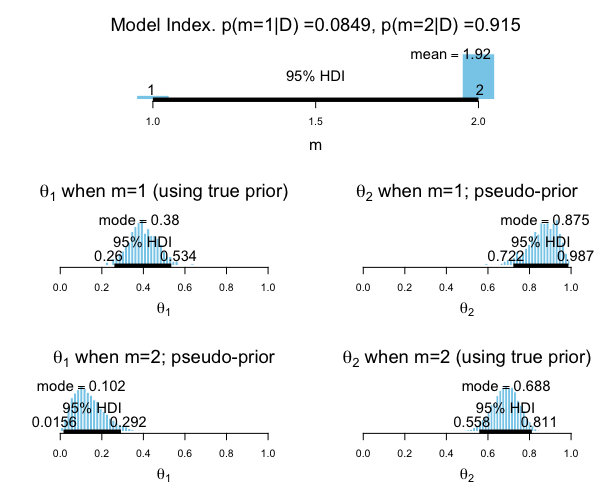
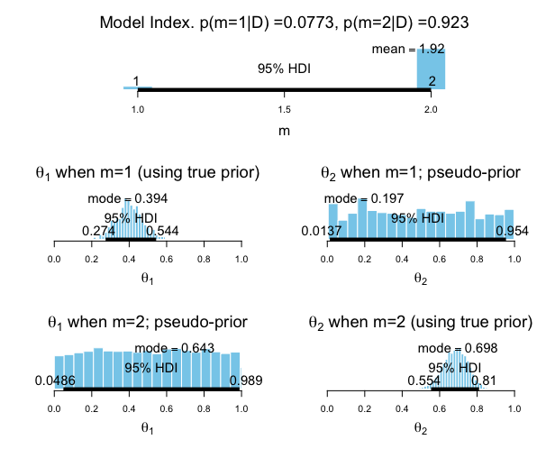

* Bayesian is about allocating credibility across possibilities. What if two different possibilities are different models?
* Bayesian model comparison = Bayesian parameter estimation applied to a hierarchical model where the top-level parameter is an index for the models
* A "model" consists of both its likelihood function and it's prior distribution. _Model comparison can be extremely sensitive to choice of prior._

## 10.1. General Formula and the Bayes Factor

### Notation

* Data is denoted as $\gamma$ or $D$. Likelihood function is $p(\gamma | \theta)$. Prior is $p(\theta)$.
* $m$ is an indexical parameter representing the model, with $m=1$ for model 1, $m=2$ for model 2, etc.
* Likelihood function for model $m$: $p_m(\gamma | \theta_m, m )$
* Prior for model $m$: $p_m(\theta_m | m)$
* Prior probability of each model: $p(m)$

### General Formula

Bayes rule on joint space: $$p(\theta_1,\theta_2,...,m|D) = \frac{p(D|\theta_1,\theta_2,...,m)p(\theta_1,\theta_2,...,m)}{\sum_m{\int{{p(D|\theta_1,\theta_2,...,m)p(\theta_1,\theta_2,...,m)d\theta_m}}}} $$

$$p(\theta_1,\theta_2,...,m|D) = \frac{\prod_m{p_m(D|\theta_m,m)p(\theta_m|m)p(m)}}{\sum_m{\int{\prod_m{p_m(D|\theta_m,m)p_m(\theta_m|m)p(m)d\theta_m}}}} $$

Note: factoring of likelihood-times-prior into chain of dependencies is the hallmark of a hierarchical model.

Just like any other application of Bayes rule, can also marginalize over parameters within component models to see the relative credibilities of models overall: $$p(m|D) = \frac{p(D|m)p(m)}{\sum_m{p(D|m)p(m)}}$$

where (marginalize over parameter values): $$p(D|m)=\int{p_m(D|\theta_m,m)p_m(\theta_m|m)d\theta_m}$$

__This is spelt out to emphasize the role of the prior distribution $p_m(\theta_m|m)$; a model is not just the likelihood but also the prior.__

### Bayes Factor

$$\frac{p(m=1|D)}{p(m=2|D)}=\frac{p(D|m=1)}{p(D|m=2)}\frac{p(m=1)}{p(m=2)}\frac{/\sum_m{p(D|m)p(m)}}{/\sum_m{p(D|m)p(m)}}$$
$$Bayes\ Factor\ (BF) = \frac{p(D|m=1)}{p(D|m=2)}$$
__Posterior odds = Prior odds * Bayes Factor__

## 10.2. Example: Two Factories of Coins

* Tail-biased factory. Mode: $\omega_1 = 0.25$, consistency: $\kappa=12$, biases distributed as $\theta \sim beta(\theta|\omega_1(\kappa-2)+1,(1-\omega_1)(\kappa-2)+1)$
* Heads-biased factory. Mode: $omega_2=0.75$, consistency: $\kappa=12$
* Work out $a$ and $b$ from $\omega$ and $\kappa$
* Likelihood function is the same for both models but the prior is different.
* Observed flips $\gamma_i$. Suppose 9 flips and 6 heads; what are the posterior probabilities of the coin coming from each of the two factories?
* Three methods to consider: formal analysis, grid approximation, MCMC.

### 10.2.1. Solution by formal analysis

Likelihood ($p(D|m)$): $p(z,n)=\frac{B(z+a,N-z+b)}{B(a,b)}$
$p(D|m=1)=p(z,N|m=1)=B(z+a_1,N-z+b_1)/B(a_1,b_1)=0.000499$ (3sf)
```{r}
pD = function(z,N,a,b) { beta(z+a,N-z+b) / beta(a,b) } # Underflow errors for large arguments
pD = function(z,N,a,b) { exp( lbeta(z+a,N-z+b) - lbeta(a,b) ) } # lbeta is log(beta()) 
print(paste0("p(D|m=1) = ",pD(z=6,N=9,a=3.5,b=8.5)))
print(paste0("p(D|m=2) = ",pD(z=6,N=9,a=8.5,b=3.5)))
print(paste0("BF = ",pD(z=6,N=9,a=3.5,b=8.5)/pD(z=6,N=9,a=8.5,b=3.5)))
```
* If prior odds for two factories were 50/50, then posterior odds are 0.213 against the tail-biased factory, which is 4.68 in favour of the head-biased factory.
* Assuming $p(m=1)=p(m=2)=0.5$, we have $p(m=1|D)/(1-p(m=1|D))=0.213$ which implies $p(m=1|D)=0.176$ and $p(m=2|D)=0.824$.

### 10.2.2. Solution by grid approximation

* Think of instead of discrete parameter $m$ which controls $\omega_m$, have a continuous parameter $\omega$ being allowed only two discrete values by the prior.
* Grid approx allows us to visualize (see below). Notice how likelihood does not depend on omega. Also observe how marginal posterior over theta changes.

```{r, out.width = "400px", echo=FALSE}
#
knitr::include_graphics("dbda_fig10.3.png")
#dbda_10_MbernBetaModelComp_out
```

### 10.2.3. Solution by MCMC

* For large, complex models cannot derive $p(D|m)$ analytically or with grid approximation. Consider two approaches:
  + Compute p(D|m) using MCMC for individual models
  + Put models together into a hierarchy, and MCMC visits different values of the model index proportionally to their posterior probabilities.

#### 10.2.3.1 Nonhierarchical MCMC computation of each model's marginal likelihood

Approximating functions on probability distributions: $$\int{f(\theta)p(\theta)d\theta}=\frac{1}{N}\sum\limits_{\theta_i\sim p(\theta)}^N f(\theta_i)$$

so $p(D)=\int{p(D|\theta)p(\theta)d\theta}=\frac{1}{N}\sum\limits_{\theta_i\sim p(\theta)}^N p(D|\theta_i)$
but in practice prior is diffuse and $p(D|\theta)$ is small for nearly all sampled values, so need many many samples to converge.

So, instead of sampling from the prior, we use our MCMC sample from the posterior distribution, in a clever way. Consider Bayes: $p(\theta|D)=\frac{p(D|\theta)p(\theta)}{p(D)}$ rearranged $\frac{1}{p(D)}=\frac{p(\theta|D)}{p(D|\theta)p(\theta)}$. Let $h(\theta)$ be a probability density function that integrates to 1.
$$\frac{1}{p(D)}=\frac{p(\theta|D)}{p(D|\theta)p(\theta)}\int{h(\theta)d\theta}=\int{\frac{h(\theta)}{p(D|\theta)p(\theta)}p(\theta|D)d\theta}=\frac{1}{N}\sum\limits_{\theta_i\sim p(\theta|D)}^N \frac{h(\theta_i)}{p(D|\theta_i)p(\theta_i)}$$

* _Notice the magic in the maths above; it's allowed because_ $\frac{p(\theta|D)}{p(D|\theta)p(\theta)}$ _isn't really a function of theta, so we can let theta vary for that expression and it won't matter._
* Now the trick is to choose $h(\theta)$ such that it is similar to $p(D|\theta)p(\theta)$ so that the ratio never gets too large or too small.
* When likelihood is Bernoulli, then posterior will tend to be Beta-ish, so $h(\theta)$ should be a beta distribution. Set this beta distributions mean and standard deviation to be equal to the mean and standard deviation of the $\theta$ values sampled.
* In general doesn't matter too much exactly what $h(\theta)$ is, only that it reasonably mimics the posterior. Can sometimes just sample the posterior and find any function that fits the sample reasonably well.
* For complex models with many parameters ($\theta$ is a vector) finding a suitable $h(\theta)$ is difficult. One approach is to sample, mimick the marginal distributions of each parameter, and multiply them all together. This assumes no strong correlations.
* Even if good $h(\theta)$ found, probability densities may get too small to be handled well numerically by the computer.

##### 10.2.3.1.1 Implementation with JAGS

```{r, message=FALSE, warning=FALSE, results=FALSE}
# Used the following modelString in "Jags-Ydich-Xnom1subj-MbernBeta_m2"
modelString = "
model {
  for ( i in 1:Ntotal ) {
    y[i] ~ dbern( theta )
  }
  theta ~ dbeta( 0.75*(12-2)+1, (1-0.75)*(12-2)+1 )
}
"
setwd("~/resources/training/DBDA2Eprograms")
# setwd("~/Data Science/Portfolio/doing_bayesian_data_analysis/DBDA2Eprograms")
source("DBDA2E-utilities.R") # Load definitions of graphics functions etc.
source("Jags-Ydich-Xnom1subj-MbernBeta_m2.R")
myData = c(rep(0,9-6),rep(1,6))
mcmcCoda=genMCMC(data=myData, numSavedSteps=10000)
theta = as.matrix(mcmcCoda[,"theta"]) # convert from coda object to vector
```
```{r, message=FALSE, warning=FALSE}
meanTheta = mean(theta)
sdTheta = sd(theta)
aPost = meanTheta * (meanTheta*(1-meanTheta)/sdTheta^2 - 1)
bPost = (1-meanTheta) * (meanTheta*(1-meanTheta)/sdTheta^2 - 1)

# compute 1/p(D)
oneOverPD = mean(dbeta(theta,aPost,bPost) / 
                   (theta^6 * (1-theta)^(9-6) * dbeta(theta, 0.75*(12-2)+1, (1-0.75)*(12-2)+1))
                 )
PD = 1/oneOverPD
show(PD)
```
Exact result from previous section was: $p(D|m=2) = 0.002338$, so they are quite close. Can repeat for m=1 and the rest follows as before.

#### 10.2.3.2 Hierarchical MCMC computation of relative model probability

* Implementing the whole thing as explained in the theory sections at the start of this chapter.
* Argument of dcat is a vector of probabilities for each category, but vector constants cannot be defined inside the argument.
* The output sample of theta values is a mixture combining cases m=1 and m=2
* Previously we had $p(m=1|D)=0.176$ and now we have $p(m=1|D)=0.177$. Note that the resulting histogram of $\theta_1$ is only based on $17.7%$ of the values in this approach; could have situations with a much stronger swing.

```{r}
modelString = "
model {
  for ( i in 1:N ) {
    y[i] ~ dbern( theta )
  }
  theta ~ dbeta( omega[m]*(kappa-2)+1 , (1-omega[m])*(kappa-2)+1 ) 
  omega[1] <- .25
  omega[2] <- .75
  kappa <- 12
  m ~ dcat( mPriorProb[] )
  mPriorProb[1] <- .5
  mPriorProb[2] <- .5
}"
```

##### 10.2.3.2.1 Using pseudo-priors to reduce autocorrelation

```{r}
modelString = "
model {
  for ( i in 1:N ) {
    y[i] ~ dbern( theta )
  }
  theta <- equals(m,1)*theta1 + equals(m,2)*theta2
  theta1 ~ dbeta( omega1*(kappa1-2)+1 , (1-omega1)*(kappa1-2)+1 ) 
  omega1 <- .25
  theta2 ~ dbeta( omega2*(kappa2-2)+1 , (1-omega2)*(kappa2-2)+1 ) 
  kappa2 <- 12
  omega2 <- .75
  m ~ dcat( mPriorProb[] )
  mPriorProb[1] <- .5
  mPriorProb[2] <- .5
}"
```

* An alternative way to specify the model of the previous section: two distinct beta distributions to generate distinct $\theta_m$ values
* Allows different functional forms of the priors if desired (so this way is more general)
* Three parameters in the model: $m$, $\theta_1$, $\theta_2$; each are generated in each step of the MCMC random walk.
  + If at some stemp $m=1$ then $\theta_1$ is used to describe the data while $\theta_2$ is constrained only by its prior.
* For model structures of this type, the chain for the model index can be highly autocorrelated: it will run on one model for a long time before jumping to the other. When choosing a new $m$ (leaving other parameters unchanged), $\theta_{m=current}$ (generated from conditional distribution: given m and the data) is credible given the data but $\theta_{m=other}$ (generated from its prior) might be far from posterior credible values.
  + Therefore, we use the "pseudopriors" trick.
    - Idea is to make unused, free-floating parameter values remain in their zone of posterior credibility.
    - When $m=1$, $\theta_1$ uses its true prior and $\theta_2$ uses its pseudoprior.
    - When $m=2$, $\theta_2$ uses its true prior and $\theta_1$ uses its pseudoprior.
    - It causes $p(\theta_1,\theta_2|m=1,D)$ to overlap a lot more closely with $p(\theta_1,\theta_2|m=2,D)$, so that there is a roughly 50% chance of jumping every time rather than a much smaller chance.

```{r}
modelString = "
model {
  for ( i in 1:N ) {
    y[i] ~ dbern( theta )
  }
  theta <- equals(m,1)*theta1 + equals(m,2)*theta2
  theta1 ~ dbeta( omega1[m]*(kappa1[m]-2)+1 , (1-omega1[m])*(kappa1[m]-2)+1 ) 
  omega1[1] <- .10 # true prior value
  omega1[2] <- .40 # pseudo prior value
  kappa1[1] <- 20 # true prior value
  kappa1[2] <- 50 # pseudo prior value
  theta2 ~ dbeta( omega2[m]*(kappa2[m]-2)+1 , (1-omega2[m])*(kappa2[m]-2)+1 ) 
  omega2[1] <- .70 # pseudo prior value
  omega2[2] <- .90 # true prior value
  kappa2[1] <- 50 # pseudo prior value
  kappa2[2] <- 20 # true prior value
  m ~ dcat( mPriorProb[] )
  mPriorProb[1] <- .5
  mPriorProb[2] <- .5
}
"
```

* Important to remember theta values in output only correspond to true posterior wbe the model index corresponds to the parameter.
* In first run we get $p(m=1|D)=0.11$ and $p(m=2|D)=0.89$, so in the next run we set mPriorProb[1] <- 0.89 and mPriorProb[2]=0.11 so that the chain visits the two models about equally often. _But if we don't use 50-50 priors, how do we know the posterior probabilities of the models for 50-50 priors?_
  + Posterior probabilities for 50-50 priors reduces to finding bayes factor. We can calculate this from $BF=[p(m=1|D)/p(m=2|D)]\times[p(m=2)/p(m=1)]$
* _References given in this section._

### 10.2.3.3 Models with different "noise" distributions in JAGS

* So far in the examples, $p(D|\theta)$ is the same for all models, which is called the "noise" distribution as it describes the random variability of the data values around the underlying trend.
* We want different likelihood functions for different indices: $p_1(D|\theta_1,m_1)$ vs $p_2(D|\theta_2,m_2)$.
* Sadly, cannot use y[i] ~ (equals(m,1) * pdf(param1)) + (equals(m,2) * pdf(m,2)), but can use the ones trick.
* Of course can and should combine with pseudopriors trick.

```{r}
"
data {
  C <- 10000
  for (i in 1:N) {
    ones[i] <- 1
  }
}
model{
  for (i in 1:N) {
    spy1[i] <- pdf1(y[i], parameters1)/C # where pdf1 is a formula
    spy2[i] <- pdf2(y[i], parameters2)/C # where pdf2 is a formula
    spy[i] <- equals(m,1)*spy1[i] + equals(m,2)*spy2[i]
    ones[i] ~ dbern(spy[i])
  }
  parameters1 ~ dprior1...
  parameters2 ~ dprior2...
  m ~ dcat(mPriorProb[])
  mPriorProb[1] <- .5
  mPriorProb[2] <- .5
}
"
```

## 10.4. Prediction: Model Averaging

* Sometimes the analyst wants to work out the best model and base future predictions on this.
* Can do this but if the hierarchical structure really expresses our prior beliefs, then the most complete prediction of the future is one that takes into account all the models weighted by their posterior credibilities.

## 10.5. Model Complexity Naturally Accounted For

* Bayesian model comparison naturally compensates for model complexity. A complex model (usually) has an inherent advantage over a simpler model because it can find some combination of parameter values that match the data better. 
* However we don't want to overfit.
* Bayesian model comparison compensates for model complexity by the fact that each model must have a prior distribution over its parameters, and more complex models must dilute their priors over larger parameter spaces.
  + E.g. compare two coin factories (simple: $\omega_s=0.5, \kappa_s=1000$ and complex: $\omega_c=0.5, \kappa_c=2$) where there is a simple "must-be-fair" model and also a complex "anything's-possible" model where $\theta$ could have many values.
  + z=15, N=20 => complex model wins
  + z=11, N=20 => simple model wins
  + The complex model pays the price of having smaller prior probabilities on parameter values that describe simple data.

### 10.5.1. Caveats regarding nested model comparison

* Consider a model that implements all meaningful parameters one might contemplate, call this the full model.
* Can then consider various restrictions such as setting some parameters to zero.
* A model with such a restriction is said to be nested within the full model.
* The full model is always able to fit data at least as well as any of its restricted versions but Bayesian model comparison will be able to prefer the restricted model if the data are well described by the restricted model, because the full model pays the price of diluting its prior over a larger parameter space.
  + __BB: is this truly a sensible way of choosing simpler vs complex models?__
* A bayes factor may favour a restricted model to a full model, however it is still more meaningful to use the full model for parameter estimation.

## 10.6. Extreme Sensitivity to Prior Distribution

* Bayesian model comparison involves marginalizing across the prior distribution in each model, so the posterior probabilities and bayes factor become extremely sensitive to the choice of prior distribution.
* If the prior distribution places a lot of mass where the likelihood distribution peaks, then the marginal likelihood p(D|m) will be large.
* Different forms of vague priors can yield very different Bayes factors.
  + Uniform (a=1,b=1) vs Haldane prior (a=0.01,b=0.01).
  + For the "anything's-possible" vs "must-be-fair" models, with z=65 and N=100, this can change the BF from 0.125 to 5.728

### 10.6.1. Priors of different models should be equally informed

How do we mitigate the above issue?

*  Inform the priors of all models with a small set of representative data
  + Much better than any kind of vague prior and at least gets you in the right ballpark, and models on level playing field going into model comparison.
  + This data should be fictional but representative of previous research.
  + Or it could come from a small percentage of the data from the research at hand.
* This is an active research topic discussed at length in the literature (J O Berger and Pericchi (2001))

## 10.7. Exercises

### Ex 10.1

A
```{r}
pD = function(z,N,a,b) { beta(z+a,N-z+b) / beta(a,b) } # Underflow errors for large arguments
pD = function(z,N,a,b) { exp( lbeta(z+a,N-z+b) - lbeta(a,b) ) } # lbeta is log(beta()) 
z=7
N=10
kappa=6
omega1=0.25
omega2=0.75
a1 = omega1*(kappa-2)+1
b1 = (1-omega1)*(kappa-2)+1
a2 = omega2*(kappa-2)+1
b2 = (1-omega2)*(kappa-2)+1
BF = pD(z=z,N=N,a=a1,b=b1)/pD(z=z,N=N,a=a2,b=b2)
pm1gD = BF / (1+BF)
pm2gD = 1-pm1gD
print(paste0("BF = ",BF))
print(paste0("p(m=1|D) = ",pm1gD))
print(paste0("p(m=2|D) = ",pm2gD))
```
B
```{r}
pD = function(z,N,a,b) { beta(z+a,N-z+b) / beta(a,b) } # Underflow errors for large arguments
pD = function(z,N,a,b) { exp( lbeta(z+a,N-z+b) - lbeta(a,b) ) } # lbeta is log(beta()) 
z=7
N=10
kappa=202
omega1=0.25
omega2=0.75
a1 = omega1*(kappa-2)+1
b1 = (1-omega1)*(kappa-2)+1
a2 = omega2*(kappa-2)+1
b2 = (1-omega2)*(kappa-2)+1
BF = pD(z=z,N=N,a=a1,b=b1)/pD(z=z,N=N,a=a2,b=b2)
pm1gD = BF / (1+BF)
pm2gD = 1-pm1gD
print(paste0("BF = ",BF))
print(paste0("p(m=1|D) = ",pm1gD))
print(paste0("p(m=2|D) = ",pm2gD))
```
C. Models are much more concentrated around their respective modes; they have much sharper priors. Probability of observing 7/10 is now much lower for 0.25 compared to 0.75 than it was before. If became less concentrated would become more uniform and ratio of pDs would become closer to 1; as getting more concentrated the ratio diverges from 1.

### Ex 10.2

#### A
Prior:
```{r, out.width = "400px", echo=FALSE}
#

```

Posterior:
```{r, out.width = "400px", echo=FALSE}
#

```

#### B

```{r, out.width = "400px", echo=FALSE}
#

```
Looks the same as fig 10.3 bottom middle because it is the same result obtained via a different method.

#### C

$\kappa=6$: $p(m=1|D)$=0.255
$\kappa=6$: $p(m=2|D)$=0.745

Increased number of steps to 5000000
$\kappa=202$: $p(m=1|D)$=1
$\kappa=202$: $p(m=2|D)$=0

Getting stuck with large concentration; not enough opportunity to jump.

Using pseudopriors:
$\kappa=202$: $p(m=1|D)$=0.0154
$\kappa=202$: $p(m=2|D)$=0.985

Gets quite close.

### Ex 10.3

#### A
Pseudopriors
```{r, out.width = "400px", echo=FALSE}
#

```

True priors
```{r, out.width = "400px", echo=FALSE}
#

```

#### B
pseudoprior values: $\omega=0.5$, $\kappa=2.1$
```{r, out.width = "400px", echo=FALSE}
#

```
Can't see diagnostics because bug (mac-related?) but broad pseudopriors seem to give decent end results similar-ish to proper fit pseudopriors. This is because the broad priors will allow some jumping although not near-perfect jumping, so autocorrelation will be a lot lower than for true priors but not as low as for proper fit pseudopriors.