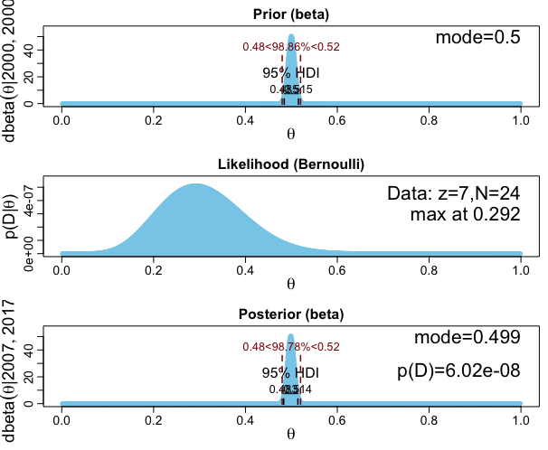
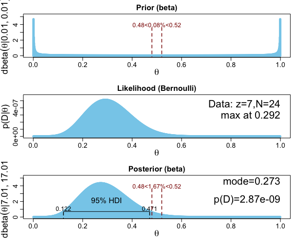
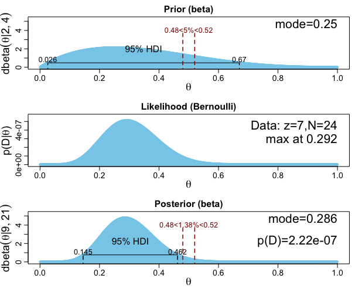

* Previous chapter argued testing questions such as "is there a non-zero effect or not?" (or "is a value of interest significantly different from 0") via NHST has deep problems. This chapter is about Bayesian approaches to the question.
* Two ways to do this:
  + Does the value of interest fall among the most credible values in the posterior?
  + Compare a prior that allows only the value of interest to a prior that allows a broad range of all possible values. Assess the posterior believability via Bayesian model comparison.

## 12.1 The Estimation Approach

We have often used Bayesian inference to derive a posterior distribution of a parameter, for example the bias $\theta$ of a coin; this can then be used to discern credible values of the parameter. We can then check to see if the null value is close to or far from credible values.

### 12.1.1 Region of practical equivalence (ROPE)

* ROPE indicates a small range of parameter values considered to be practically equivallent to the null value.
  + e.g. for determining if a coin is fair for purpose of deciding which team will kick off a football game, we want to know if bias is close to 0.5, so dont care if its 0.473 or 0.528, so ROPE might be from 0.45 to 0.55.
  + Suppose then observe 325/500 heads, and uniform prior, so posterior 95% HDI is 0.608 to 0.691, which is completely outside the ROPE, so reject null value of 0.5
* If 95% HDI completely contained within ROPE, and null value contained within 95% HDI, then null value is accepted.
* If HDI completely within ROPE but does not contain null value, null value would still be accepted despite it having low credibility.
  + _Decision rule merely says that most credible values are practically equivalent to null value, not that null value has high credibility_. __BB: but isn't null value credibility exactly what we set out to find?__
* If HDI and ROPE overlap with ROPE not completely containing HDI, then we withhold a decision.

All theories are wrong, at least in so far as they simplify reality somewhat, so as precision increases (or we collect more data) it always becomes more likely that we reject a null hypothesis; the null hypothesis is a strawman. Alternatively, using ROPE we can decrease the ROPE as precision of data increases to test the theory more stringently.

Specifying ROPE limits is difficult, depends on precision of measurement and state of the art theory; depends on the practical purpose of the ROPE. Also analysis can also report how much of the posterior falls within a ROPE as a function of different ROPE widths.

Remember HDI limits have error if derived via MCMC; rule of thumb std is 5% of the std of the posterior.

Tempting to adopt the use of ROPE to NHST and use the confidence interval CI instead of HDI; this is called _equivalence testing_ in NHST. Two problems:
* CIs can be difficult to determine, especially as problems get complex (modern bayesian methods handle complexity much better)
* A CI does not actually indicate the most credible parameter values. Stopping and testing intention also.

_ROPE may also be known as "range of equivalence" or "indifference zone"_

### 12.1.2 Some examples

* Can take a lot of data to achieve narrow HDIs
* plotPost function has options to display null value and ROPE.

#### 12.1.2.1 Differences of correlated parameters

Marginal distributions of two parameters do not reveal whether or not they are different.
* Wide marginal distributions -> lots of overlap
* But could be strongly correlated
* So distribution of idfferences show credibly greater than 0

#### 12.1.2.2 Why HDI and not equal-tailed interval (ETI)?

* HDI intuitively meaningful
* ETI easy to compute
* ETI for skewed distributions may be including many values of low credibility, not behaviour we want.
* ETI limits invariant under nonlinear transformations of the parameter

## 12.2 The Model-Comparison Approach

* Need to decide which of two hypothetical prior distributions is least incredible.
* Model comparison not meaningful unless both hypotheses are viable in the first place.

### 12.2.1 Is a coin fair or not?

* 'Spike' prior null model gives $p(z,N|M_{null}) = \theta^z_{null}(1-\theta_{null})^{(N-z)}$
* 'Beta' prior alternative model gives $p(z,N|M_{alt}) = B(z+a_{alt},N-z+b_{alt})/B(a_{alt},b_{alt})$
* $Bayes Factor = p(z,N|M_{alt})/p(z,N|M_{null})$
* BF = 1.9390 for $a_{alt}=b_{alt}=1.000$ (preference for alternative hypothesis)
* BF = 0.0049 for $a_{alt}=b_{alt}=0.001$ (preference for null hypothesis)
* BF strongly dependant on choice of uninformed prior.
* If consider posterior distribution instead of bayes factor then see that distribution is only slightly affected by the choice of prior. The HDI excludes null value, and ROPE would have to be quite wide to overlap.
* Haldane prior is a default uninformed prior; most mathematically correct. However Haldane is meaningless for an applied setting, because does not resemble a credible alternative hypothesis; U shaped prior not a genuinely meaningful theory.
* Would use fictional prior of 1 in 4 flips on top of uniform proto-prior to get a $beta(\theta|2,4)$ alternative prior, giving BF = 3.7, so can reject null hypothesis.

#### 12.2.1.1 Bayes factor can accept null with poor precision

* Suppose data has 2 flips 1 head, and using Haldane prior. Get BF = 51 in favor of null hypothesis! But posterior is virtually uniform, so shouldn't really believe this!
* BB: NHST would argue we are never accepting NH but simply dont have sufficient evidence to reject

### 12.2.2 Are different groups equal or not?

* Suppose we have 4 groups, and one is quite a bit different to the other 3 which are similarish to each other
* Parameter esimation can quite easily see the differences and compare HDI to null and ROPE.
* Model comparison a little more tricky - all groups considered together with a single parameter more credible than each group having its own parameter. However group 1 and group 2-3-4 clustered together using two parameters is more credible than either previous options. 15 possible partitions could be considered, but this is quite a large-scale test already. Even if 1/2-3-4 wins this, it is not necessarily the "best" model and we might care about small differences between 2-3-4.

#### 12.2.2.1 Model specification in JAGS

Model specification, reminder of pseudopriors etc.
Groups have distinct concentration under either model, but could specify differently. BB: lost me a bit here.

## 12.3 Relations of Parameter Estimation and Model Comparison

* Both logically coherent but posing the question at different levels of the model.
* Ratio of posterior probability in the ROPE to prior probability in the ROPE is approximately equal to the Bayes factor of alternative to null. Quite a good approximation.
  + Known as the Savage-Dickey method.
* Therefore, model comparison focuses on the null value and whether its local probability increases from prior to posterior.
* Parameter estimation considers the entire posterior distribution, including the uncertainty (HDI) of the parameter estimate relative to the ROPE.

## 12.4 Estimation or Model Comparison?

* Typically, estimation approach more transparently meaningful and informative
* Model comparison approach has two requirements to be meaningful:
  + Must be theoretically meaningful for the parameter value to be exactly the null value
  + Alternative hypothesis prior must be meaningfully informed
* Much effort often goes into justifying an 'automatic' prior for the alternative model that has desirable mathematical properties, but a default prior is only useful to the extent that it happens to express a meaningful informed theory.

## 12.5 Exercises

### Ex. 12.1 
__Purpose: to make sure you understand the Bayes' factors regarding a single coin in Figure 12.3 and Equation 12.4, including the Savage-Dickey method.__

#### Ex. 12.1.A.
```{r}
z=7; N=24; theta_null = 0.5
pD_null = theta_null**z * (1-theta_null)**(N-z)
print(pD_null)
```

#### Ex. 12.1.B.
```{r, eval=FALSE}
#setwd("~/Data Science/Portfolio/doing_bayesian_data_analysis/DBDA2Eprograms")
setwd("./DBDA2Eprograms")
library(grDevices)
source("DBDA2E-utilities.R")
source("BernBeta.R")
a=2000; b=2000
openGraph()
plots_B = BernBeta(c(a,b),
         c(rep(0,N-z),rep(1,z)),
         ROPE = c(0.48,0.52),
         plotType="Bars", showCentTend="Mode", showHDI=TRUE, showpD=TRUE)
```

```{r, out.width = "200px", echo=FALSE}

```

Result: $p(D)=6.02*10^{-8}$. Very similar but not exactly the same as the result for part A. This is because a $beta(\theta|2000,2000)$ distribution is not the exact same as a perfect spike.

#### Ex. 12.1.C.

```{r, eval=FALSE}
setwd("./DBDA2Eprograms")
library(grDevices)
source("DBDA2E-utilities.R")
source("BernBeta.R")
a=0.01; b=0.01
openGraph()
plots_B = BernBeta(c(a,b),
         c(rep(0,N-z),rep(1,z)),
         ROPE = c(0.48,0.52),
         plotType="Bars", showCentTend="Mode", showHDI=TRUE, showpD=TRUE)
```

```{r, out.width = "200px", echo=FALSE}

```

Result: $p(D)=2.87*10^{-9}$.
```{r}
(2.87*10**(-9)) / (6.02*10**(-8))
```

$BF = p(D|Haldane)/p(D|null) = 0.0477$

#### Ex. 12.1.D.

Savage-Dickey approximation to this:
```{r}
0.08/1.67
```

#### E. 

```{r, eval=FALSE}
setwd("./DBDA2Eprograms")
library(grDevices)
source("DBDA2E-utilities.R")
source("BernBeta.R")
a=2; b=4
openGraph()
plots_B = BernBeta(c(a,b),
         c(rep(0,N-z),rep(1,z)),
         ROPE = c(0.48,0.52),
         plotType="Bars", showCentTend="Mode", showHDI=TRUE, showpD=TRUE)
```

```{r, out.width = "200px", echo=FALSE}

```

Result: $p(D)=2.22*10^{-7}$.
```{r}
(2.22*10**(-7)) / (6.02*10**(-8))
```

$BF = p(D|informed)/p(D|null) = 3.6877$

#### Ex. 12.1.F.

Savage-Dickey approximation to this:
```{r}
5/1.38
```

#### Ex. 12.1.G.

* Haldane HDI: 0.122 to 0.471
* Informed HDI: 0.145 to 0.462
* HDIs not very different
* Bayes factors were very different

#### Ex. 12.1.H. 
* Estimation most informative. Useful to see and consider the posterior and compare. Can interpret the results of model comparison well from it anyway using the Savage-Dickey method.
* Mildly informed prior seems most meaningful. Haldane can be used to give arbitrarily low p(D) around 0.5 as $\epsilon$ tends to 0, but this is not a practical alternative proposal distribution for the parameter values.