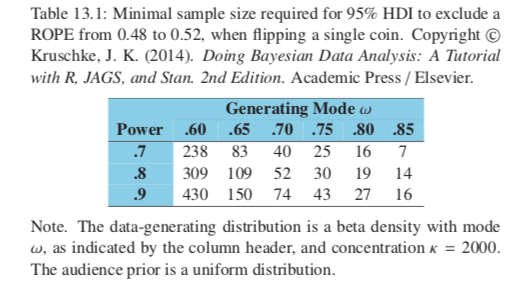

## 13.0 Introduction

* Researchers collect data to achieve a goal (e.g. to show a suspected underlying state of the world is credible); goals can only be probabilistically achieved because data have random noise.
* Statistical power is the probability of achieving the goal of a planned empirical study, if a suspected underlying state of the world is true.
* Not worth spending time and money on things with low power.

## 13.1 The Will to Power

### 13.1.1 Goals and obstacles

Some possible goals:

* __Reject a null value of a parameter:__ show that a ROPE around the null value excludes the posterior 95% HDI.
* __Affirm a predicted value of a parameter:__ show that a ROPE around the predicted value includes the posterior 95% HDI.
* __Achieve precision in the estimate of a parameter:__ show that the posterior 95% HDI has width less than a specified maximum.

Crucial obstacle: a random sample is only a probabilistic representation of the population from which it came, so it is a fickle indicator of the true state of the underlying world.

### 13.1.2 Power

* In traditional NHST power has only one goal (rejecting the null hypothesis) and there is one conventional sampling plan (stop at predetermined sample size), and the hypothesis is only a single specific value of the parameter. _This book generalizes this traditional definition of power._
* How to increase power:
  + Reduce measurement noise; control other influences
  + Amplify the underlying magnitude of the effect (where possible)
  + Increase sample size 
  
Research Western & Jackman 1994 for Bayesian inference where poulation is finite, so sample size restricted (e.g. comparing provinces of a nation).

Flow of information in a power analysis:

* 1.) Have some hypothesis regarding distribution of parameters
* 2.) From above hypothetical distribution, randomly sample values of the parameters
* 3.) From the sampled parameters, generate a random sample of data, using the planned sampling method
* 4.) From the simulated sample of data, compute the posterior estimate, using Bayesian analysis with audience-appropriate priors.
* 5.) From the posterior estimate, tally whether or not the goals were attained.
* 6.) Repeat steps 2-5 many times to approximate the power.

### 13.1.3 Sample Size

* Power increases as sample size increases (usually) and gathering data is costly, so would often like to know the minimal sample size to achieve a desired power.
* The best that a large sample can do is exactly reflect the data-generating distribution, so even with arbitrarily large sample it may be impossible to reject null hypothesis for example.
  + _When N is very large, the HDI essentially just reproduces the $\theta$ value that generated it.
* Therefore important to decide what a realisic goal is when planning sample size.
* Frequentist approach to precision - _AIPE_ (accuracy in parameter estimation). Analagous to Bayesian HDIs.

### 13.1.4 Other expressions of goals

* Expressing precision:
  + _Average length criterion_: average HDI width across repeated simulated data does not exceed some maximal value L.
  + _Average coverage criterion_: Starts with a specified width for the HDI and requires its mass to exceed 95% (say) on average across simulated data.
  + Entropy: smaller entropy <-> narrower distribution. Good for multimodal distributions. Less intuitive?
* Expressing excluding null value:
  + attaining a sufficiently large Bayes factor (BF) in a model comparison between spike-null prior and the automatic alternative prior.

## 13.2 Computing Power and Sample Size

Consider data from a single coin.

### 13.2.1 When the goal is to exclude a null value

* Suppose our goal is to show that the coin is unfair: the 95% HDI excludes a ROPE around 0.50
* Need to establish hypothetical distribution of parameter values:
  + _Equivalent prior sample method:_ use actual or idealized prior data with a uniform proto-prior
* Can generate using process outlined in 13.1.2 minimum sample sizes as a function of the generating mode $\omega$ and the power.

#### 13.2.1.1 Formal solution and implementation in R

```{r, message=FALSE, warning=FALSE}
setwd("./DBDA2Eprograms")
source("minNforHDIpower.R")
sampSize = minNforHDIpower(genPriorMode=0.75,genPriorN=2000,
                           HDImaxwid=NULL,nullVal=0.5,ROPE=c(0.48,0.52),
                           desiredPower=0.8,
                           audPriorMode=0.5, audPriorN=2,
                           HDImass=0.95, initSampSize=5, verbose=FALSE)
print(sampSize)
```

### 13.2.3 When the goal is precision

* Want HDI width to be small enough no matter what $\theta$ was used from the hypothesis parameter distribution.

```{r}
setwd("./DBDA2Eprograms")
source("minNforHDIpower.R")
sampSize = minNforHDIpower(genPriorMode=0.75,genPriorN=10,
                           HDImaxwid=0.20,nullVal=NULL,ROPE=NULL,
                           desiredPower=0.8,
                           audPriorMode=0.5, audPriorN=2,
                           HDImass=0.95, initSampSize=50, verbose=FALSE)
print(sampSize)
```

### 13.2.4 Monte Carlo approximation of power

Simply use Monte Carlo instead of analytical approach as done above. Once we have the MCMC chain we can calculate as many goals as we like.

```{r, message=FALSE, warning=FALSE, results=FALSE}
setwd("./DBDA2Eprograms")
source("Jags-Ydich-Xnom1subj-MbernBeta.R")

goalAchievedForSample = function(data) {
  mcmcCoda=genMCMC(data=data, numSavedSteps=1000, saveName=NULL)
  thetaHDI = HDIofMCMC(as.matrix(mcmcCoda[,"theta"]))
  
  goalAchieved=list()
  # Goal: Exclude ROPE around null value:
  thetaROPE = c(0.48, 0.52)
  goalAchieved = c(goalAchieved,
                  "ExcludeROPE"=(thetaHDI[1] > thetaROPE[2] 
                                 | thetaHDI[2] < thetaROPE[1]))
  # Goal: HDI less than max width:
  thetaHDImaxWid = 0.2
  goalAchieved = c(goalAchieved,
                   "NarrowHDI"=(thetaHDI[2]-thetaHDI[1] < thetaHDImaxWid))
  
  return(goalAchieved)
}

# Specify mode and concentration of hypothetical parameter distribution:
omega = 0.70
kappa = 2000
# Specify sample size for each simulated data set:
sampleN = 74
# Run a bunch of simulated experiments:
nSimulatedDataSets = 1000
for (simIdx in 1:nSimulatedDataSets) {
  genTheta = rbeta(1, omega*(kappa-2)+1, (1-omega)*(kappa-2)+1)
  sampleZ = rbinom(1,size=sampleN,prob=genTheta)
  simulatedData = c(rep(1,sampleZ),rep(0,sampleN-sampleZ))
  goalAchieved = goalAchievedForSample(simulatedData)
  if (!exists("goalTally")) {
    goalTally = matrix(nrow=0,ncol=length(goalAchieved))
  }
  goalTally = rbind(goalTally, goalAchieved)
}
```

```{r}
for (goalIdx in 1:NCOL(goalTally)) {
  goalName = colnames(goalTally)[goalIdx]
  goalHits = sum(unlist(goalTally[,goalIdx]))
  goalAttempts = NROW(goalTally)
  goalEst = goalHits/goalAttempts
  goalEstHDI = HDIofICDF(qbeta,
                         shape1=1+goalHits,
                         shape2=1+goalAttempts-goalHits)
  show(paste0(goalName,
              ": Est. Power=", round(goalEst,3) ,
              ": Low Bound=", round(goalEstHDI[1],3) ,
              ": High Bound=", round(goalEstHDI[2],3) ))
}
```

Power for excluding ROPE is 0.900 which matches with analytical approach, where with everything else matching we get sample size required of 74 (see below), which matches the actual sample size used above.

```{r}
setwd("./DBDA2Eprograms")
source("minNforHDIpower.R")
sampSize = minNforHDIpower(genPriorMode=0.7,genPriorN=2000,
                           HDImaxwid=NULL,nullVal=0.5,ROPE=c(0.48,0.52),
                           desiredPower=0.9,
                           audPriorMode=0.5, audPriorN=2,
                           HDImass=0.95, initSampSize=5, verbose=FALSE)
print(sampSize)
```


### 13.2.5 Power from idealized or actual data

* Suppose we have a hierarchical model and we are trying to come up with distributions to help us sample the top level parameters. Often it helps to start bottom-up: come up with actual or idealized data that express the hypothesis then use Bayes rule to generate the corresponding distributions on parameter values.
* One nice feature of this approach is that our confidence in the hypothesis is expressed by the amount of data in the actual or idealized sample: bigger sample -> tighter posterior.
* Another benefit is that the appropriate correlations of parameters are automatically created in the posterior distribution of Bayes' rule, rather than having to be intuitied and explicitly specified (or inappropriately ignored). _BB: surely if creating idealized data we still have to think about the correlations..._
* We don't need high resolution impression of the posterior distribution; we just need some representitive values of the parameters, which is how MCMC comes up with the distribution anyway. So ideally we want chains with very small autocorrelation and only as many steps in the chain as we may want for the analysis.

Also note: hierarchical model of type given in example (many subjects many trials) - need more subjects for better global results, need more trials per subject for better individual level results.

See Krushke (2013a) and software called "BEST" found on his website, with implementations in Python and R, with videos and a web app for software and examples of using idealized data for power analysis.

## 13.3 Sequantial Testing and the Goal of Precision

* Sequential testing means that we stop collecting data when we achieve significance (p < 0.05).
* If we have infinite patience, under sequential testing the true probability of false alarm is 100% not 5%.
* One solution: don't make rejecting the null value be the goal, make precision the goal.

### 13.3.1 Examples of sequantial tests

Figures

### 13.3.2 Average behaviour of sequential tests

Figures

Also note:
* Sampling to achieve criterial precision tends to require larger samples
* There may be situations where the costs of this are too high (e.g. medical trials)
* Full treatment of these trade-offs is a whole area of study; see Bayesian _adaptive design_ and Bayesian _decision theory_. List of references to books and articles on this provided at end of chapter.

## 13.4 Discussion

### 13.4.1 Power and multiple comparisons

Mostly recalling from previous sections:

* Frequentist: precision measured by confidence interval. CI depends on intended tests because p values depend on the intended tests.
* Bayesian: power analysis not affected by intended tests. Power determined only bt data-generating process (incl. stopping rule) and not by the cloud of conterfactual samples.

### 13.4.2 Power: prospective, retrospective, and replication

* __Prospective__: research being planned for which there has not yet been any data collected.
  + Hypothetical distribution comes from theory or idealized data, or actual data from related research.
* __Retrospective__: have already collected data and want to determine the power of the research we conducted.
  + Can use posterior distribution derived from the actual data as the representative parameter values for generating new simulated data.
* __Traditional__: hypothesis is a spike and only goal is to reject null based on a p value.
  + Estimate of retrospective power has direct correspondence with the p value.
  + Retrospective power not useful for additional inference.
* __Replication__: suppose we already collected some data and we want to know probability we would achieve our goal if we exactly replicated the experiment.
  + Tantamount to using the posterior of the original data as the prior for the novel simulated data.
  + Natural in a Bayesian setting, difficult or impossible for traditional NHST.

### 13.4.3 Power analysis requires verisimilitude of simulated data

* Power analysis only useful when simulated data imitate actual data.
* If model is not a good description of the actual data, then the simulated data do not imitate actual data, and inferences from simulated data are not very meaningful.
* Imagine we combine simulated data with actual data, but each have different trends. When we have an equal amount of both data uncertainties on parameters become larger. When the simulated sample size becomes large then uncertainty will decrease again. This is a smoking gun that the model does not faithfully mimic actual data.

### 13.4.4 The importance of planning

* Often in real research a fascinating theory and clever experimental manipulation imply a subtle effect. It can come as a schock when power analysis reveals that detecting the subtle effect would take many hundreds of subjects! _This is much better than the alternative of actually running dozens of subjects and finding highly uncertain estimates of the sought-after effect_.
* The alternative can also happen where power analysis may reveal that far less data is actually needed than may have otherwise been collected.
* Useful for proposing research to funding agencies, e.g. clinical research.

## 13.5 Exercises

### Exercise 13.2. Understanding power for flipping a single coin.

#### A)

```{r}
setwd("./DBDA2Eprograms")
source("minNforHDIpower.R")
sampSize = minNforHDIpower(genPriorMode=0.8,genPriorN=10,
                           HDImaxwid=0.2,nullVal=NULL,ROPE=c(0.48,0.52),
                           desiredPower=0.8,
                           audPriorMode=0.5, audPriorN=2,
                           HDImass=0.95, initSampSize=85, verbose=TRUE)
print(sampSize)
```

```{r}
setwd("./DBDA2Eprograms")
source("minNforHDIpower.R")
sampSize = minNforHDIpower(genPriorMode=0.8,genPriorN=2000,
                           HDImaxwid=0.2,nullVal=NULL,ROPE=c(0.48,0.52),
                           desiredPower=0.8,
                           audPriorMode=0.5, audPriorN=2,
                           HDImass=0.95, initSampSize=65, verbose=TRUE)
print(sampSize)
```
N = 67, power = 0.8239177

#### B)

Why might a research pursue a goal of precision if the data-generating hypothesis is already very precise? Hint: the audience prior may be different than the data generating hypothesis. Discuss briefly, perhaps with an example.

Example above shows that even when data generating hypothesis is very precise (200x larger concentration) the min sample size required for the same prior is only 67 compared to 87.

Data generating hypothesis being precise does not mean that the data it generates have a distribution that is precise or that can be well defined with only a small sample size. Suppose we have a precise data-generating prior for coin flips of $\theta = 0.65$, have shown in this chapter that it is still important to have a goal of precision, and just because our data generating prior is 0.65 doesn't mean that we initially know for certain that this is the true bias of a real coin - we are just using the value to conduct a power analysis for example.

#### C)

```{r}
setwd("./DBDA2Eprograms")
source("minNforHDIpower.R")
sampSize = minNforHDIpower(genPriorMode=0.8,genPriorN=2,
                           HDImaxwid=NULL,nullVal=0.5,ROPE=c(0.48,0.52),
                           desiredPower=0.8,
                           audPriorMode=0.5, audPriorN=2,
                           HDImass=0.95, initSampSize=133, verbose=TRUE)
print(sampSize)
```
Minimal N for vague data-generating distribution: 134, power = 0.8

#### D)

Wrong? mu = 0.8, not mode = 0.8, so should get value of 0.868? Or maybe they did mean mode=0.8
```{r}
mode = 0.8
k = 2
a = mode * (k-2) + 1
b = (1-mode) * (k-2) + 1
sum(rbeta(100000,a,b) > 0.5)/100000
```
```{r}
qbeta(0.5,a,b)
```


```{r, eval=FALSE}
setwd("./DBDA2Eprograms")
source("minNforHDIpower.R")
sampSize = minNforHDIpower(genPriorMode=0.8,genPriorN=2,
                           HDImaxwid=NULL,nullVal=0.5,ROPE=c(0,0.5),
                           desiredPower=0.8,
                           audPriorMode=0.5, audPriorN=2,
                           HDImass=0.95, initSampSize=133, verbose=TRUE)
print(sampSize)
```

Even an infinite sample size cannot achieve power of 0.8; power asymptotically approaches 0.5. Large sample size just allows data generating distribution to be reproduced, but data generating distribution will not reject the null hypothesis.

## Figures

```{r, out.width = "200px", echo=FALSE}

```
```{r, out.width = "200px", echo=FALSE}

```
```{r, out.width = "200px", echo=FALSE}

```
```{r, out.width = "200px", echo=FALSE}

```
```{r, out.width = "200px", echo=FALSE}

```
```{r, out.width = "200px", echo=FALSE}
knitr::include_graphics("images/dbda_fig13_7.png")
```
```{r, out.width = "200px", echo=FALSE}

```