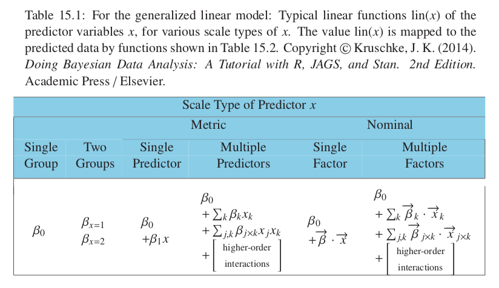
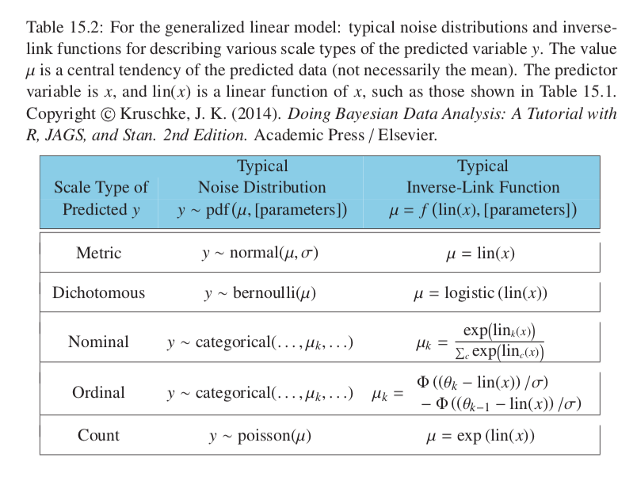
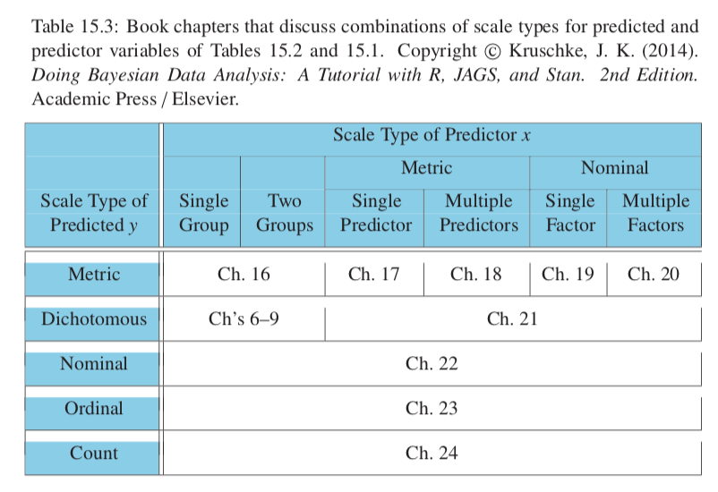

## 15.0 Introduction

GLM family of models comrpises many analyses: t-tests, ANOVA, multiple linear regression, logistic regression, log-linear models, etc.

## 15.1 Types of Variables

### 15.1.1 Predictor and predicted variables

* Mathematical difference: likelohood function expresses probability of values of predicted as a function of values of the predictor.

### 15.1.2 Scale types: metric, ordinal, nominal, and count

* Metric: 
  + Ratio: scales with a natural zero point (temperature, height, weight, response time)
  + Interval: scales with no natural zero (date)
  + Count / frequency: number of something...
* Ordinal: only know order, no information about metric (strongly agree - strongly disagree)
* Nominal: categorical (political party) no distance or order between categories.

For the following sections will often assume all metric variables before extending to other variable types.

## 15.2 Linear Combination of Predictors

### 15.2.1 Linear function of a single metric predictor

* Linear functions are simple, GLM is based on linear functions.

### 15.2.2 Additive combination of metric predictors

* If we want predicted variable to be linear in _any_ of the predictors, then those predictors need to be combined using _addition_. This gives us a linear combination.

### 15.2.3 Nonadditive interaction of metric predictors

* We can have interaction terms (e.g. $x_{1}x_{2}$). Now have subtlety in use of the term "linear": if $x_{1}x_{2}$ is thought of as a third predictor then the model is linear on the three predictors, but it would be non-linear on the two predictors.
* Can use other types of interaction (not just multiplicative.)

### 15.2.4 Nominal predictors

#### 15.2.4.1 Linear model for a single nominal predictor

* Basically one-hot encode these: build a vector to represent the nominal variable, with the length of the vector equal to the number of categories, and the values are 0 apart from one which value which is 1.
* In the linear model this forms a dot product: $\vec{\beta} \cdot \vec{x}$
* Need to remember to have this condition for $\beta$: $\sum_{j=1}^{J}\beta_{[j]}=0$

#### 15.2.4.2 Additive combination of nominal predictors

#### 15.2.4.3 Nonadditive interaction of nominal predictors

* Encode interaction as dot product between longer vectors where there is an element for each possible categorical interaction (if 3 categories in $x_1$ and 2 in $x_2$ then there is 6 in $x_{1\times2}$

```{r, out.width = "400px", echo=FALSE}

```

## 15.3 Linking from Combined Predictors to Noisy Predicted data

### 15.3.1 From predictors to predicted central tendency

* Inverse link function: $y=f(lin(x))$ where f is the link function, lin(x) represents linear functions of the predictors x. 
* We are actually predicting a central tendency of y, not y itself.

#### 15.3.1.1 The logistic function

* $y = \mathit{logistic}(x) = 1 / (1 + e^{-x})$
* With parameters: $y = \mathit{logistic}(x; \gamma, \theta) = 1 / (1 + e^{-\gamma(x-\theta)})$
* Gain $\gamma$ indicates how steeply logistic rises though midpoint
* Threshold $\theta$ shifts the whole function along x axisl tetermines where on the x acis the point $y=0.5$ is.
* $logit$ is the inverse of the logistic function.
* Logit function often used as the link function: $y=logistic(lin(x))$

#### 15.3.1.2 The cumulative normal function

* Looks a lot like the logistic function, so is sometimes used instead.

### 15.3.2 From predicted central tendency to noisy data

```{r, out.width = "400px", echo=FALSE}

```

## 15.4 Formal Expression of the GLM

$$\mu = f(lin(x),[parameters])$$
$$y \sim \mathit{pdf}(\mu,[parameters])$$

### 15.4.1 Cases of the GLM

```{r, out.width = "400px", echo=FALSE}

```

## 15.5 Exercises

### Ex 15.1

A
Predictors: spend/pupil (metric), %eligible (metric)
Predicted: SAT score (metric)
Table Cell: chapter 18 multiple linear regression

B
Predictors: #transformations (metric)
Predicted: perceived similarity (ordinal)
Table Cell: chapter 23

C
Predictors: diet (nominal 2 groups)
Predicted: logevity (metric)
Table Cell: chapter 16

D
Predictors: weight (metric)
Predicted: tar content (metric)
Table Cell: chapter 17 single linear regression

E
Predictors: height (metric), weight (metric)
Predicted: gender (dichotomous)
Table Cell: chapter 21

F
Predictors: party affiliation (nominal)
Predicted: agree or disagree (dichotomous) (could be argued ordinal?)
Table Cell: chapter 22