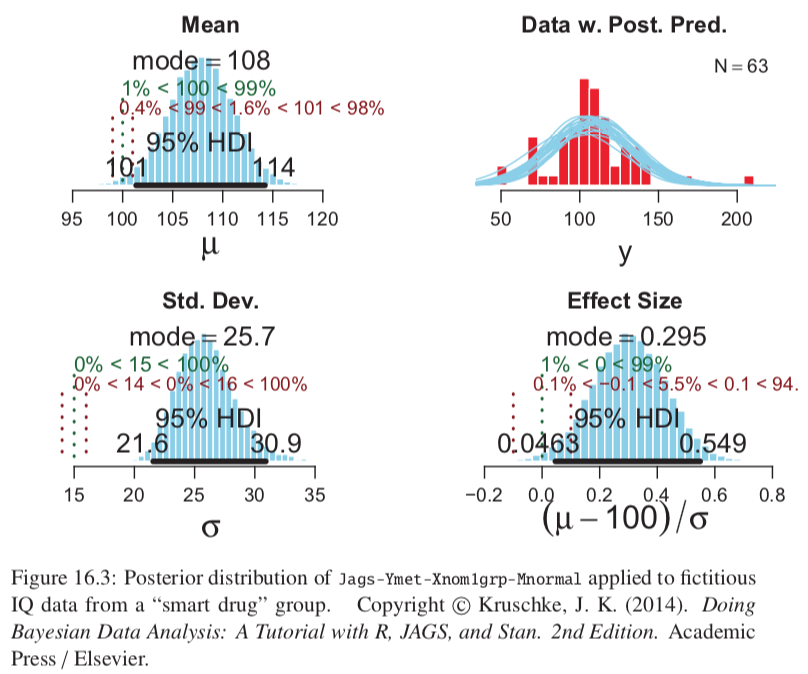
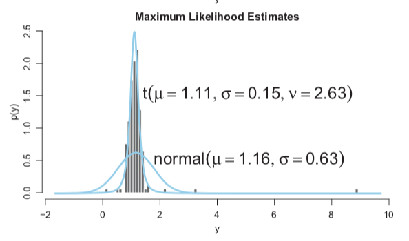
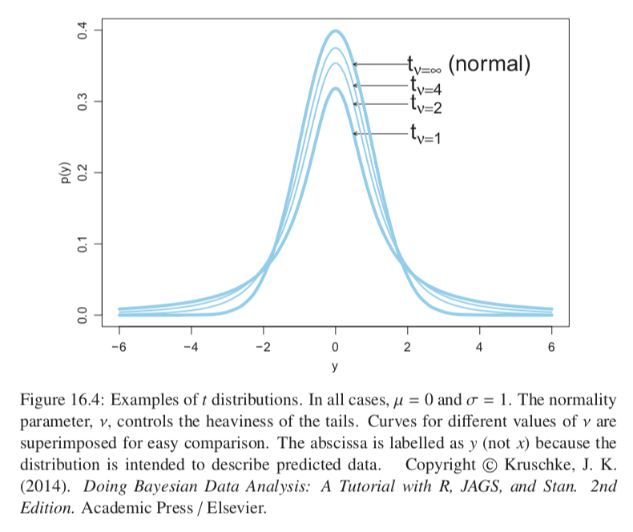
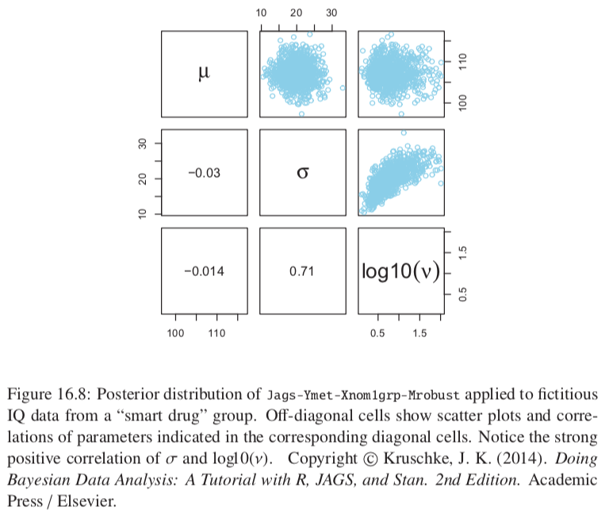
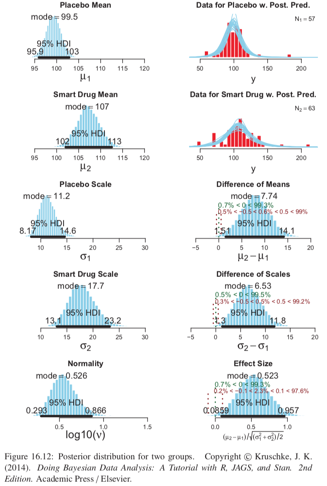
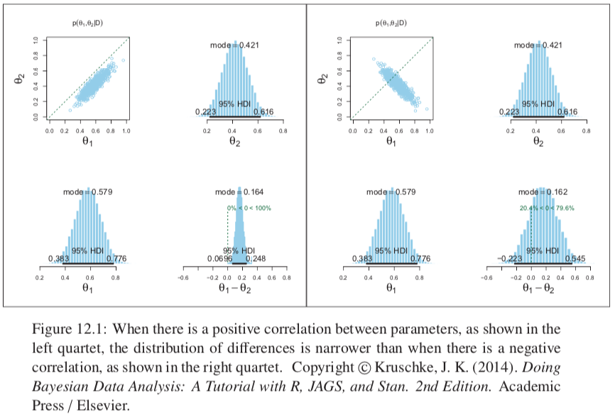
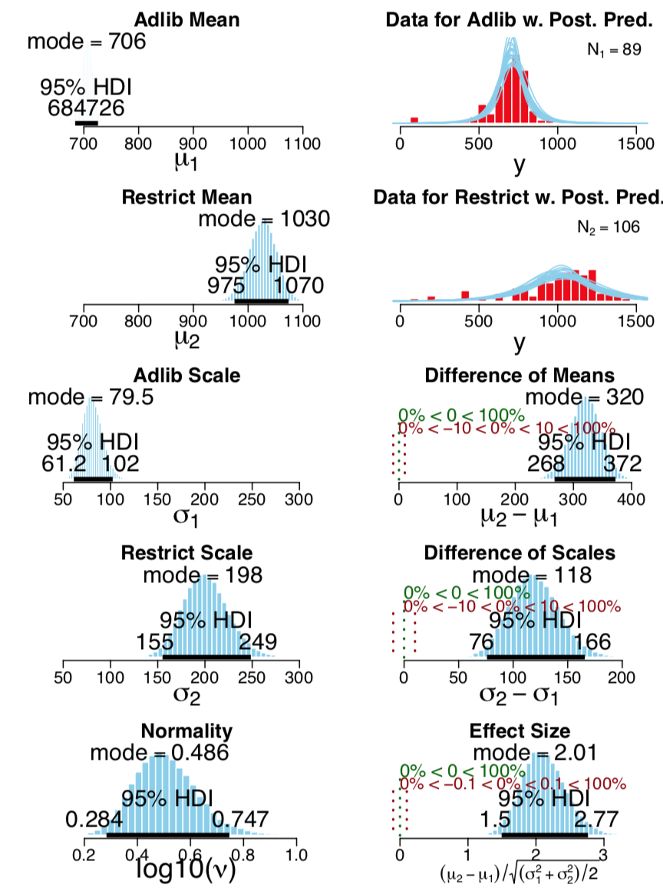
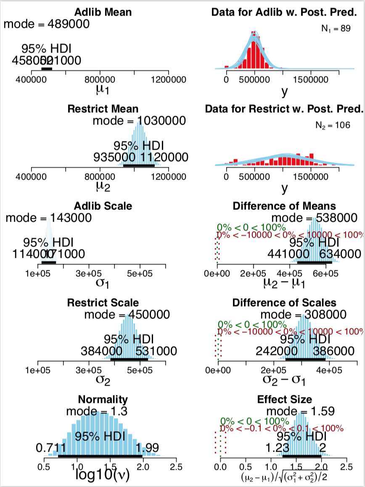

## 16.0 Introduction

Example 1: blood pressure (metric) for people randomly sampled from first-year university students (single group). We might be interested in how this varies from a published value.

Example 2: measure IQ (metric) of people randomly sampled from everyone self-described as vegetarian (single group). We might be interested in how this differs from population average of 100.

We will use trivial cases of the GLM:

* link function is identity
* noise described by normal distribution

We will explore:

* Options for the prior distribution on the parameters of the normal distribution
* Methods for Bayesian estimation of these parameters
* Alternative noise distributions for describing data with outliers

## 16.1 Estimating the Mean and Standard Deviation of a Normal Distribution

Simple review of normal distributions, likelihood functions, and bayes rule.

### 16.1.1 Solution by mathematical analysis

First consider case where standard deviation of likelihood function is fixed (prior on $\sigma$ is a delta function), so we are only estimating $\mu$.

* Conjugate prior for $\mu$ is therefore a normal distribution. (Book gives proof of this which boils down to the fact that two normal distributions multiplied together gives you a normal distribution.)
* Posterior precision = prior precision + likelihood precision
* Posterior mean = weighted average of prior mean and datum with weighting corresponding to the relative precisions of the prior and the likelihood
* Can adapt this naturally to $N$ data points because that is also modelled by a normal distribution with the same mean $\mu$ and standard deviation $\sigma / \sqrt{N}$

Second consider when the mean is fixed so we are only estimating $\sigma$:

* Conjugate prior for the precision is the gamma distribution.
* Gamma distributions routinely used as a prior on precision, but no necessity to do so in MCMC, and in practice may do something else that is more intuitive.

Looking up the conjugate joint prior I find: variance distributed according to a scaled inverse chi squared distribution, and then the mean given the variance is a normal distribution.

### 16.1.2 Approximation by MCMC in JAGS

* We will assume a noncommital prior: 
  + Normal prior: M as mean of our data and S as 100*std of our data
  + EITHER Gamma prior for precision: shape=0.01, rate=0.01
  + OR Very wide uniform prior for standard deviation (H as a huge multiple of the std of the data and L as a tiny fraction)
    + __BB: don't we have log vs linear scaling issues in doing this with the standard deviation uniform prior?__

Data passed to JAGS as follows:
```{r eval=FALSE}
dataList = list(
  y = y,
  Ntotal = length(y),
  meanY = mean(y),
  sdY = sd(y_)
)
```

Model expressed in JAGS as:
```{r eval=FALSE}
modelString = "
model {
  for (i in 1:Ntotal) {
    y[i] ~ dnorm(mu, 1/sigma^2) # JAGS uses precision
  }
  mu ~ dnorm(meanY, 1/(100*sdY)^2) # JAGS uses precision
  sigma ~ dunif(sdY/1000, sdY*1000)
}
"
```

Results for smart drug example:
```{r, eval=FALSE, message=FALSE, warning=FALSE, results=FALSE}
setwd("./DBDA2Eprograms")
source("DBDA2E-utilities.R") # Load definitions of graphics functions etc.
source("Jags-Ymet-Xnom1grp-Mnormal-Example.R")
```

```{r, out.width = "400px", echo=FALSE}

```

It appears that the smart drug increases IQ however improvement is not large relative to uncertainty in the estimate. 95% HDI does not exclude the ROPE for effect size. An effect size of 0.2 is considered small in psychological research. It is more clear that the smart drug has an effect on the standard deviation of IQ. Top-right plot is a posterior-predictive check, and shows that model may be straining to adjust for outliers.

## 16.2 Outliers and Robust Estimation: The t Distribution

* The t distribution has heavier tails than the normal distribution, so it is better for modelling data with outliers.
* Three parameters: mean, scale (indirectly controls standard deviation), degrees of freedom $\nu$ (controls heaviness of tails, here we are not using t distribution as a sampling distribution but only for its shape, so can instead call this parameter _normality_, where the distribution becomes normal when $\nu$ tends to infinity.)
* t distribution also good for modelling outliers at higher levels in a hierarchical prior.
* Image below shows how it models data with outliers much better

```{r, out.width = "400px", echo=FALSE}

```

### 16.2.1 Using the t distribution in JAGS

Model expressed in JAGS as:
```{r eval=FALSE}
modelString = "
model {
  for (i in 1:Ntotal) {
    y[i] ~ dt(mu, 1/sigma^2, nu)         # JAGS dt uses precision
  }
  mu ~ dnorm(meanY, 1/(100*sdY)^2) 
  sigma ~ dunif(sdY/1000, sdY*1000)
  nu <- nuMinusOne+1                     # nu must be >=1
  nuMinusOne ~ dexp(1/29)                # prior on nu-1
}
"
```

* Model prior of $\nu$ in this way because by looking at Fig 16.4 we can see that almost all the variation happens when $\nu$ is fairly small
* Prior on $\nu$ can have lingering influence on posterior even for large datasets becuase mostly affects outliers and outliers are relatively rare by definition.

```{r, out.width = "400px", echo=FALSE}

```

* To accomodate outliers either $\nu$ must be small to provide heavy tails or $\sigma$ must be large to provide wider distribution.
* This correlation (Fig 16.8) is a signature of the data having outliers.

```{r, out.width = "400px", echo=FALSE}

```

Typically we don't care about the exact value of $\nu$, we just want the model to have flexibility to use heavy tails if needed.

It is interesting to compare Fig 16.9 with Fig 16.3:

* Most of our previous conclusions were actually due to outliers in the data.
* Fig 16.9 shows that $\sigma$ is now not much higher than out be expected
* Effect size is now less different from the ROPE too; more difficult to estimate $\mu$ when $\sigma$ is larger.

### 16.2.2 Using the t distribution in Stan

* In JAGS $\nu$ had a relatively small ESS. It has relatively little effect on the other parameters and does not need to be as finely tuned so this is okay, but it would still be better if it was larger.
* Stan uses HMC sampling rather than Gibbs sampling which has much better autocorrelation characteristics in the chains, and therefore much better ESS.

## 16.3 Two Groups

* Often makes more sense to compare an experiment group to a control group rather than to some assumed landmark.
* Model such that the data within group $j$ come from a _t_ distribution with mean $\mu_{j}$ and scale $\sigma_j$, and use the same normality parameter $\mu$ for both groups.
* In stan this is done simply by making mu and sigma variables vectors of 2 elements (for the two groups)

```{r, out.width = "400px", echo=FALSE}

```
```{r, out.width = "400px", echo=FALSE}

```

* Results in Fig 16.12 show difference of means, although only barely excludes a small ROPE. Similar for effect size.
* Need to remember lesson from Fig 12.1: we are looking and caring about jointly credible values of $\sigma_1$ and $\sigma_2$ for example; _not sufficient to only care about marginal distributions!_

### 16.3.1 Analysis by NHST

* Typical t test in R would give p=0.05273 which is greater than 0.05 so we would _not_ reject the null hypothesis.
* This conflicts with Bayesian analysis Fig 16.12 (unless a wide ROPE is used).
* The reason: t test assumes normality, so its estimates of within-group variances is too large when there are outliers.
* Other problems with the t test:
  + Only tests equality of means, without testing equality of variances
  + To also test equality of variances would need to run an F test, which would inflate the p values of both tests.
  + F test is particularly sensitive to violations of the normality assumption.
  + Better to use resampling methods to compute p values (and correcting them for multiple tests)

## 16.4 Other Noise Distributions and Transforming Data

* If the initially assumed noise distribution does not match the data distribution, there are two ways to pursue a better description:
  + 1. (Preferred) Use a better noise distribution
  + 2. Transform the data to a new scale so that it tolerably matches the assumed noise distribution
* JAGS and Stan are pretty flexible in allowing to specify various noise distributions. Many distributions are available in JAGS and Stan, and can also specify noise distributions using the Bernoulli ones trick.
* Example non-normal: response time, typically positively skewed, try Weibull distribution.

## 16.5 Exercises

### Ex 16.2.A
```{r, eval=FALSE}
setwd("./DBDA2Eprograms")
source("DBDA2E-utilities.R") # Load definitions of graphics functions etc.
source("Jags-Ymet-Xnom2grp-MrobustHet.R")

myDataFrame = read.csv( file="RatLives.csv" )
xName="Group"
yName="DaysLive"
fileNameRoot = "RatLives-" 
RopeMuDiff=c(-10,10) ; RopeSdDiff=c(-10,10) ; RopeEff=c(-0.1,0.1)

graphFileType = "eps" 
#------------------------------------------------------------------------------- 
# Load the relevant model into R's working memory:
source("Jags-Ymet-Xnom2grp-MrobustHet.R")
#------------------------------------------------------------------------------- 
# Generate the MCMC chain:
mcmcCoda = genMCMC( datFrm=myDataFrame , yName=yName , xName=xName ,
                    numSavedSteps=50000 , saveName=fileNameRoot )
#------------------------------------------------------------------------------- 
# Display diagnostics of chain, for specified parameters:
parameterNames = varnames(mcmcCoda) # get all parameter names
for ( parName in parameterNames ) {
  diagMCMC( codaObject=mcmcCoda , parName=parName , 
                saveName=fileNameRoot , saveType=graphFileType )
}
#------------------------------------------------------------------------------- 
# Get summary statistics of chain:
summaryInfo = smryMCMC( mcmcCoda , RopeMuDiff=RopeMuDiff , 
                        RopeSdDiff=RopeSdDiff , RopeEff=RopeEff ,
                        saveName=fileNameRoot )
show(summaryInfo)
# Display posterior information:
plotMCMC( mcmcCoda , datFrm=myDataFrame , yName=yName , xName=xName , 
          RopeMuDiff=RopeMuDiff , RopeSdDiff=RopeSdDiff , RopeEff=RopeEff ,
          pairsPlot=TRUE , saveName=fileNameRoot , saveType=graphFileType )
#------------------------------------------------------------------------------- 
```

```{r, out.width = "400px", echo=FALSE}

#
```

Clear difference in central tendencies and variances.
Normality parameter does suggest outliers relative to a normal distribution because modal value of $\nu$ ($log_{10}(\nu)=0.486 \to \nu=3.06$) is much less than 30 and quite close to 1.

### Ex 16.2.B

```{r, eval=FALSE}
setwd("./DBDA2Eprograms")
source("DBDA2E-utilities.R") # Load definitions of graphics functions etc.
source("Jags-Ymet-Xnom2grp-MrobustHet.R")

myDataFrame = read.csv( file="RatLives.csv" )
myDataFrame = cbind(myDataFrame, DaysLiveSq = myDataFrame$DaysLive^2)
xName="Group"
yName="DaysLiveSq"
fileNameRoot = "RatLives-" 
RopeMuDiff=c(-10000,10000) ; RopeSdDiff=c(-10000,10000) ; RopeEff=c(-0.1,0.1)

graphFileType = "eps" 
#------------------------------------------------------------------------------- 
# Load the relevant model into R's working memory:
source("Jags-Ymet-Xnom2grp-MrobustHet.R")
#------------------------------------------------------------------------------- 
# Generate the MCMC chain:
mcmcCoda = genMCMC( datFrm=myDataFrame , yName=yName , xName=xName ,
                    numSavedSteps=50000 , saveName=fileNameRoot )
#------------------------------------------------------------------------------- 
# Display diagnostics of chain, for specified parameters:
parameterNames = varnames(mcmcCoda) # get all parameter names
for ( parName in parameterNames ) {
  diagMCMC( codaObject=mcmcCoda , parName=parName , 
                saveName=fileNameRoot , saveType=graphFileType )
}
#------------------------------------------------------------------------------- 
# Get summary statistics of chain:
summaryInfo = smryMCMC( mcmcCoda , RopeMuDiff=RopeMuDiff , 
                        RopeSdDiff=RopeSdDiff , RopeEff=RopeEff ,
                        saveName=fileNameRoot )
show(summaryInfo)
# Display posterior information:
plotMCMC( mcmcCoda , datFrm=myDataFrame , yName=yName , xName=xName , 
          RopeMuDiff=RopeMuDiff , RopeSdDiff=RopeSdDiff , RopeEff=RopeEff ,
          pairsPlot=TRUE , saveName=fileNameRoot , saveType=graphFileType )
#------------------------------------------------------------------------------- 
```

```{r, out.width = "400px", echo=FALSE}

#
```

* Possibly ROPEs could be even bigger than this; hard to determine an appropriate ROPE just from knowing the transform alone (does anyone have any good ideas about the best way to do this?)
* Certainly still differ in central tendencies and variances on the days-squared scale.
* Normality parameter suggests some outliers but much closer to normal because modal value of $\nu$ ($log_{10}(\nu)=1.3 \to \nu=20.0$) is close to 30, and much futher away from 1 than it was. Much larger normality parameter = much more normal.
* The effect size is different now, it's much smaller. This second value is likely more robust because we have lessened the skew in the data which the model was previously not able to account for very well.