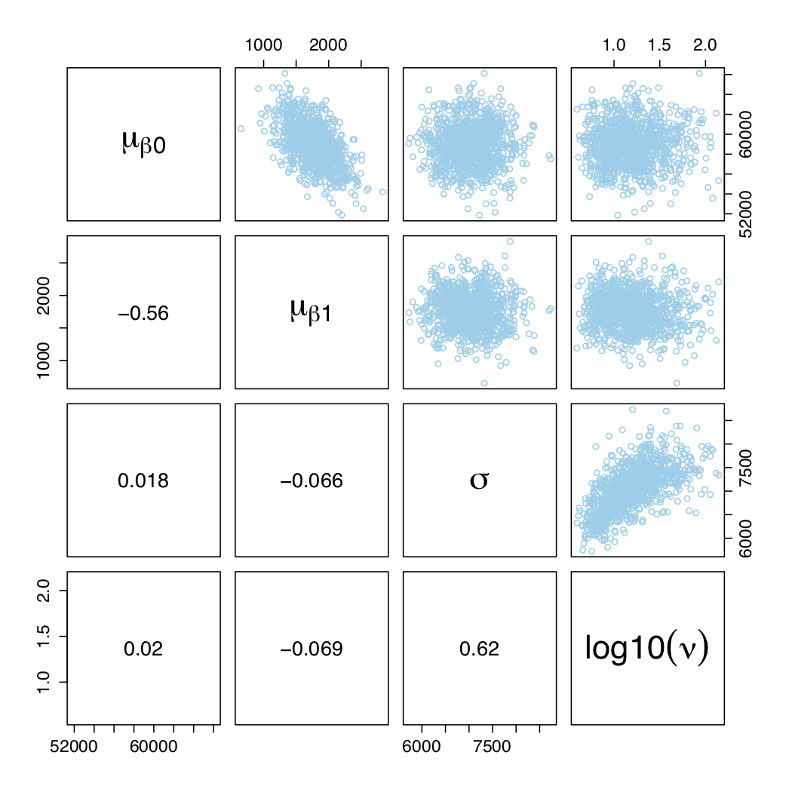
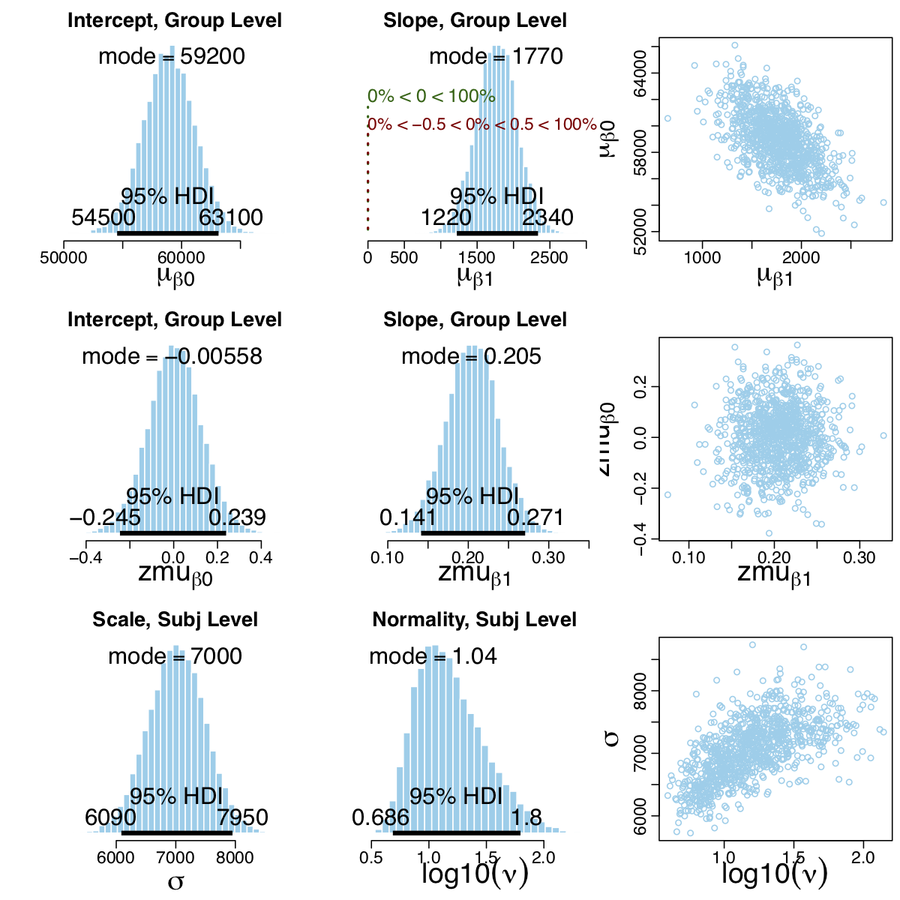
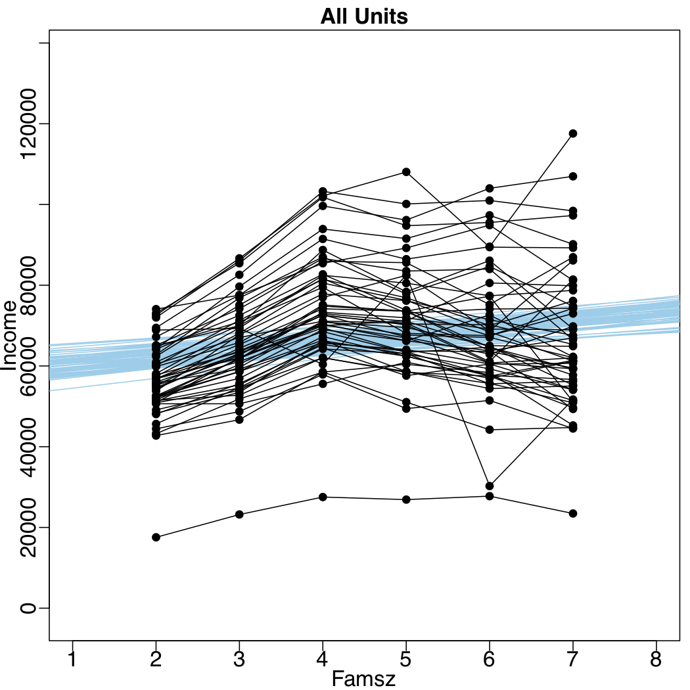
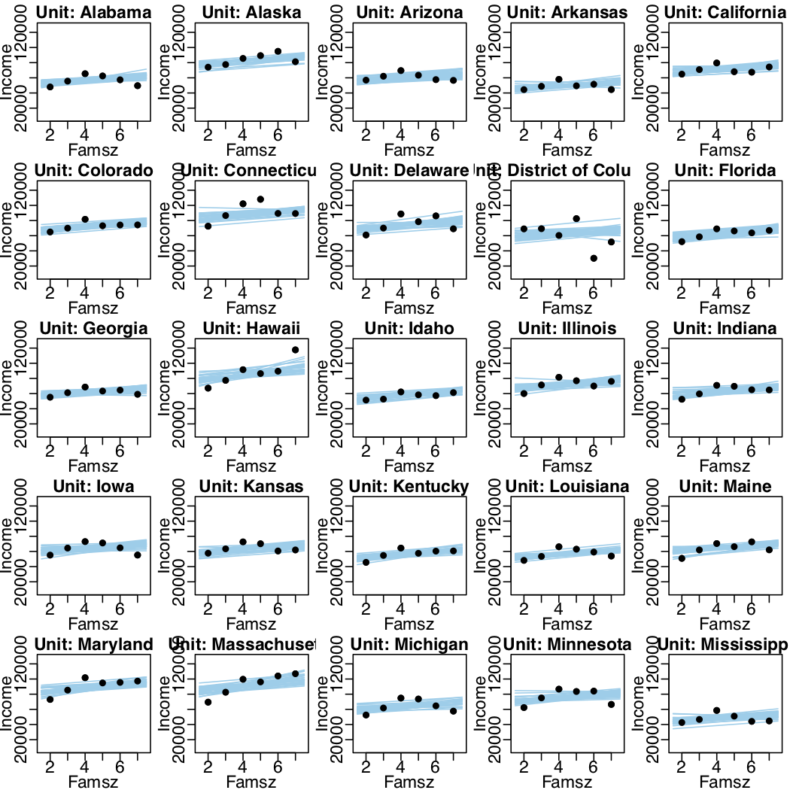
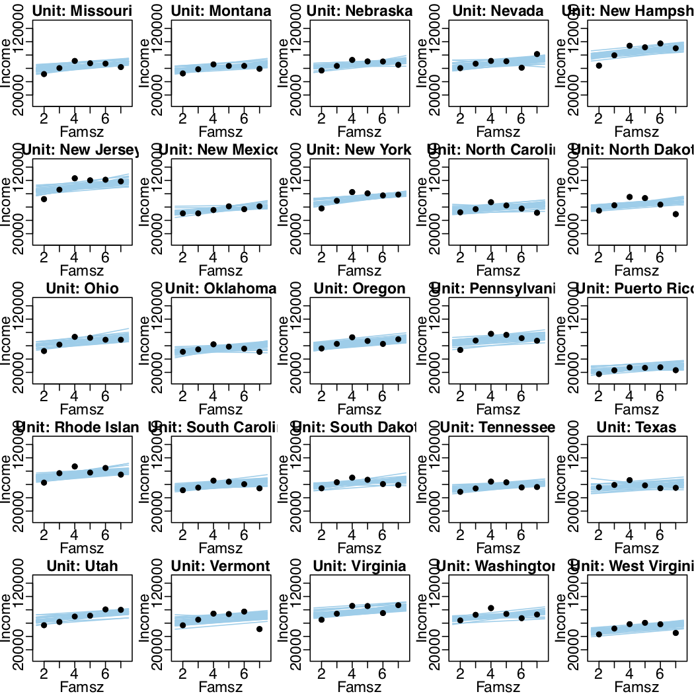

Initially we look at simple linear model between x and y with normally distributed residual randomness in y: "simple linear regression". Then generalize in 3 ways:
* Noise distribution to accomodate outliers
* Different relationships between predictor and predicted (e.g. quadratic)
* Hierarchical models of situations in which every individual has data that can be described by an individual trend, and we also want to estimate group-level typical trends across individuals.

## 17.1 Simple Linear Regression

* Model only specifies dependency of y on x; does not say anything about what generates x and theres is no probability distribution assumed for describing x.
* Model assumes _homogeneity of variance_.
* No claims made about causal connections.

## 17.2 Robust Linear Regression

* As explained in section 16, we can use t distribution instead of normal to make model robust to outliers.
* Our job is to specify sensible priors and make sure MCMC process generates a trustworthy posterior sample that is converged and well mixed.

### 17.2.1 Robust linear regression in JAGS

```{r}
model = "
model {
  for (i in 1:Ntotal) {
   zy[i] ~ dt(mu[i], 1/zsigma^2, nu)
   mu[i] ~ zbeta0 + zbeta1 * zx[i]
  }
  zbeta0 ~ dnorm(0, 1/(10)^2)
  zbeta1 ~ dnorm(0, 1/(10)^2)
  zsigma ~ dunif(1.0E-3, 1.0E+3)
  nu <- nuMinusOne+1
  nuMinusOne ~ dexp(1/29.0)
}
"
```

* z prefix because data will be standardized before being sent to the model.
* mi[i] doesn't need to be on a separate line, but doing so allows recording it.

#### 17.2.1.1 Standardizing the data for MCMC sampling

* In principle, can run the above code on the "raw" data, nothing wrong with the mathematics or logic.
* Issue is that credible values of slope and intercept tend to be strongly correlated. Narrow diagonal posterior distribution difficult for some ampling algorithms to explore -> extremely inefficient chains.
* So in practice, takes too long to get suitably representative sample.
* Solutions:
  + Use Hamiltonian Monte Carlo in Stan.
  + Transform the data so credible regression lines don't suffer such a strong correlation.
    + Can see in example that propblem arises because of the arbitrary position of zero on the x axis being far away from the data. If the data was centered around 0, then regression slopes could vary more without requiring big changes in intercepts.
    + If we're going to mean-center, we may as well fully standardize.
    + Can use means and standard deviations of x and y to work out actual data regression coefficients from the standardized data coefficients.
* Can implement the standardization either in R or in JAGS, can do in JAGS using a data block, which will also keep a record, as follows:

```{r}
data = "
data {
  Ntotal <- length(y)
  xm <- mean(x)
  ym <- mean(y)
  xsd <- sd(x)
  ysd <- sd(y)
  for (i in 1:length(y)) {
    zx[i] <- (x[i] - xm) / xsd
    zy[i] <- (y[i] - ym) / ysd
  }
}
"
```

This can allow us to specify vague priors no matter the original scale of the data.

### 17.2.2 Robust linear regression in Stan

Key question how to set the priors if we don't standardize the data? For example we could say max slope could be value of $SD_y/SD_x$.

### 17.2.3 Stan or JAGS?

* Stan took 485 seconds, JAGS took 180 seconds, for same steps and thinning and chains.
* ESS in JAGS was 5000 for $\nu$ and 16000 for $\beta$s.
* ESS in Stan was about 8000 for $\nu$ but only 7000 for $\beta$s.
* Stan didn't require us to manually standardize the data, and handled it robustly anyway.
* Stan efficiency might be improved if the t distribution were reparameterized.

### 17.2.4 Interpeting the posterior distribution

* Uncertainty varies with x.
* In example model fits data quite well despite that data was generated using 3 bivariate normal distributions.
* Can easily incorporate skewed noise distributions if posterior check implied it would be a good idea.

## 17.3 Hierarchical Regression on Individuals Within Groups

Every individual $j$ contributes multiple observations of $x_{i|j}$, $y_{i|j}$; we then estimate a regression curve for every individual. We can also estimate group-level parameters too if we also assume the individuals are representative of a common group.

### 17.3.1 The model and implementation in JAGS

* Think carefully about the model of dependencies
* __BB: JAGS code they show seems to have Nsubj and s used but not defined..?__
* Key lines of the model shown below:
```{r}
model = "
model {
  for (i in 1:Ntotal) {
    zy[i] ~ dt(zbeta0[s[i]] + zbeta1[s[i]] * zx[i], 1/zsigma^2, nu)
  }
  for (j in 1:Nsubj) {
    zbeta0[j] ~ dnorm(zbeta0mu, 1/(zbeta0sigma)^2)
    zbeta1[j] ~ dnorm(zbeta1mu, 1/(zbeta0sigma)^2)
  }
  ... # all the rest of the code goes below here, such as priors on standardized scale and standardization transforms
}
"
```


### 17.3.2 The posterior distribution: shrinkage and prediction

* Tracking many variables now (107 variables acorss 25 subjects in example) so use thinning to reduce file size.
* _Shrinkage of estimation in hierarchical models_: estimates of individual slopes are pulled together. See final two subjects in Figure 17.5

## 17.4 Quadratic Trend and Weighted Data

* Very easy to have not just linear trend but quadratic trend.
* Standardization transformations require more algebra.
* We can also apply weighting. In family-income data example the median income for a given family size in a given state has higher uncertainty if there were fewer data points used to calculate that median. Original dataset had "margin of error" recorded for each point so we can use that for weighting.
  + In practice this involves doing $y_i \sim normal(\mu_i,w_i \sigma)$ instead of $y_i \sim normal(\mu_i,\sigma)$

### 17.4.1 Results and interpretation

* Careful interpreting linear component when we have quadratic component also.
* Low $\nu$ less than 4 suggest we have outliers within individual states.

### 17.4.2 Further extensions

* Could use any non-linear trend: higher order polynomial, sinusoidal, exponential, etc.
* Assumed single underlying noise $\sigma$ for all individuals, but could modulate by relative standard error of each datum. Different individuals might have different inherent amounts of noise. Could use gamma distribution to describe variation of noise.
* Assumed intercepts, slopes, and curvatures are normally distributed across individuals; it could be that there are outliers. Easy to use t distributions at teh group level.
* No explicit parameters to describe covariation of intercepts, slopes, and curvatures across individuals. Could easily use multivariate normal prior on the intercept, slope, and curvature parameters.

## 17.5 Procedure and Perils for Expanding a Model

### 17.5.1 Posterior predictive check

* Nested models: simpler model is the complex model with some parameters fixed; simpler is nested within more complex.
* Bayesian model comparison. Remember to keep priors on parameters within the two models equivalently informed.
* Bayesian p value; not recommended.

### 17.5.2 Steps to extend a JAGS or Stan model

### 17.5.3 Perils of adding parameters

### 17.6 Exercises

#### Exercise 17.1

##### A

```{r, eval=FALSE, message=FALSE, warning=FALSE, results=FALSE}
setwd("./DBDA2Eprograms")
source("DBDA2E-utilities.R") # Load definitions of graphics functions etc.
source("Jags-Ymet-XmetSsubj-MrobustHier-ExampleFamilyIncome.R")
```

```{r, out.width = "400px", echo=FALSE}

```
```{r, out.width = "400px", echo=FALSE}

```
```{r, out.width = "400px", echo=FALSE}

```
```{r, out.width = "400px", echo=FALSE}

```
```{r, out.width = "400px", echo=FALSE}

```

Data tends to peak in the middle and is lower at the edges. Consistently for familysizes 2 or 7 for example the data is below the line, whereas for familysize 4 the data is consistently above the line.

Correlation between $\nu$ and $\sigma$ shows we have non-normal distributed error; possible indication either model doesn't fit or we have outliers.

##### B

Is there a way of rejecting the linear model without reference to any other model? How might you compute the "Bayesian p value" for this situation? Should you?

Bayesian p value would tell you the probability of getting the data's discrepancy, or something more extreme, from the model.

Issues with p valus: would need to think about sampling and testing intentions of the analyst. Prefer to keep posterior predictive checks fully Bayesian; drive intuitions about the qualitative manner in which the model succeeds or fails, and what sort of novel model formulation might better capture trends, and then we can quantitatively compare the models. In this paradigm, Krushke suggests we should always be comparing and referring to other models rather than having an absolute measure without reference to other models.

The posterior marginal likelihood p(D|m) is highly dependant on the choice of vague prior, which is another complication. Makes model comparison hard too. Solved this using 10% of the data to provide an initial step, turning the vague prior into a slightly informed prior, which helps a lot with this issue.
