## 18.1 Multiple Linear Regression

Examples:

* Predict college GPA from high-school GPA and SAT
* Predict blood pressure from height and weight

We consider models in which predicted variable is an additive combination of predictors all of which have proportional influence on the prediction: _multiple linear regression_. Will also consider nonadditive combinations of predictions called _interactions_.

In context of GLM:

* linear function of multiple metric predictors
* link function is identity
* noise distribution is normal (or similar)

See http://www.indiana.edu/kruschke/BMLR/ for more details.

### 18.1.1 The perils of correlated predictors

Reminders:

* Model specifies dependence of y on X but not the distribution of X.
* $y \sim normal(\mu,\sigma)$ and $\mu = \beta_0 + \beta_1 x_1 + \beta_2 x_2$.
* Homogeneity of variance $\sigma^2$ assumed.

```{r, out.width = "400px", echo=FALSE}
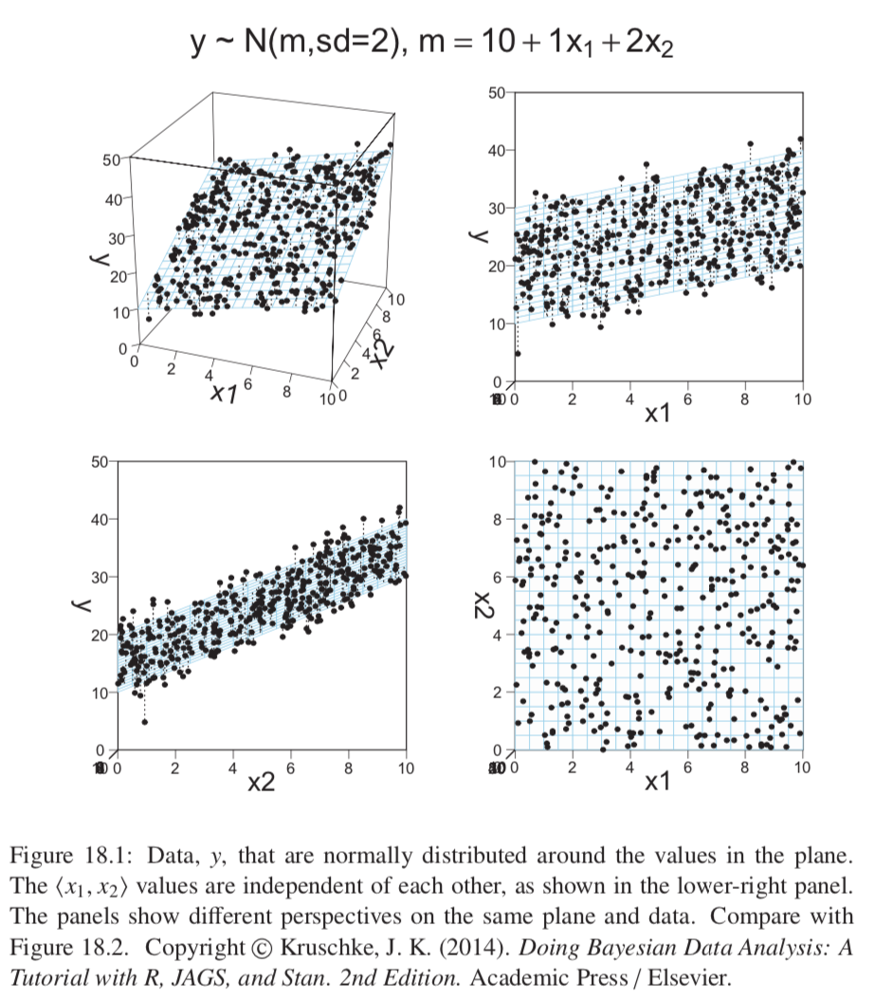
```
```{r, out.width = "400px", echo=FALSE}
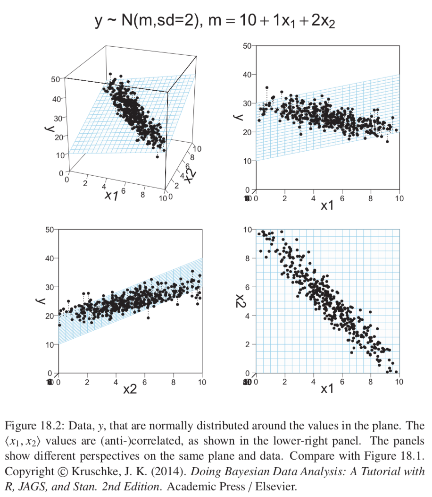
```

* Top-right plot in 18.2 does not reflect true underlying slope $\beta_1$. This shows that if we hadn't also included $x_2$ in the model, we would have come to the wrong conclusion about $\beta_1$. Downward trend is an illusion caused by influence of another factor ($x_2$) which happens to be correlated with the first factor ($x_1$).
* Real-life example of this in figure 18.3. Why do SAT scores go down when spending goes up? Because more spending means more likely to take SAT even if the average score isn't as good.
* In 18.3 the correlation is mild enough that there is enough independent variation of the two predictors that their separate influences can still be assessed.
  + Stronger correlation -> more difficult to tease apart distinct effects.
  + Correlation of predictors cause estimates of regression coefficients to trade-off.

```{r, out.width = "400px", echo=FALSE}
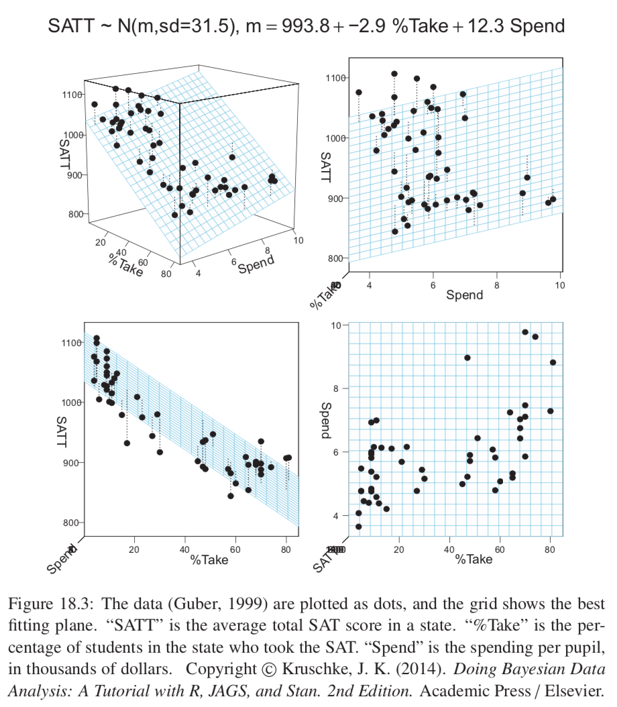
```

### 18.1.2 The model and implementation

Direct expension to previous, although now have a coefficient for each predictor, each of which has a normal prior.

JAGS normalize all data:
```{r}
data = "
data {
  ym <- mean(y)
  ysd <- sd(y)
  for (i in 1:Ntotal) { # for each row of data
    zy[i] <- (y[i] - ym) / ysd
  }
  for (j in 1:Nx) { # for each predictor
    xm[j]  <- mean(x[,j])
    xsd[j] <-   sd(x[,j])
    for (i in 1:Ntotal) {
      zx[i,j] <- (x[i,j] - xm[j]) / xsd[j]
    }
  }
}
"

model = "
model {
  for (i in 1:Ntotal) {
    zy[i] ~ dt(zbeta0 + sum(zbeta[1:Nx] * zx[i,1:Nx]), 1/zsigma^2, nu)
  }
  
  # Priors vague on standardized scale:
  zbeta0 ~ dnorm(0,1/2^2)
  for (j in 1:Nx) {
    zbeta[j] ~ dnorm(0,1/2^2)
  }
  zsigma ~ dunif(1.0E-5, 1.0E+1)
  nu <- nuMinusOne+1
  nuMinusOne ~ dexp(1/29.0)
  
  # Transform to original scale:
  beta[1:Nx] <- (zbeta[1:Nx] / xsd[1:Nx])*ysd
  beta0 <- zbeta0*ysd + ym - sum(zbeta[1:Nx]*xm[1:Nx] / xsd[1:Nx])*ysd
  sigma <- zsigma*ysd
}
"
```

Use prior on regression coefficients with standard deviation of 2, because standardized regression coefficients constrained to fall between -1 and 1, so get something quite flat over that range.

### 18.1.3 The posterior distribution

* Spend is credibly above zero, even with a modest ROPE and MCMC instability. Mode is 13 which suggests SAT rises by 13 for every $1000 spent per pupil.
* Slope on percentage taking exam is also credibly non-zero at -2.8, so SAT scores fall 2.8 points for every extra 1% who take the test.
* Scatter plots show pairwise credible parameter values from the MCMC chains.
  + Spend trades off with PrcntTake, which means that if we believe influence of spending is smaller then must believe influence of percentage taking is larger. The predictors are also correlated in the data so it makes sense.
* Normality parameter largeish, so not many outliers. Remember an outlier for one set of predictors may not be for another set.

```{r, out.width = "400px", echo=FALSE}
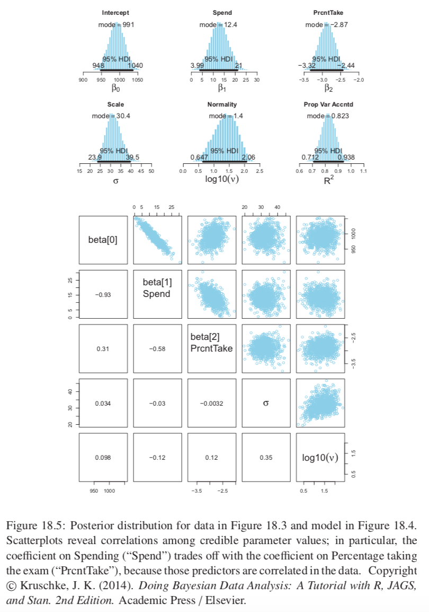
```

$R^2$ in traditional least-squares multiple regression is called proportion of variance accounted for because overall variance in y can be decomposed: $$\sum_i(y_i-\bar{y})^2 = \sum_i(y_i-\hat{y}_i)^2 + \sum_i(\hat{y}_i-\bar{y})^2$$, and so $R^2 = \sum_i(\hat{y}_i-\bar{y})^2 / \sum_i(y_i-\bar{y})^2$. $\hat{y}_i$ is the linear prediction using coefficients that minimize $\sum_i(y_i-\hat{y}_i)^2$.

In Bayesian analysis no such decomposition of variance occurs. Instead a surrogate of $R^2$ is computed: $R^2 = \sum_j\zeta_j r_{y,x_j}$ where $\zeta_j$ is the standardized regression coefficient for the $j$th predictor at that step in the MCMC chain and $r_{y,x_j}$ is the correlation of the predicted values $y$ with the $j$th predictor values $x_j$ (correlations are constants fixed by the data). This measure can exceed 1 or be less than 0. __BB: is this really a good approximation/analogy to $R^2$? How similar does it get if we compare to traditional linear regression on the same data?__

### 18.1.4 Redundant predictors (multicollinearity)

* Suppose two data points: $x_1 = x_2 = y = 1$, $x_1 = x_2 = y =2$. Then linear model could have any combination of coefficients that satisfy $\beta_1 + \beta_2 = 1$. Credible values of $\beta_1$ and $\beta_2$ are anticorrelated and trade-off to fit the data _(each trade-off fits equally well)_.
* Key indicator is in the data itself: the predictors will be correlated.
* A benefit of Bayesian analysis the correlations of credible parameter values are explicit in the posterior.
  + The estimation doesn't just "explode" as in traditional, but will happily generate a posterior distribution regardless of correlations.
  + In extreme cases, marginal posteriors will simply reflect the priors, with strong trade-off in joint posterior.
  + Sometimes only the prior tempers an infinite range of equally credible possibilities.
* Example in Figure 18.6: PrcntTake and PropNotTake are redundant.

```{r, out.width = "400px", echo=FALSE}
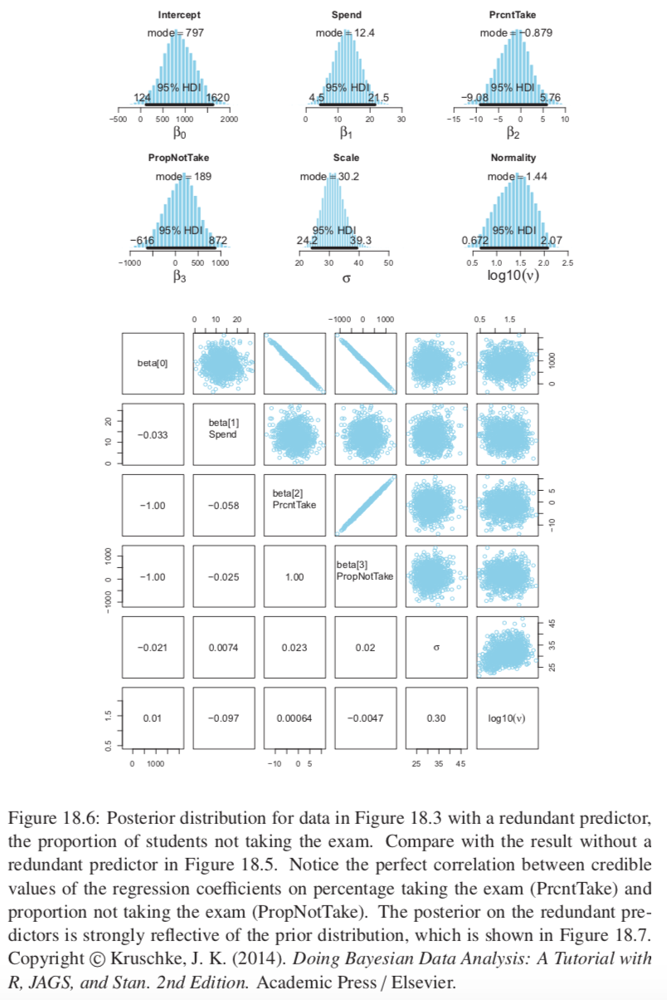
```

* Result: 
  + Strong correlation in posterior pairwise scatter plots.
  + Extremely broad marginal posteriors for the redundant predictors.
  + Chains for coefficients of redundant predictors highly autocorrelated and highly correlated with each other.
  + __Signs diffused when three or more strongly correlated predictors.__ Pairwise scatterplots not sufficient to show three-way tradeoff. Autocorrelation remains high though.
* Priors shown in figure 18.7 for interest and comparison. __BB: why correlation in top left between intercept and spend?__
* Actions: 
  + Remove completely redundant predictors
  + Arbitarily create a single predictor that standardizes then averages the correlated predictors.
  + Use PCA
  + Use factor analysis or SEM to find an underlying common factor.

### 18.1.5 Informative priors, sparse data, and correlated predictors

* Informed priors especially useful when amount of data small compared to parameter space.
* Can get usefully precise posteriors with sparse data _if_ some coefficients have informed priors _and_ the predictors are strongly correlated.
  + Predictors correlated -> regression coefficients anti-correlated (see fig 18.3 and 18.5 for example)
  + Coefficients correlated means that knowledge of one constrains the credible values of the other.
  + If we have prior knowledge on one of the coefficients, this will help us estimate the other.
* Example from political science: Western and Jackman 1994

## 18.2 Multiplicative Interaction of Metric Predictors

* E.g. the effect of increaseing does of drug A depends on the dose of drug B.
* May have many different functional forms but here consider only multiplicative.
* Algebraically a $\beta_{1\times2}x_1 x_2$ term means that the slope of $x_1$ depends on $x_2$ and vice-versa.
* $\beta_1$ then only indicates the slope along $x_1$ when $x_2 = 0$. Not appropriate to say this indicates the _overall_ influence of $x_1$ on $y$.

### 18.2.1 An example

* To do this practically in JAGS or Stan we will invent a new predictor and provide that as input to the previously applied additive (noninteraction) model.
* Go back to SAT dataset; if very few students are taking the test they are probably already at the top of the class so might not have much head-room for increasing scores if more money is spent on them; _so plausible that effect of spending is larger when percentage taking the test is larger_.
  + Turns out interaction variable is strongly correlated with both predictors -> strong trade-offs and marginal distributions of single regression coefficients may well be wider.
  + SpendXPrcnt 95% HDI includes 0, so not very strong precision in estimate of this effect.
  + Spend 95% HDI now includes 0 __but this does not mean no credible influence of spending on SAT scores because $\beta_1$ only indicates the slope on spending when the percentage of students taking the test is zero__.

```{r, out.width = "400px", echo=FALSE}
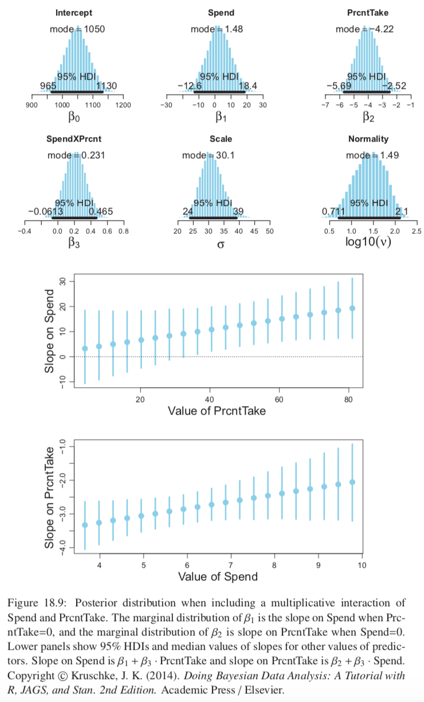
```

* For a given $x_2$ we can work out slope on $x_1$ for every data point by using the value of $x_2$ and the coefficients at every step in the chain, and we can then summarize the distribution of slopes. Gives us middle panel of 18.9.
* If you include an interaction term _you cannot ignore it even if it appears not very influential and must carefully consider all the effects_.

## 18.3 Shrinkage of Regression Coefficients

```{r, out.width = "400px", echo=FALSE}
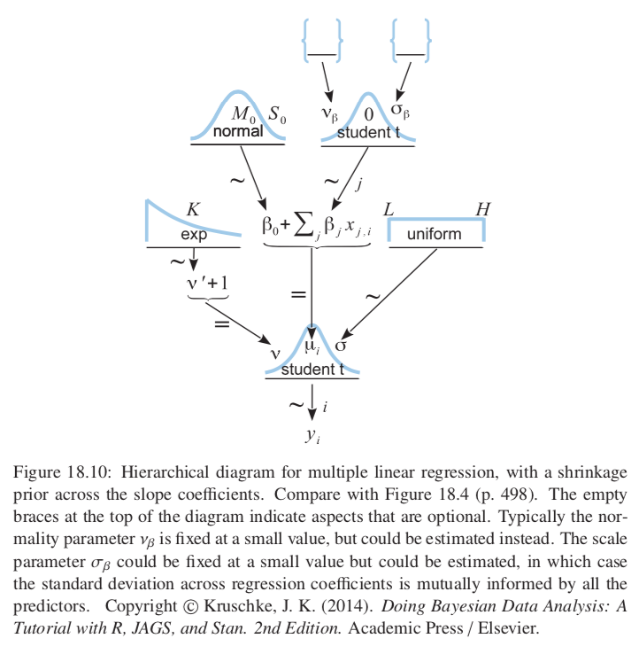
```

* Oftentimes there are many candidate predictors we might consider.
* There may be noisy data and some regression coefficients would be spuriously estimated as non-zero. How do we protect ourselves from this? How do we focus on the predictors that are most clearly related to the predicted?
  + Use t distribution on priors of regression coefficients. This dictates that should probably be near zero, but if clearly non-zero then could be large as allowed by the heavy tails. Could also use a double exponential _(lasso regression)_.
  + Can make normality and scale parameters of the t distributions constants, making the prior a regularizer for the estimation.
  + Need to think about whether the scale parameter $\sigma_{\beta}$ should be fixed or estimated.
    + If shared parameter is estimated, model is assuming all coefficients are mutually representitive of the variability across coefficients.
* Example:
  + 12 more randomly generated predictors added; completely random so any relations must be spurious.
  + Simple model (fixed, independent, vague normal priors for regression coefficeints)
    + Fig 18.11 posterior
    + Spend 95% HDI still above 0 but only barely, certainty of estimate reduced.
    + Coefficient on xRand10 is negative; but relation is spurious.
  + Hierarchical model ($\nu_{\beta}$ fixed at 1, $\sigma_{\beta}$ given a gamma prior with mode 1 and standard deviation 1 - broad for the standardized data).
    + Fig 18.12 posterior
    + xRand10 95% HDI now covers 0.
    + Also surpressed a real but small regression coefficient on spend.
    + Estimates shrunken towards 0 because many predictors are telling the higher-level t distribution that their regression coefficients are near zero; $\sigma_{\beta}$ posterior mode is 0.05 even though prior mode was 1.0
    + PrcntTake coefficient posterior not much changed because big enough that falls in the tail of the t distribution where prior is relatively flat.
    + Shrinkage desirable as it shares information across predictors and it rationally helps control for false alarms
    + Posterior shapes are pinched (funnel shaped, pointy and concave tails) and pushed towards 0.
    
```{r, out.width = "400px", echo=FALSE}
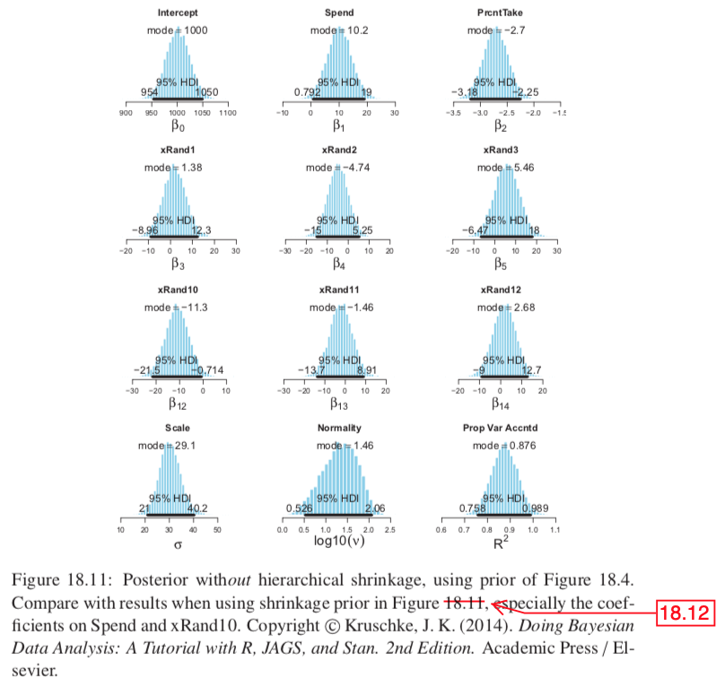
```
```{r, out.width = "400px", echo=FALSE}
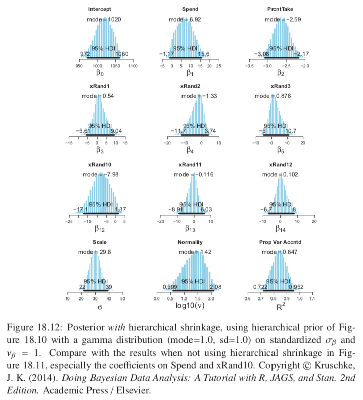
```

## 18.4 Variable Selection

* We might want to estimate the credibility that the predictor should be included, in combination with various subsets of other predictors.
* Some authors do not consider variable-selection worthwhile: not a conceptual advantage to get point estimates of zero - but regularized estimates can be much better than those from simple least squares and flat prior distributions.
* Other authors take it for granted variable selection helps them make sense of their data.
* Active research area.
* Key to models is that each predictor has both a regression coefficient and an inclusion indicator (either 0 or 1).
* Modified regression equation: $\mu_i = \beta_0 + \sum_j\delta_j\beta_j x_{j,i}$ where $\delta_j$ is the inclusion indicator for the $j$th parameter.
* Every possible combination of $\delta_j$ values constitutes a distinct model of the data. A simple prior on the indicator is to come from an independent Bernoulli prior such as $\delta_j \sim dbern(0.5)$. 0.5 means all models are equally credible a priori; less than 0.5 means models with less than half predictors included are a priori more credible.
* Trivial to do in JAGS, cannot be implemented in Stan (but can do hierarcical shrinkage models in Stan).

```{r, out.width = "400px", echo=FALSE}
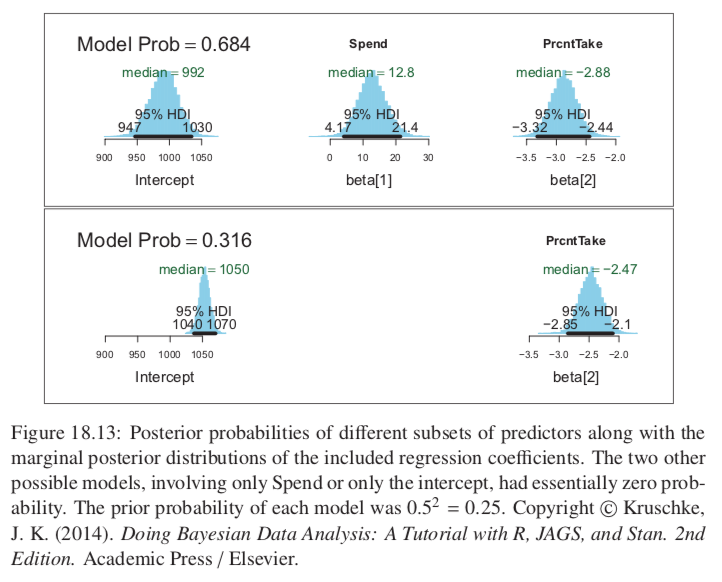
```

* Example shown above for SAT, with 4 possible models for combinations of two parameters. Only two of these four had non-negligible posterior probability.
* Remember the MCMC chain is split among all the possible models.

### 18.4.1 Inclusion probability is strongly affected by vagueness of prior

__The vagueness of the prior on the regression coefficient has enormous influence on the inclusion probability; although the degree of vagueness has little influence on the estimate of the regression coefficient itself.__ Figure 18.14 demonstrates this effect clearly.

```{r, out.width = "400px", echo=FALSE}
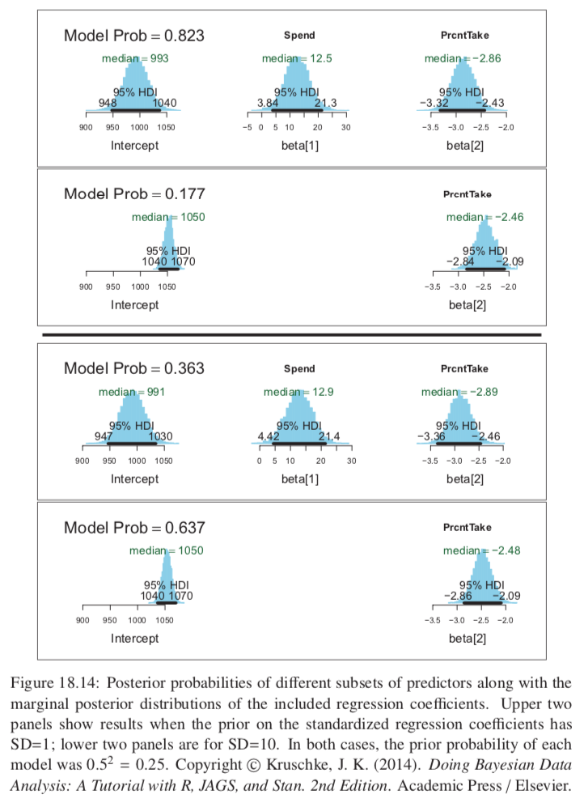
```

Reason for the lower probability of the more complex model is that each extra parameter dilutes the prior density on the pre-existing parameters (see Section 10.5). Models that include more parameters pay the cost of lower prior probability. Models with additional predictors are only favored to the extent that their benefit in higher likelihood outweights their cost in lower prior probability. Broader prior on regression coefficient means prior density at any particular value tends to be smaller.

Should spend be included or not? For the author, the non-zero explicit estimate of the regression coefficient trumps the model comparison.

__Need to be very careful interpreting results of Bayesian model comparison because so strongly affected by vagueness of priors.__

### 18.4.2 Variable selection with hierarchical shrinkage

* As before, can use concurrent data to inform these important priors.
* Lets place a broad prior on what that standard deviation should be from fig 18.14.
* Example: SAT data has two extra predictors, what are the probabilities of each set?
* Notice that the predictors most likely to be included are those with largest magnitude _standardized_ regression coefficients.

```{r, out.width = "400px", echo=FALSE}

```

### 18.4.3 What to report and what to conclude

* No single "correct" answer.
* Important to recognise that using the single best model when it excludes some predictors is concluding that the regression coefficients on the excluded predictors are exactly zero.
* A forthright report should state the posterior probabilities of the several top models. Arbitrary convention to report all models that have a posterior probability at least 1/3 of the posterior probability of the best model.
* Another useful perspective is the overall posterior inclusion probability of each predictor: the sum of the posterior probabilities of the models that include it (equivalently, the proportion of MCMC steps that include it). Cannot multiply these though and if include one often means it's less likely to include another etc.
* Should test what happens to the model probabilities when the prior is changed, to see how robust they are.
* If goal is prediction of y for interesting predictors, predictions should be based on as much information as possible, not only using the single most probable model: _Bayesian model averaging_ (BMA).

### 18.4.4 Caution: Computational methods

Code created for examples in this section does not scale well for larger applications:

* MCMC only useful when there are a modest number of predictors.
  + $p$ predictors -> $2^p$ models, so 20 predictors -> 1048576 models
  + A useful MCMC chain needs ample opportunity to sample from every model
  + So requires impractically long chain even for moderately large numbers of predictors
* Even for modest number of predictors, MCMC chain can be badly autocorelated. There have been methods suggested in the literature to mitigate this issue.
  + E.g. use pseudoprior method (Gibbs variable selection)

Variable selection:

* Only reasonable if plausible and meaniningful that some predictors have zero relation to predicted.
* Surprisingly sensitive to seemingly innocuous choces of priors (for regression coefficients and the inclusion probability)
* Hierarchical shrinkage priors may be a more meaningful approach.

### 18.4.5 Caution: Interaction variables

* When interaction terms included in a model that also has hierarchical shrinkage, interaction coefficients should not be put under the same higher-level prior distribution as the individual component coefficients, because interaction coefficients are conceptually from a different class of variables than individual components.
* When an interaction term is included in a model it is important to also include all lower order terms. Otherwise you set the lower-order coefficient to 0 arbitrarily which distorts the higher-order coefficient (Braumoeller 2004; Brambor, Clark, Golder 2006).
  + Therefore can't use interactions with variable selection program of Section 18.4 because that would explore models that violate the above. Would need to modify it so only meaningful models are included.

## 18.5 Exercises

### Exercise 18.4

#### 18.4 A)
```{r, eval=FALSE, message=FALSE, warning=FALSE, results=FALSE}
setwd("./DBDA2Eprograms")
source("DBDA2E-utilities.R") # Load definitions of graphics functions etc.
source("Jags-Ymet-XmetMulti-MrobustVarSelect-Example.R")
```

```{r}
x <- seq(0, 20, length=100)
hx <- dgamma(x, shape=1.1051, rate = 0.1051)

degf <- c(1, 3, 8, 30)
colors <- c("red", "blue", "darkgreen", "gold", "black")
labels <- c("df=1", "df=3", "df=8", "df=30", "normal")

plot(x, hx, type="l", lty=2, xlab="x value",
  ylab="Density", main="Gamma prior")
```


```{r, out.width = "800px", echo=FALSE}
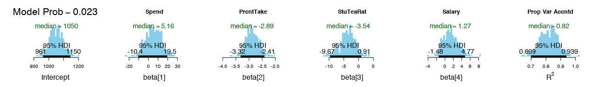
```
```{r, out.width = "800px", echo=FALSE}
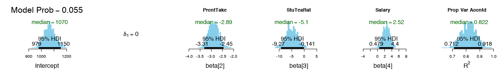
```
```{r, out.width = "800px", echo=FALSE}
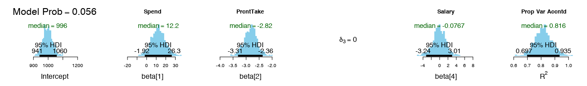
```
```{r, out.width = "800px", echo=FALSE}
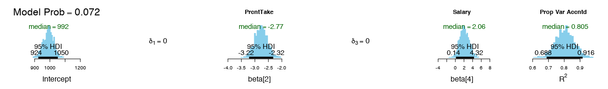
```
```{r, out.width = "800px", echo=FALSE}
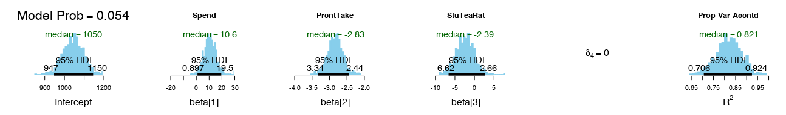
```
```{r, out.width = "800px", echo=FALSE}
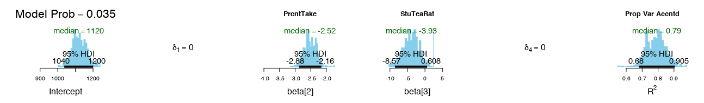
```
```{r, out.width = "800px", echo=FALSE}
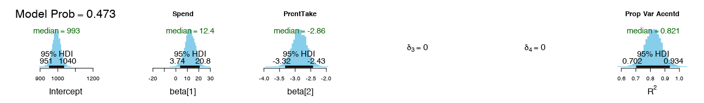
```
```{r, out.width = "800px", echo=FALSE}
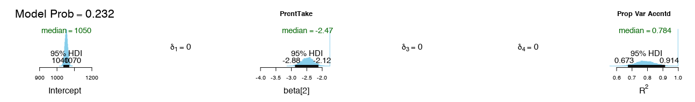
```

```{r, out.width = "400px", echo=FALSE}
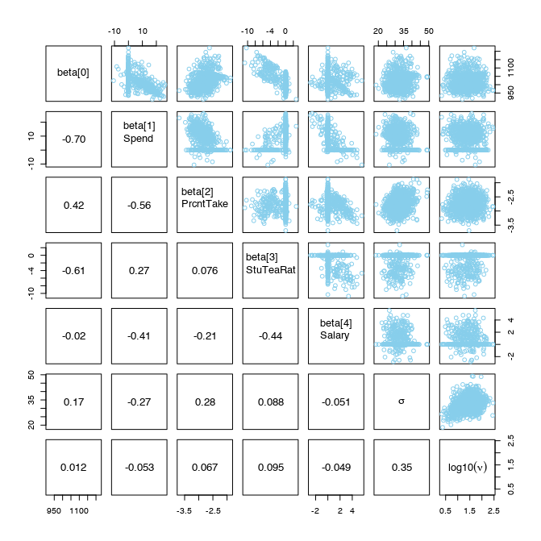
```
```{r, out.width = "400px", echo=FALSE}
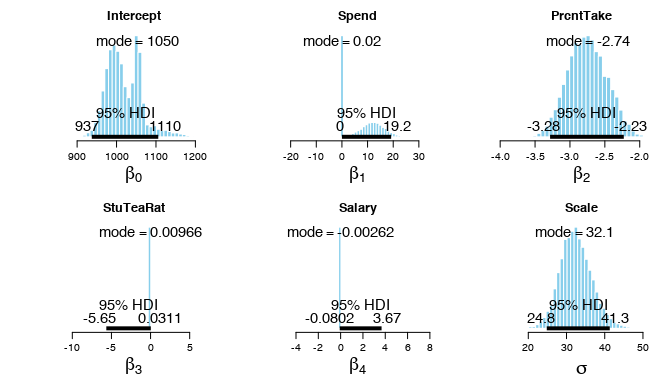
```
```{r, out.width = "400px", echo=FALSE}
knitr::include_graphics("images/Guber1999data-Jags-4X-VarSelect/Guber1999data-Jags-4X-VarSelect-PostMarg2.png")
```
```{r, out.width = "400px", echo=FALSE}
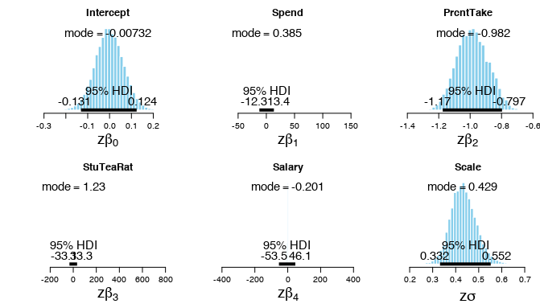
```
```{r, out.width = "400px", echo=FALSE}
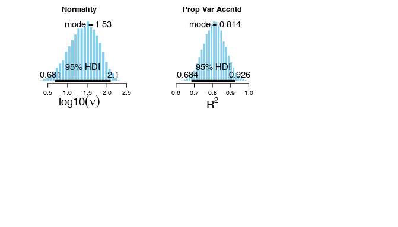
```

```{r, out.width = "400px", echo=FALSE}
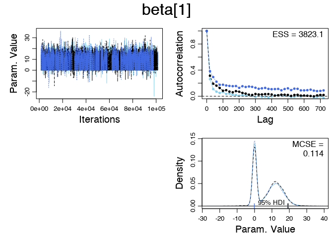
```
```{r, out.width = "400px", echo=FALSE}
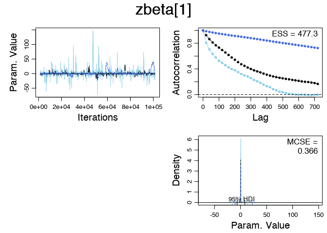
```
```{r, out.width = "400px", echo=FALSE}
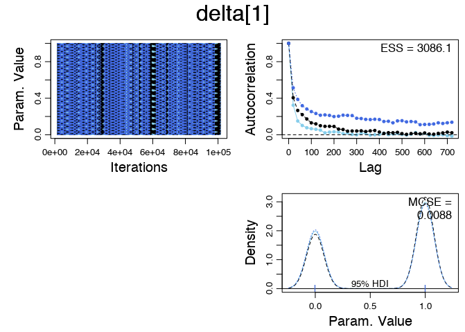
```

#### 18.4 B)

Change $\sigma_{\beta}$ to $10.0$ instead of it being estimated using a gamma prior.

```{r, out.width = "800px", echo=FALSE}
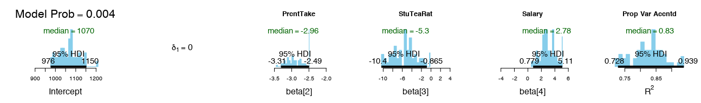
```
```{r, out.width = "800px", echo=FALSE}
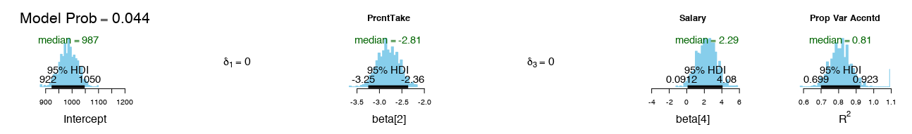
```
```{r, out.width = "800px", echo=FALSE}
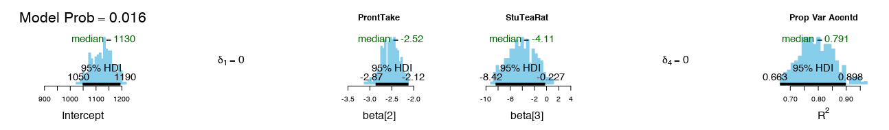
```
```{r, out.width = "800px", echo=FALSE}
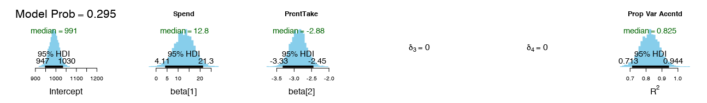
```
```{r, out.width = "800px", echo=FALSE}
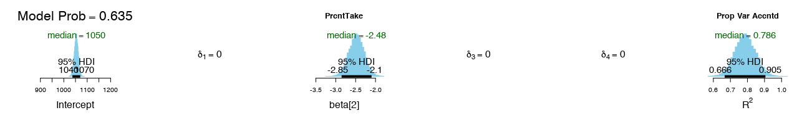
```
```{r, out.width = "400px", echo=FALSE}
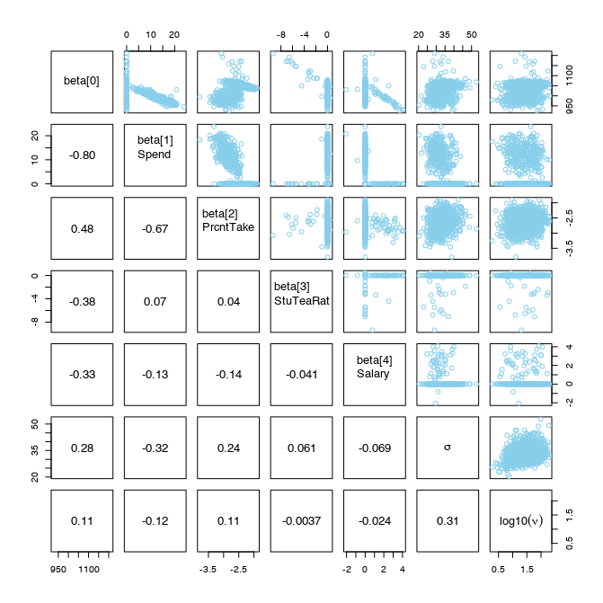
```

Model probabilities are much different now; the favored model is now a different one, showing how sensitive the variable selection is to the width of the priors on the regression coefficients. A choice of $\sigma_{\beta} = 2$ would have produced much more similar results. Either way $\sigma_{\beta}$ is fixed at a single value which means the priors for all the regression coefficients have the same standard deviation which is fixed at this value; if this value is larger it allows greater credibility for coefficients to be further from 0.

#### 18.4 C)

Set $\sigma_{\beta}$ back to gamma distribution, and now change prior on inclusion indices from delta[j] ~ dbern(0.5) to delta[j] ~ dbern(0.2). This means that a priori we would only expect 20% of the predictors to be included as opposed to 50%.

```{r, out.width = "800px", echo=FALSE}
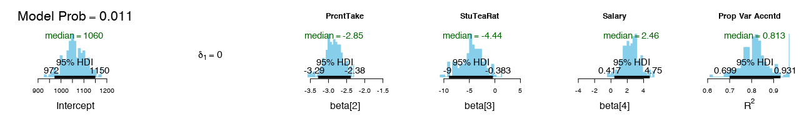
```
```{r, out.width = "800px", echo=FALSE}
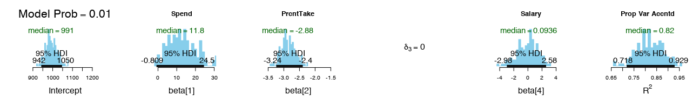
```
```{r, out.width = "800px", echo=FALSE}
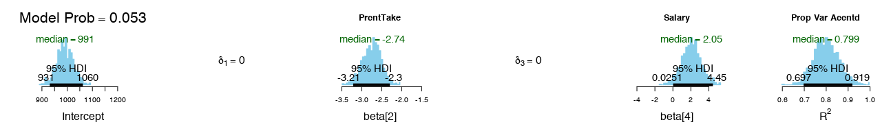
```
```{r, out.width = "800px", echo=FALSE}
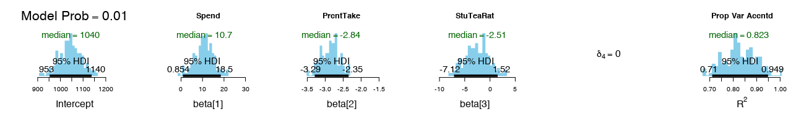
```
```{r, out.width = "800px", echo=FALSE}
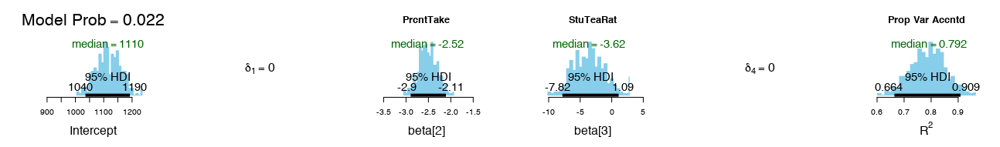
```
```{r, out.width = "800px", echo=FALSE}
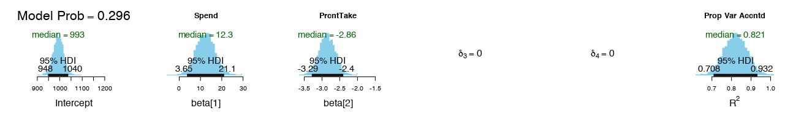
```
```{r, out.width = "800px", echo=FALSE}
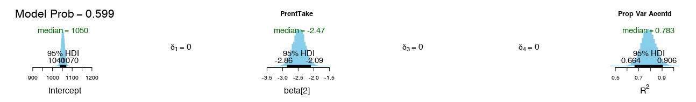
```
```{r, out.width = "400px", echo=FALSE}
knitr::include_graphics("images/Guber1999data-Jags-4X-VarSelect_C/Guber1999data-Jags-4X-VarSelect_C-PostPairs.png")
```

Definitely tending to favor models with smaller numbers of parameters.