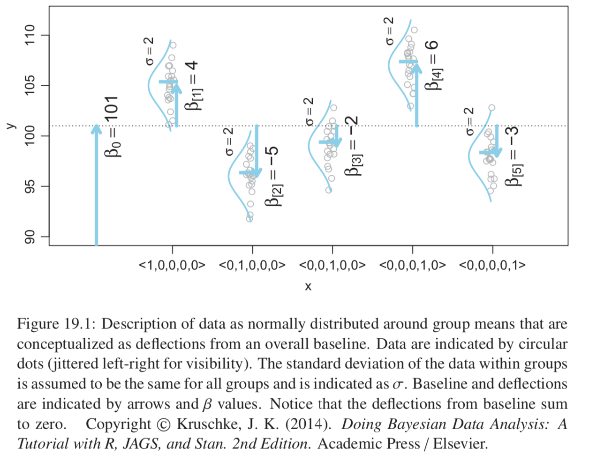
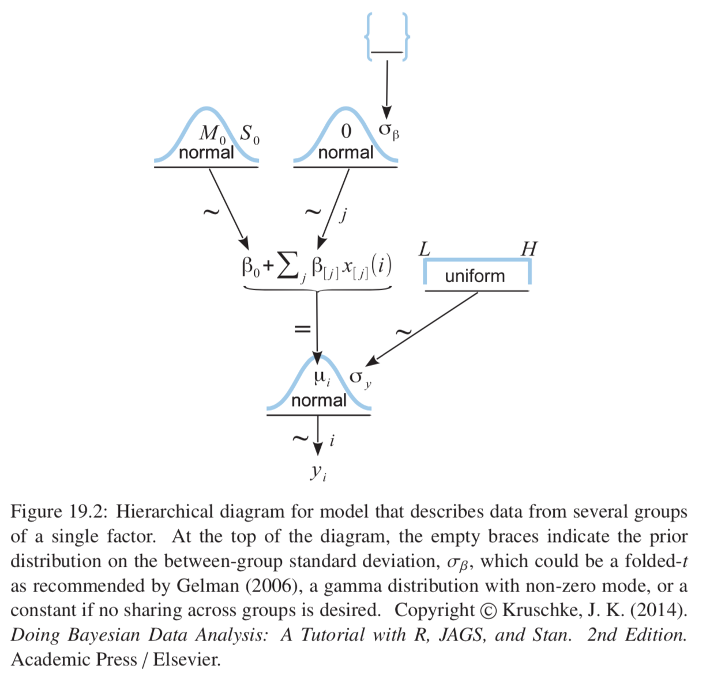
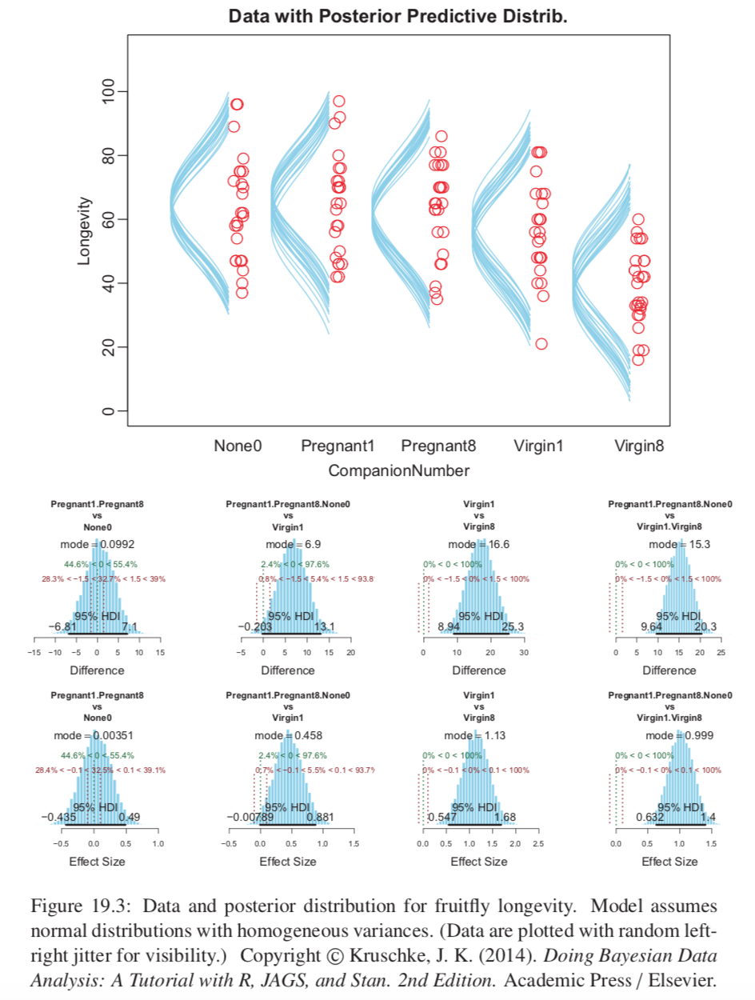
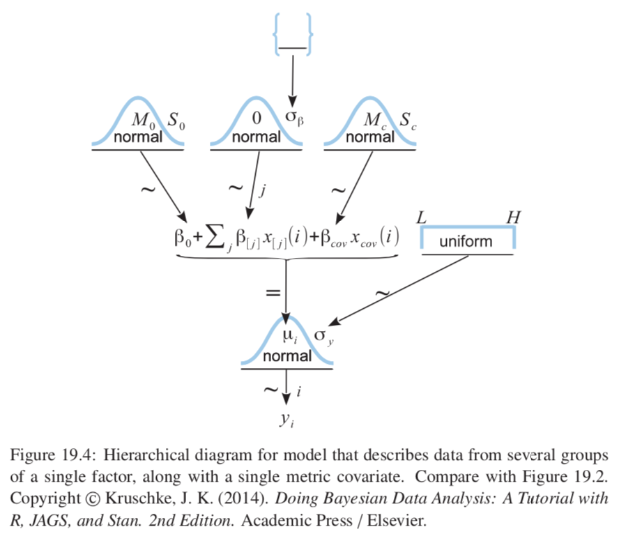
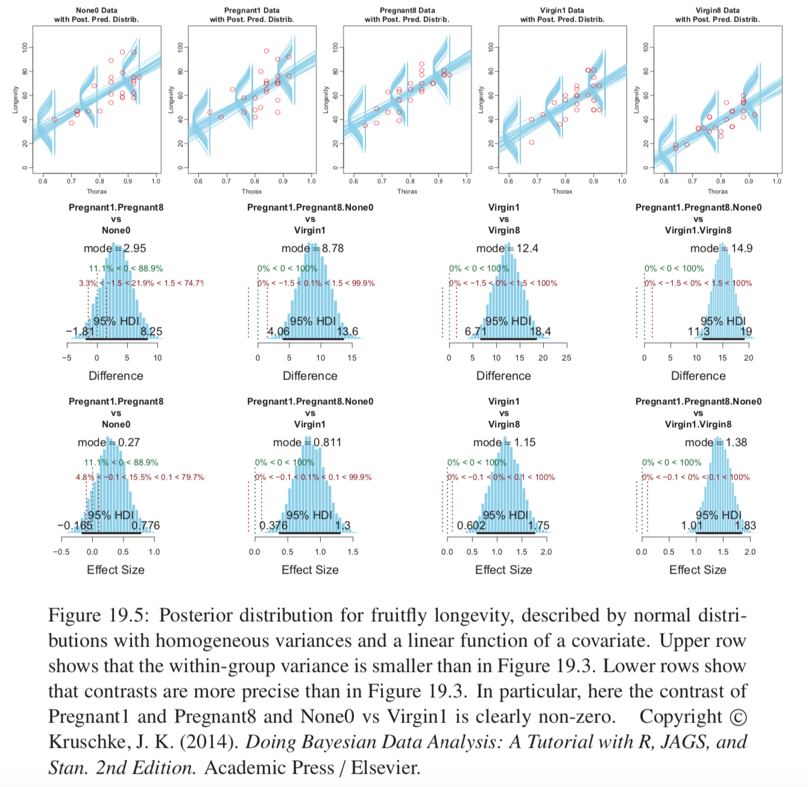
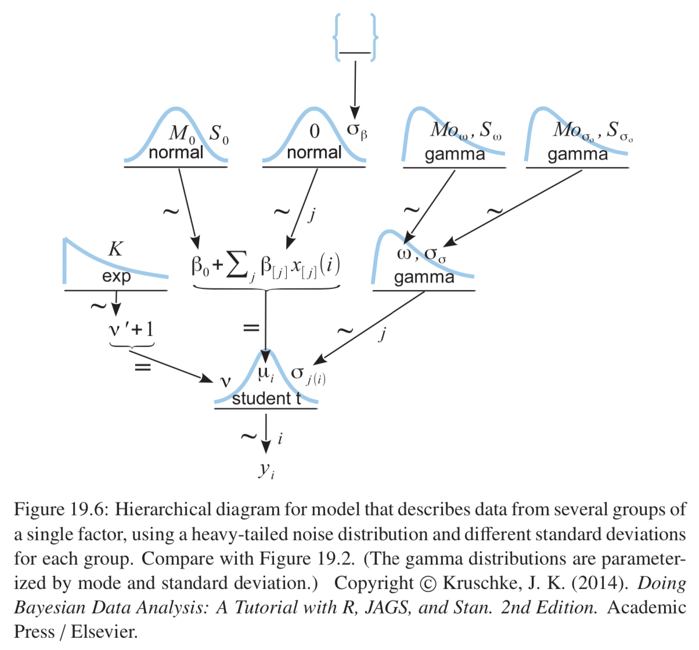
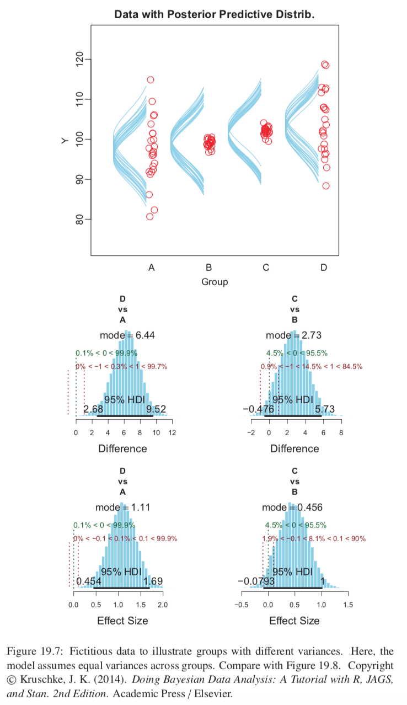
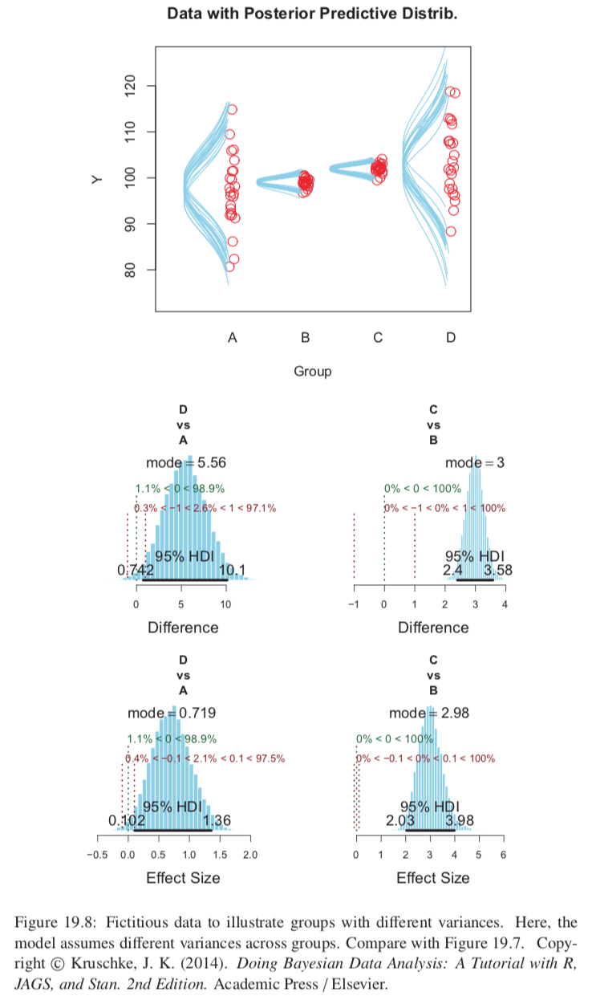

* Examples: monetary income from political party affiliation, skin response to categories of visual stimulus, life span from categories of sexual activity.
* Traditional treatment of this sort of data structure: ANOVA (single-factor analysis of variance).
* Bayesian approach is a hierarchical generalization of that
* When we have a metric covariate, that is called ANCOVA
* GLM context: normal noise, link function still identity

## 19.1 Describing Multiple Groups of Metric Data

* Each groups data are assumed to be described as random variation around a central tendency.
* The central tendencies of the groups are conceptualized as deflections from an overall baseline.
  + Overall baseline is the intercept $\beta_0$; for each nominal predictor $j$: $\sum_j \beta_{[j]} = 0$
  + Constraint implemented in JAGS in two steps:
    + Find jointy credible values of baseline and deflections without constraint
    + Enforce constraint through subtracting out the mean of the deflections from the deflections and add it to the baseline.
* Assumed normally distributed within groups, equal standard deviation in all groups

```{r, out.width = "400px", echo=FALSE}

```

## 19.2 Traditional Analysis of Variance

* Bayesian approach does not follow the mathematical partitioning of variances into between-group and within-group as ANOVA does.
* ANOVA assumes normally distributed within groups with same standard deviation for all groups (homogeneity of variance). Also assumes stopping intention is fixed sample size.
* Straightforward to relax these assumptions in Bayesian software.

## 19.3 Hierarchical Bayesian Approach

```{r, out.width = "400px", echo=FALSE}

```

* Prior on each $\beta_{[j]}$ is a normal distribution with mean 0 and standard deviation $\sigma_{\beta}$.
* $\sigma_{\beta}$ need not be fixed but may be estimated from the data if given it's own prior.
  + If fixed this causes each deflection to be estimated separately as no group has any influence on $\sigma_{\beta}$
  + $\sigma_{\beta}$ as a large constant gives results most analogous to ANOVA
  + Small $\sigma_{\beta}$ may impose strong shrinkage. When estimated the data dictate how much shrinkage to apply.
* In practice, when data sets are small (prior has more influence) even a folder-t prior on $\sigma_{\beta}$ can yield implosive shrinkage 
  + This happens when credible to set group deflections to 0 and use larger value for within-group noise $\sigma_y$
  + May want to accept this as the logically correct implication (if we are committed to this prior)
  + May alternatively adjust the prior if we really believe deflections of 0 are implausible for some reason, perhaps to a gamma prior.
* Can groups act as as prior information for each other?
  + We assume this at the moment, and yes it may be true.
  + However what if groups are dominated by a particular subtype?
  + Example: many control groups (different placebos, sham treatment, no treatment) and only one treatment group. Small variance between control groups will make estimate of $\sigma_{\beta}$ small, causing excessive shrinkage of the estimated deflection of the treatment group.
  + In this case groups do not mutually inform each other appropriately, so best to set $\sigma_{\beta}$ to a constant.

### 19.3.1 Implementation in JAGS

Novel bit is sum-to-zero constraint on the coefficients:

* a0: unconstrained baseline
* a[j]: unconstrained deflection of j
* b0: baseline
* b[j]: deflection of j
* x[i] has value j when the score for the i'th individual comes from the j'th group
* ySigma: $\sigma_y$ noise standard deviation
* aSigma: $\sigma_{\beta}$

data distribution
```{r}
"model {
  for (i in 1:Ntotal) {y[i] ~ dnorm(a0 + a[x[i]], 1/ySigma^2)}"
```

noise and intercept priors
```{r}
"ySigma ~ dunif(ySD/100, ySD*10)
 a0 ~ dnorm(yMean,1/(ySD*5)^2)"
```

use and define prior of $\sigma_{\beta}$
```{r}
"for (j in 1:NxLvl) {a[j] ~ dnorm(0.0, 1/aSigma^2)
 aSigma ~ dgamma(agammaShRa[1], agammaShRa[2])"
```

agammaShRa is to get shape and rate from mode (set to sd(y)/2) and standard deviation (2*sd(y)).

Convert to constrained quantities
```{r}
"for (j in 1:NxLvl) {m[j] <- a0 + a[j]}
 b0 <- mean(m[1:NxLvl])
 for (j in 1:NxLvl) {b[j] <- m[j] - b0}"
```

### 19.3.2 Example: Sex and death

```{r, out.width = "400px", echo=FALSE}

```

### 19.3.3 Contrasts

* Every step in the MCMC chain provides a combination of group means that are jointly credible, given the data. 
* Every step in the MCMC chain provides a credible difference between groups, for whatever difference we care to consider.
* __BB: this is still very different to re-grouping and re-running the analysis though, no?__
* At every step, compute $(\mu_1+\mu_2+\mu_3)/3 - (\mu_4+\mu_5)/2 = (+1/3)\beta_1 + (+1/3)\beta_2 + (+1/3)\beta_3 + (-1/2)\beta_4 + (-1/2)\beta_5$. Such a combination of weighted deflections is called a _contrast_.

Author specifies a contrast as a list with four components:
* vector of group names for first element of comparison
* vector of group names for second element
* comparison value (typically 0)
* ROPE limits

Can specify multiple contrasts as a list of lists.

Traditional ANOVA: omnibus test to ask if plausible that all groups simultaneously exactly equal. Not typically very useful as usually interested in more specific contrasts.

### 19.3.4 Multiple comparisons and shrinkage

* Modal values of posterior group means have range 23.2
* Sample means of the groups have range 26.1
* Therefore, there is some shrinkage in the estimated means.
* Shrinkage dictated only by the data and the prior structure, not the intended tests.

### 19.3.5 The two-group case

If top-level prior is broad and only two groups then virtually no shrinkage.
For two groups more appropriate to use model of Section 16.3; hierarchical structure not the best for this

## 19.4 Including a Metric Predictor

If we can explain some of the within-group variance, it will help us detect differences between-groups with less uncertainty.
Mathematically the nominal and metric predictors have equal status in the model.

```{r, out.width = "400px", echo=FALSE}

```

* $\beta_0$ playing double duty as baseline and intercept. Need to recenter $x_{cov}$ on its mean.
* Can still then respect the sum to zero constraint.

### 19.4.1 Example: Sex, death, and size

Larger fruit flies live longer.

```{r, out.width = "400px", echo=FALSE}

```

* Within-group noise standard deviation is smaller compared to preevious analysis.
* HDI widths of all contrasts have gotten smaller.

### 19.4.2 Analogous to traditional ANCOVA

Assume equal slope in all groups; should test this.

### 19.4.3 Relation to hierarchical linear regression

* Similar to section 17.3. Figure 17.5 similar to Figure 19.5.
* Main structural difference is slope coefficients on the metric predictor. In 17.3 each individual has its own distinct slope, but slopes of different individuals mutually informed each other via a higher-level distribution. In 19.5 all groups have the same slope on the metric predictor.
* Compare hierarchical diagrams.
* Mostly difference is merely focus of attention.

```{r, out.width = "400px", echo=FALSE}
#knitr::include_graphics("images/dbda_fig17_6.png")
```
```{r, out.width = "400px", echo=FALSE}

```

## 19.5 Heterogeneous variances and robustness against outliers

* Use t distributed noise instead of normal distributions
* Give each group its own standard-deviation parameter
* Put a hierarchical prior on the standard-deviation parameters, so each group mutually informs the others via the higher level distribution.

```{r, out.width = "400px", echo=FALSE}

```

Main novelty to think about: constants for top level gamma priors. Make broad based on scale of data.

### 19.5.1 Example: contrast of means with different variances

```{r, out.width = "400px", echo=FALSE}

```
```{r, out.width = "400px", echo=FALSE}

```

Can also now investigate differences in scales across groups; can create contrasts for say $\sigma_1 - \sigma_2$

## 19.6 Exercises