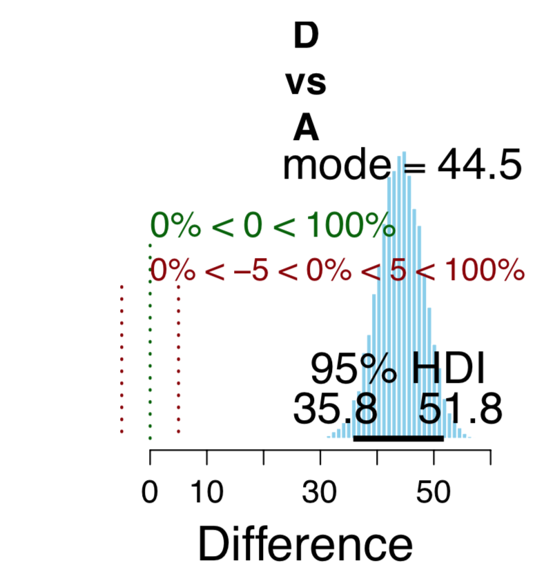
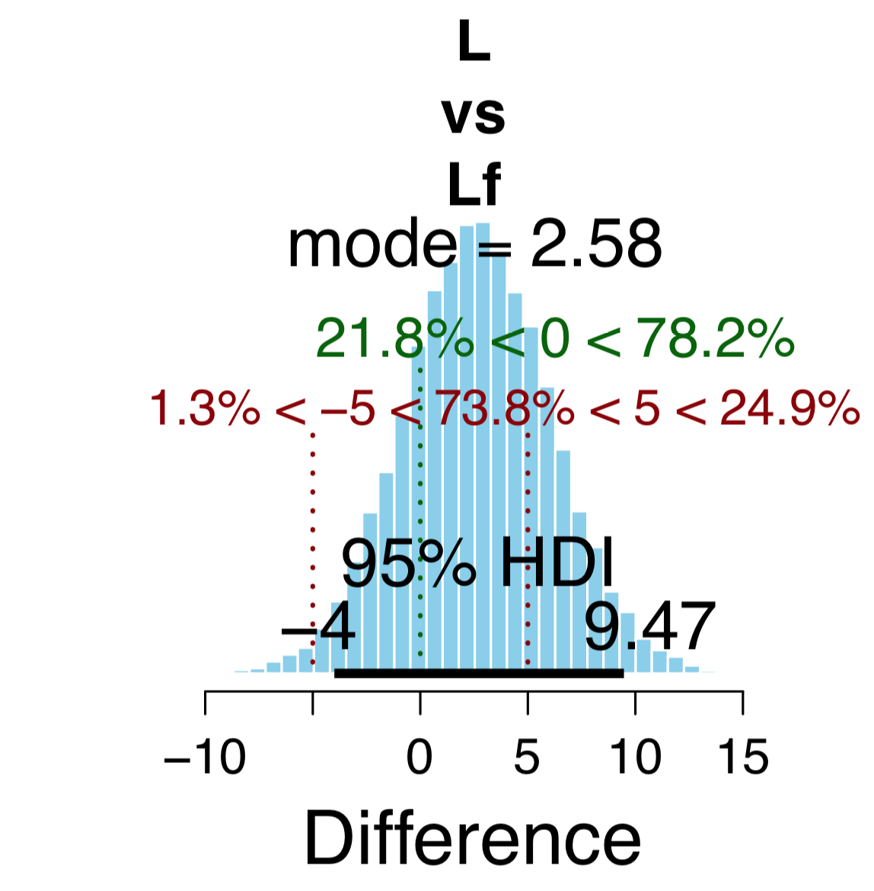
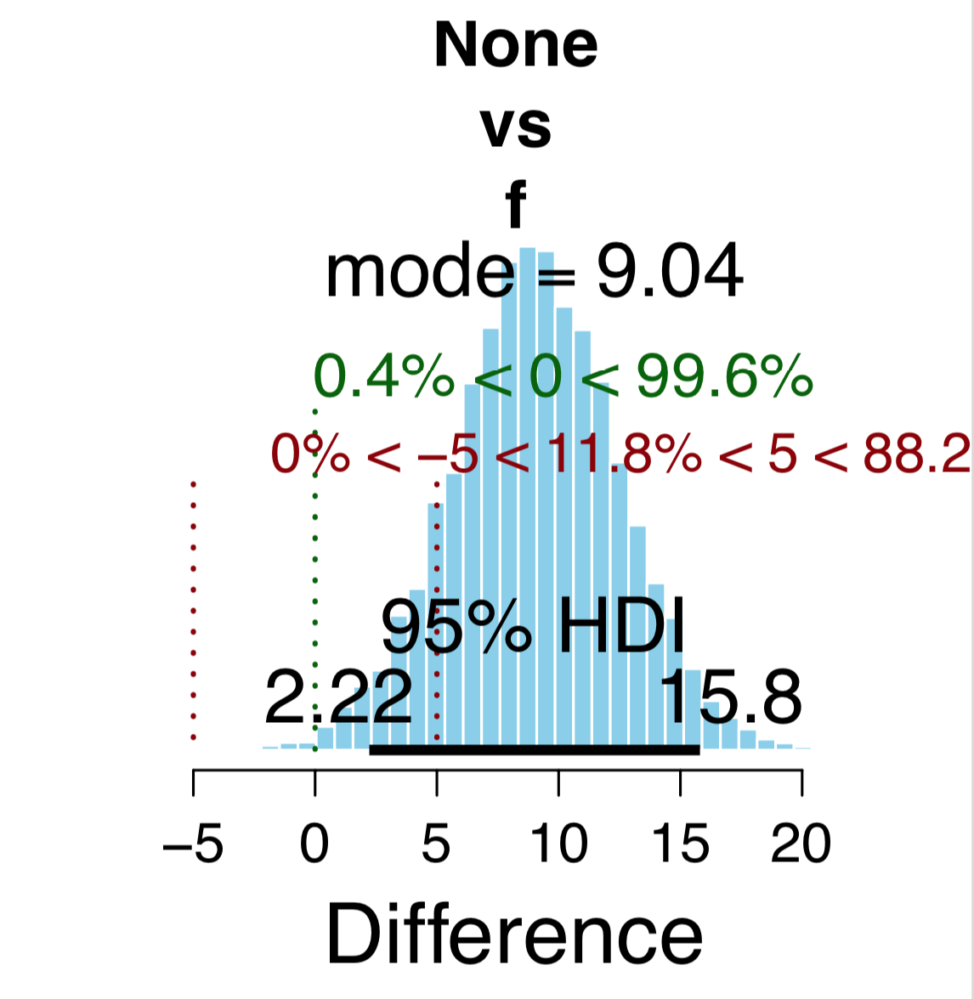
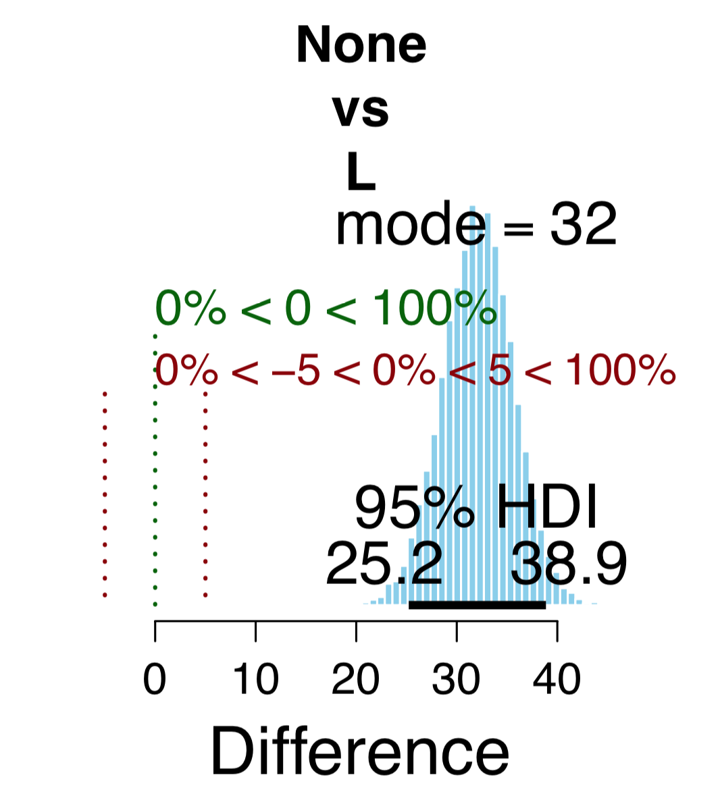
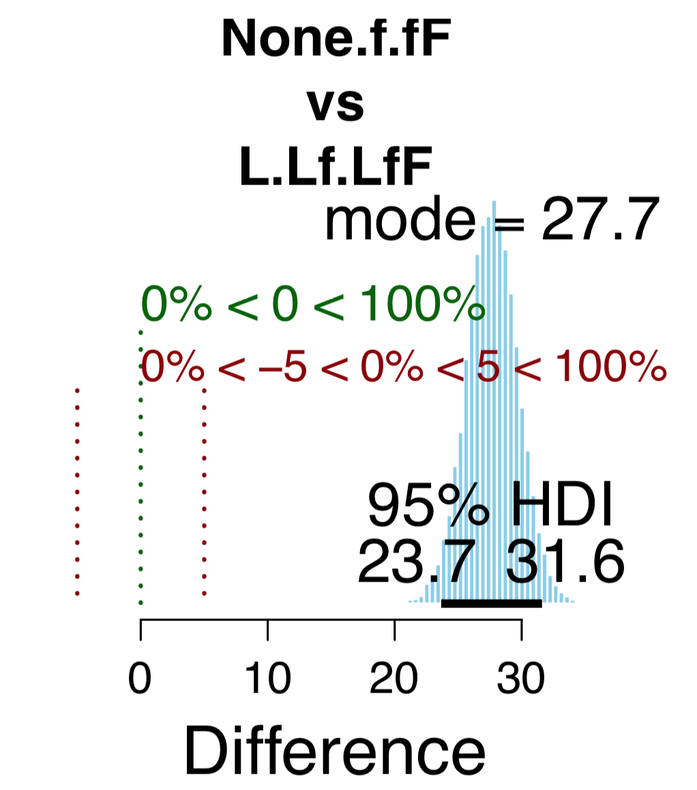
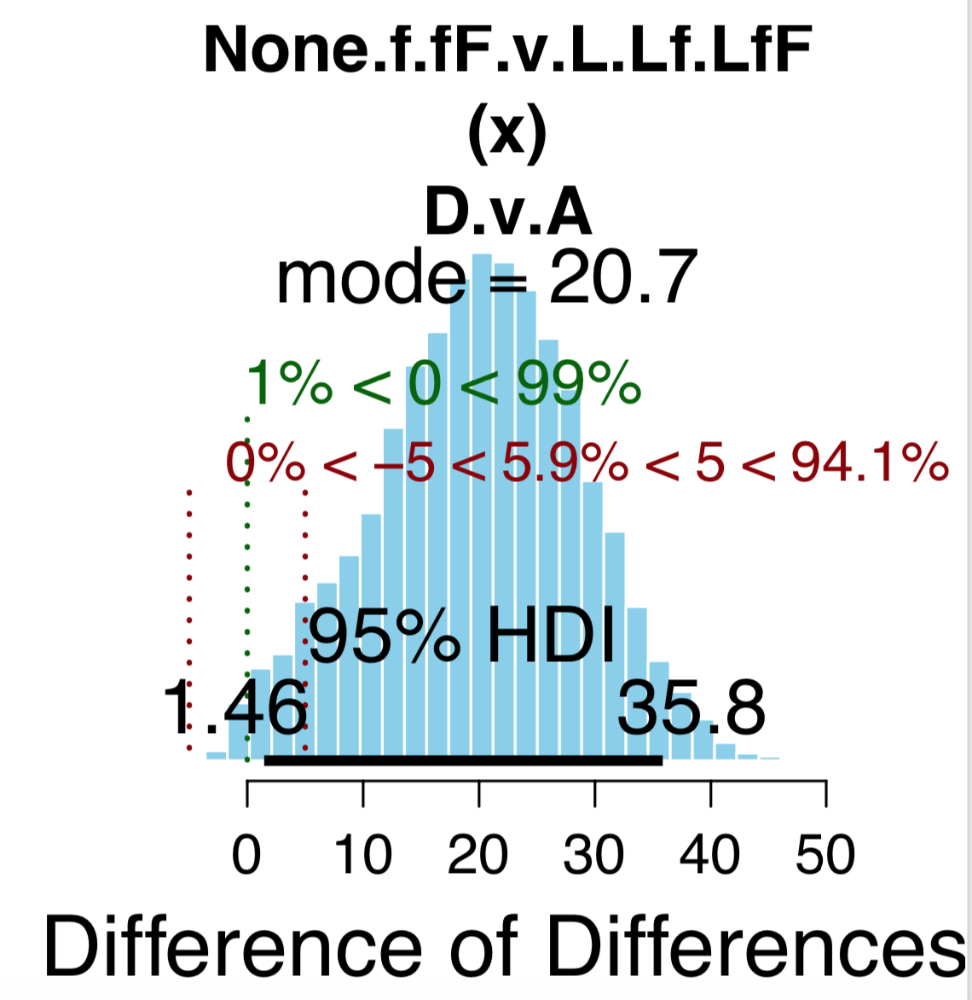
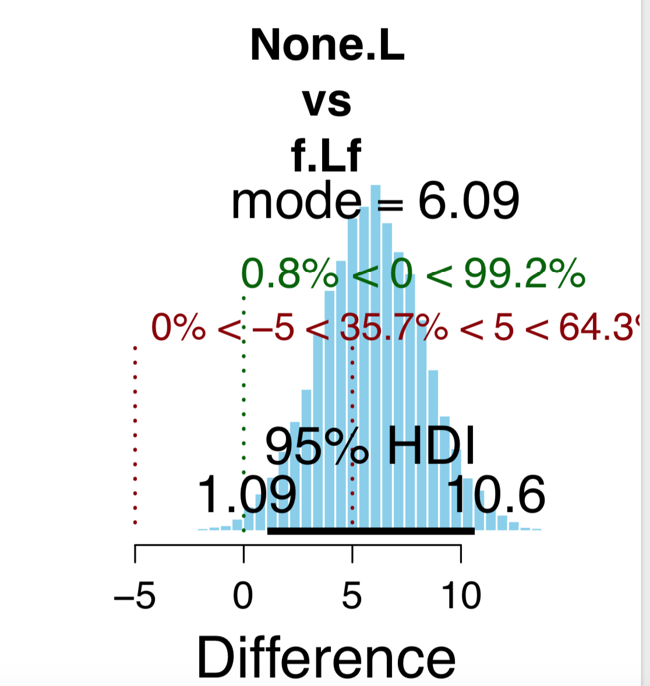
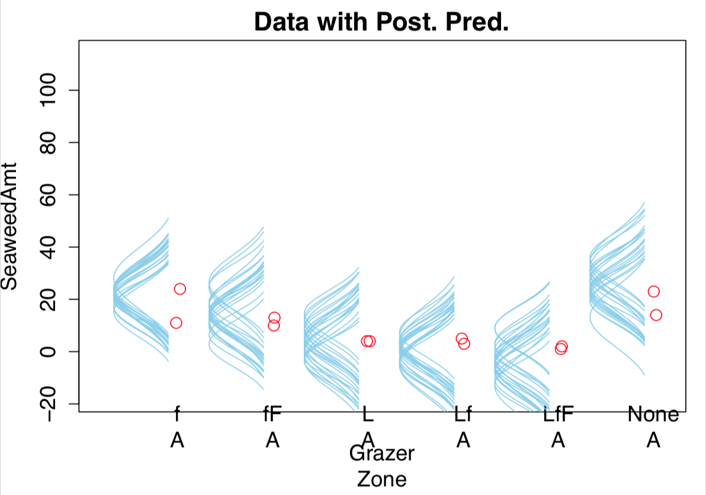
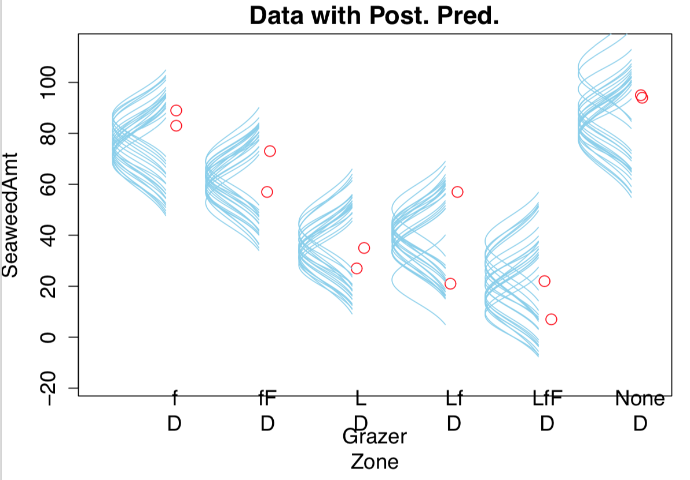

Example:

* Predict income from political party and religious affiliations
* Predict galvanic skin response to different combinations of categories of visual stimulus and auditory stimulus.

Traditional treatment: multifactor ANOVA
Our Bayesian approach will be a hierarchical generalization of traditional ANOVA

## 20.1 Describing groups of metric data with multiple nominal predictors

* j'th level of first predictor denoted $x_{1[j]}$
* Deflections within factors and within interactions are constrained to sum to zero:
  + $\sum_j\beta_{1[j]} = 0$, $\sum_k\beta_{1[k]} = 0$, $\sum_j\beta_{1 \times 2[j,k]} = 0$ for all k, $\sum_k\beta_{1 \times 2[j,k]} = 0$ for all j.

### 20.1.1 Interaction

* Nonadditive influence of factors left over once main effects are added. Happens when effect of one predictor depeonds on the level of another.
* Average effects of the factors sometimes called the main effects.
* Work out deflections from cell means and marginal means
  + cell means $m_{1\times2[j,k]}$ correspond to the heights of the bars in figure 20.1
  + marginal mean is simple average e.g. $m_{1[1]} = (1/K)\sum_k m_{1\times2[1,k]}$
    + __BB: not weighted by number of data points, is this a problem?__
* Simple effect is deflection from baseline for a predictor at a fixed level of the other predictor.
* When there is interaction, the simple effects do not equal the main effect.

### 20.1.2 Traditional ANOVA

* Remember key assumptions:
  + data normally distributed within groups
  + standard deviation of the data within each group is the same for all groups (homogeneity of variance)

## 20.2 Hierarchical Bayesian Approach

Top-level distributions apply separately for different predictors and interactions. Prior assumptions: 

  * magnitude of the effect of one predictor might not be very informative of the magnitude of effect of a different predictor; 
  * but within a predictor the magnitude of deflection produced by one level may inform the magnitude of deflection produced by other levels. 

### 20.2.1 Implementation in JAGS

### 20.2.2 Example: It's only money

* Salary based on academic department and rank of the professor.
* Predictions still made for cells with no data.

### 20.2.3 Main effect contrasts

* Comparing particular levels with each other (e.g. chemistry with psychology). Main effect contrasts such as this involve levels of a single factor and collapse across other factors.

### 20.2.4 Interaction contrasts and simple effects

* For asking questions about how much a difference between levels depends on the levels of the other predictor.
* Simple comparisons: differences between levels of one factor within a single level of another factor (difference between full and assistant for psychology)
* Interaction contrast: difference of differences in the simple comparisons (the extra more made when going from assistant to full in chemistry compared to psychology)

#### 20.2.4.1 Interaction effects: high uncertainty and shrinkage

* Typically much more uncertain.
* 5 levels of seniority times 60 departments = 300 interaction deflections; all assumed to come from a higher-level distribution with an estimated standard deviation $\sigma_{\beta1\times2}$; chances are most of them will be small so therefore estimated deflections will themselves be shrunken towards 0.
  + Not inherently good or bad; correct consequence of model assumptions.
  + Exists possibility however that it inappropriately obscures meaningful interactions.
  + Always option to consider setting $\sigma_{\beta1\times2}$ to constant if that would seem more appropriate
* __BB: Different amount of shrinkage possibly if comparing different numbers of levels of variables, so therefore our results are dependant on what we set out to test, which Krushke spent so long complaining about with traditional analysis?__

## 20.3 Rescaling can change interactions, homogeneity, and normality

* An interaction means non-additive effects _on the current scale_. If the data are nonlinearly transformed to a different scale, then the non-additivity can also change!
* Changing from looking at absolute changes to percentage changes would be a common such shift in scale; the data transformation would be a log transform.
* Tranforming the data changes the variances too (compare variance of dataset 1 (100,110,120) with dataset 2 (1000,1010,1020); now consider the vqriances of the log-transformed datasets; whether we have homogeneity of variance changes!)
* No rescaling can undo a crossover interaction.

## 20.4 Heterogeneous variances and robustness against outliers

* Same as what we did in chapter 19
* Let each cell have its own $\sigma_{[j,k]}$ parameter instead of constant $\sigma_\gamma$ parameter.
* Lets also use that t distribution instead of a normal distribution to cope with outliers.
* Model can now prefer to shrink interaction deflections and use large cell standard deviations to accomodate off-center data.
* Interaction contrasts reduced once we do this.
* Homogeneous variance model fails to represent obviously different variances of each cell but heterogenous variance model seems too eager to forego interactions in favor of increased within-cell variances.
* In principle could put them both under a higher level indexical parameter and do Bayesian model comparison, but posterior probabilities of the model indices might be overly sensitive to the arbitrary vagueness of the priors.
* We might also want to describe the data within each cell as a skewed distribution such as  Weibull.
* We might also only want to allow different variances for different seniorities but not for different departments. 
* Strength of Bayesian approach is that it is flexible and we can do such things easily.

## 20.5 Within-subject designs

In many situations, a single subject (person, device, ...) contributes data to multiple levels of the predictors (each subject tested in different ways; the levels of the predictors change within subjects, so this is called within-subject design). Often the case that we have repeated measures for the same subject, and maybe also for the same subject and the same combination of levels. In the professor salary example there are different people in every cell of the design, so the levels of the predictors change across or between subjects (between-subject design).

Within-subject = multiple conditions applied within a subject.

We can merely add subject as another nominal predictor in the model, so long as every subject contributes many measurements to every cell. Each individual subject as a level of the predictor.

What about if each subject contributes only one datum to a cell? If have subject predictor and all the interaction predictors then have only a single datum in every cell so whole thing breaks down. So now consider a simpler model in which the only influence of subjects is a main effect. In this model _the subject effect (deflection) is constant across treatments, and the treatment effects (deflections) are constant across subjects_.

### 20.5.1 Why use a within-subject design? And why not?

* Can achieve greater prevision in the estimates of effects.
* Sometimes in measuring the subject you change the subject (they get better or worse at whatever you're measuring about them)
* Differential carryover effect. Might affect not only the thing you just measured for that subject but a different predictor you might want to measure next too.

### 20.5.2 Split-plot design

* Very important in industrial experiments. Also common in psychology and in agriculture (where name comes from)
* Example:
  + Agricultural experiment in productivity of different soil tilling methods and different fertilizers.
  + Can provide each farmer with every fertilizer but not with every tilling method
  + Any particular farmer will use a single randomly assigned tilling method on his whole plot, and tilling methods will differ between whole plots.
  + Each farmer will split his field into subplots and apply all the fertilizers to different (randomly assigned) split plotsk and fertilizers will differ across split plots within the whole plot.
  + The generic experiment-design term for the farmer's field is __"block"__. The factor that varies within every field is called the __within-block factor__ and the factor that varies between fields is called the __between-block factor__.
* Each human subject is analogous to a block; each subject experiences a single level of the between-block factors but may experience all levels of the factors that vary within blocks.
* Block == subject.
* The basic split-plot design assumes a single datum per cell.

#### 20.5.2.1 Example: knee high by the forth of July

agriculture tilling fertilizer example plots

#### 20.5.2.2 The desciptive model

* In classical ANOVA-style split-plot, the overall variance is conceptually decomposed into 5 components:
  + main effect of the between-subjects factor
  + main effect of the within-subjects factor
  + the interecation of the two factors
  + the effect of subject within levels of the between-subject factor
  + the interaction of the subject with the within-subject factor
* Only a single datum per cell, so the five components exactly match the data, so as many parameters as data points. Classical approach is therefore to treat the final component as noise.
* This chapter does the same for Bayesian analysis; with mathematical details to justify and explain, defines notation, and converts to sum-to-zero deflections which are then used in JAGS implementation.

Notation:
* $B[i]$ as the ith level of the between-subject factor
* $W[j]$ as the jth level of the within-subject factor
* $S|B[k|i]$ is subject k in level i of the between-subject factor, which has $K|i$ subjects.
  + Subject $S|B[k|i]$ is in all levels of factor W and in one level (i) of factor B.
* Single datum is denoted $\gamma_{B \times W \times S|B[i,j,k|i]}$

Then shows simple mathematical derivation of means and deflections based on the above. Remember that we are going to end up treating $\beta_{W \times S|B[j,k|i]}$ (interaction between the subject and the within-subject factor) as noise.

#### 20.5.2.4 Implementation in JAGS

#### 20.5.2.4 Results

More powerful estimates of between-subject effects because traditional NHST uses different and larger denominator-error terms when computing F ratios for between-subject effects than for within-subject effects __BB: why does it do this? Maybe there's good reason that we're not applying here?__ Bayesian estimation simply finds parameter values that are jointly credible given the data.

Greater precision is no joke; compare figure 20.10 to figure 20.12.

## 20.6 Model Comparison Approach

Omnibus test in ANOVE discussed in section 19.3.3

If really want to work out if nonzero deflection somewhere can do it with a factor-iclusion paramter, analogously to predictor-inclusion parameters for variable selection in multiple linear regression (chapter 18).

Inclusion parameters range from 0 (not included at all and doesn't cause deflection) to 1 (full inclusion and deflection).

## 20.7 Exercises

### Exercise 20.1 Using a novel data file and specifying meaningful contrasts.

```{r, eval=FALSE, message=FALSE, warning=FALSE, results=FALSE}
setwd("./DBDA2Eprograms")
source("DBDA2E-utilities.R") # Load definitions of graphics functions etc.
source("Jags-Ymet-Xnom2fac-MnormalHom-Example.R")
```

```{r, out.width = "400px", echo=FALSE}

```
```{r, out.width = "400px", echo=FALSE}

```
```{r, out.width = "400px", echo=FALSE}

```
```{r, out.width = "400px", echo=FALSE}

```
```{r, out.width = "400px", echo=FALSE}

```
```{r, out.width = "400px", echo=FALSE}

```
```{r, out.width = "400px", echo=FALSE}

```
```{r, out.width = "400px", echo=FALSE}

```
```{r, out.width = "400px", echo=FALSE}

```

Heterogeneous variance model wouldn't work because only two data points in each cell so if happen to be close together then that gets interpreted as very low variance vs if they happen to be far apart; whole model becomes more suceptible to noise, and also model starts to use larger standard deviations to shrink interaction deflections which isn't necessarily desirable as there is likely to be meaningful interaction here.