## 21.1. Multiple Metric Predictors

* Looked at this in earlier chapters but now have the framework of the generalized linear model.
* Traditional treatment of these sorts of data structure is "logistic regression"
* Easy in Bayesian to generalize so:
  + robust to outliers
  + allow different variances within levels of a nominal predictor
  + have hierarchical structure to share information across levels or factors as appropriate
* Inverse-link function is logistic
* Bernoulli distribution for describing noise in the data

```{r, out.width = "400px", echo=FALSE}
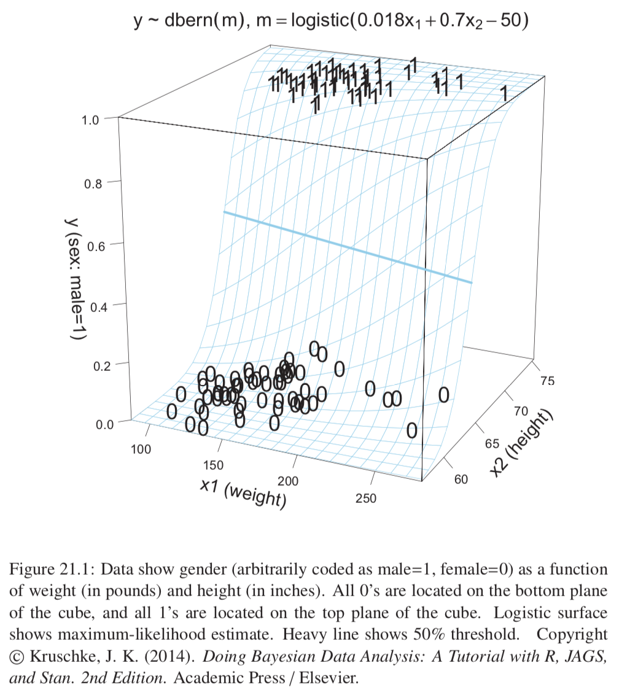
```
```{r, out.width = "400px", echo=FALSE}
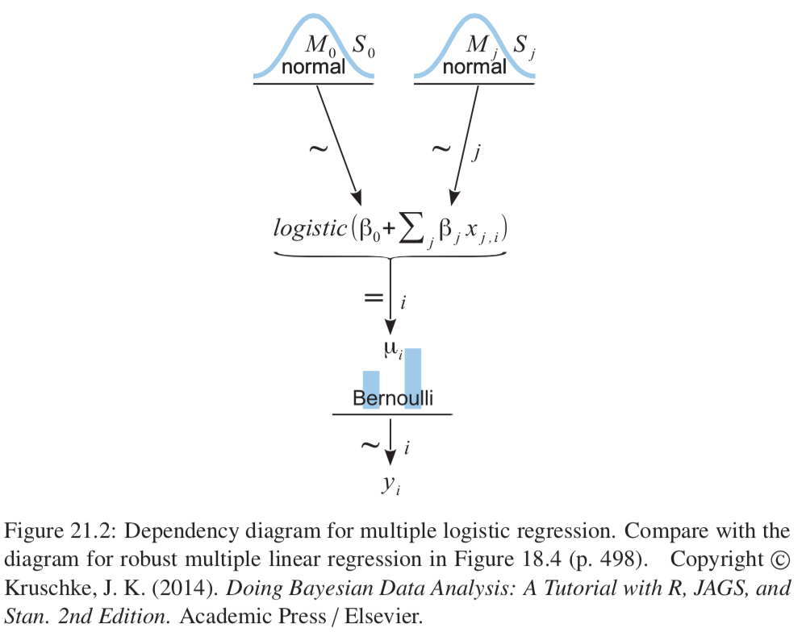
```

### 21.1.1. The model and implementation in JAGS

$$\mu = logistic(\beta_0 + \beta_1 x_1 + \beta_2 x_2)$$
$$y \sim Bernoulli(\mu) $$
$$logistic(x) = \frac{1}{1+e^{-x}}$$

Preliminary details:

* We will try to reduce autocorrelation in the MCMC chains by standardizing the data; helps efficiency of MCMC
* y values must be 0s and 1s and therefore not standardized.
* In JAGS logistic function is called ilogit (inverse logit)

### 21.1.2. Example: height, weight, and gender

Weight coefficient less important once height included. Most of the predictive work done by height, weight and height are correlated, so independent predictiveness of weight is small once height included.

```{r, out.width = "400px", echo=FALSE}
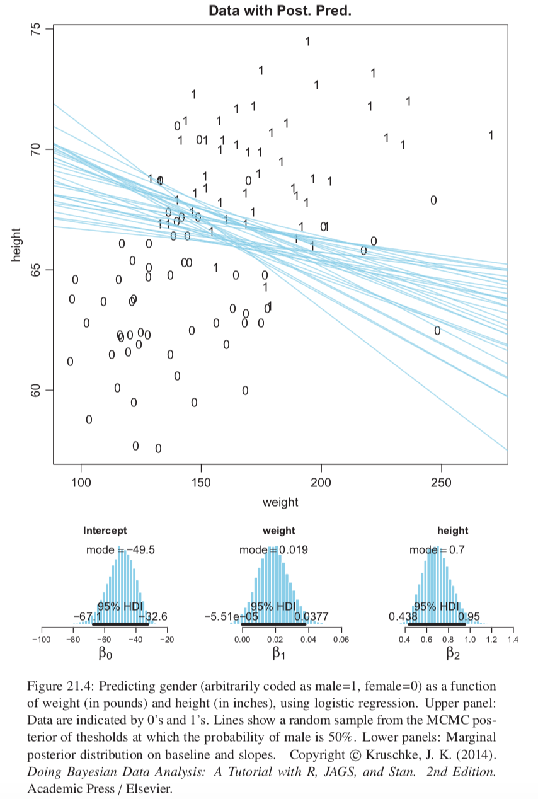
```

## 21.2. Interpreting the Regression Coefficients

### 21.2.1. Log odds

* $logit(\mu)=\beta_0 + \beta_1 x_1 + \beta_2 x_2$ implies that when $x_1$ goes up by 1 unit then $logit(\mu)$ goes up by amount $\beta_1$. The regression coefficients are telling us about increases in $logit(\mu)$.
* $logit(\mu) = log(\mu / (1-\mu))$
* $\mu$ is the probability that $\gamma=1$.
* So: $logit(\mu) = logit(p(\gamma = 1)) = log(p(\gamma=1)/p(\gamma=0))$ which is the log odds of outcome 1 to outcome 2.
* A log odds of 0 indicates a 50% chance. A coefficient value then indicates how much the log odds increases if the variable increases by 1 unit. So you get most change in the probability when the probability is already close to 50%.
* A regression coefficient of 1.0 corresponds to a rate of probability change of about 24.4 percentage points per x-unit at the threshold x value.

### 21.2.2. When there are few 1s or 0s in the data

Makes coefficient estimates more uncertain.
```{r, out.width = "400px", echo=FALSE}
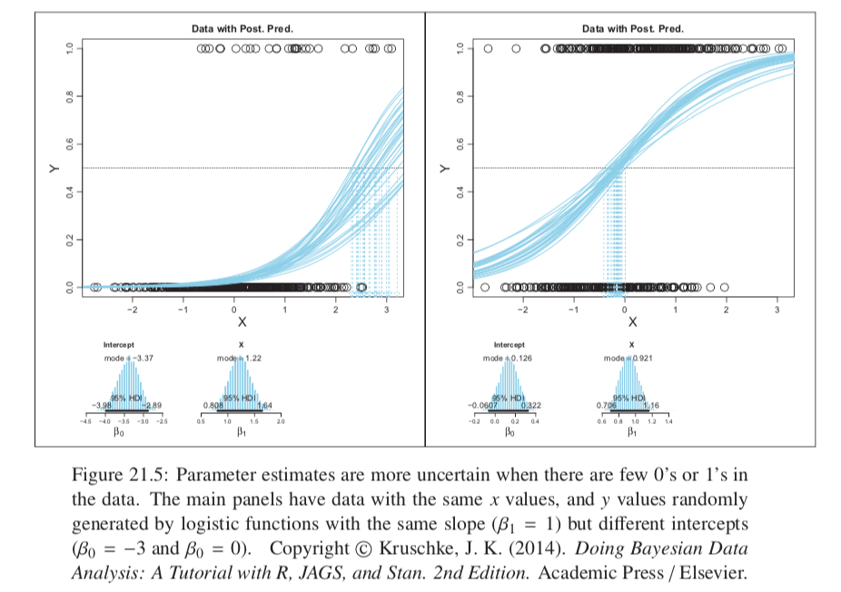
```

### 21.2.3. Correlated predictors

* Get very ambiguous threshold lines (see Figure 21.6), and anticorrelation of credible $\beta$ values.
* As with linear regression, very important to consider the correlations of predictors when interpreting the parameters of logistic regression.

```{r, out.width = "400px", echo=FALSE}
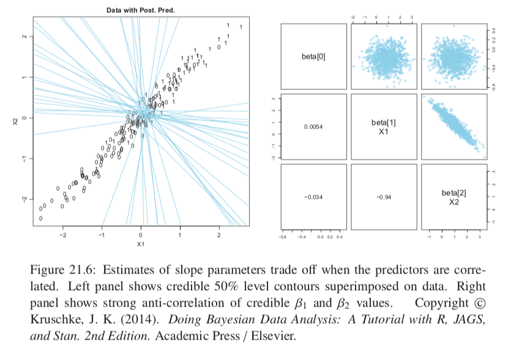
```

### 21.2.4. Interaction of metric predictors

* Might be the case that additive combinations of predictors not very accurate.
* See figure 21.7
* When no interaction the 50% level contour is always straight; with an interaction it can be curved.
* __Remember that when using an interaction term the regression coefficients on individual predictors only indicate the slope when all other predictors are set to 0 (analogously to linear regression).__

```{r, out.width = "400px", echo=FALSE}
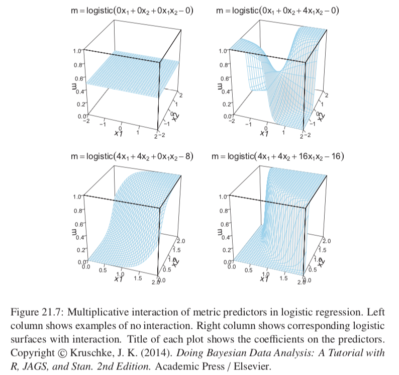
```

## 21.3. Robust Logistic Regression

* Outliers relative to the logistic function can only be accomodated by reducing the magnitude of the estimated slope.
* We can describe the data as being a mixture of two different sources:
  + the logistic function of the predictors
  + randomness
* We suppose that every data point has a small chance $\alpha$ of being generated by the guessing process but usually (with probability $1 - \alpha$) the $\gamma$ value comes from the logistic function of the predictor.
* The predicted probability that $\gamma = 1$ is $\mu = \alpha \frac{1}{2} + (1-\alpha)logistic(\beta_0 + \sum(\beta_j x_j))$
  + When guessing coefficient is 0 then get conventional logistic model. When guessing coefficient is 1 then get completely random data values.
* We need to estimate $\alpha$ as well as the logistic parameters, so lets also have a prior on $\alpha$.
* This ends up looking like curves that asymptote at 0.1 and 0.9 instead of 0 and 1 for example.
* There are other ways to model outliers (see chapter 23 exercise 23.2)

```{r, out.width = "400px", echo=FALSE}
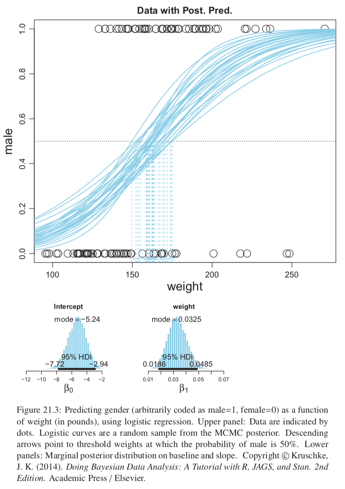
```
```{r, out.width = "400px", echo=FALSE}
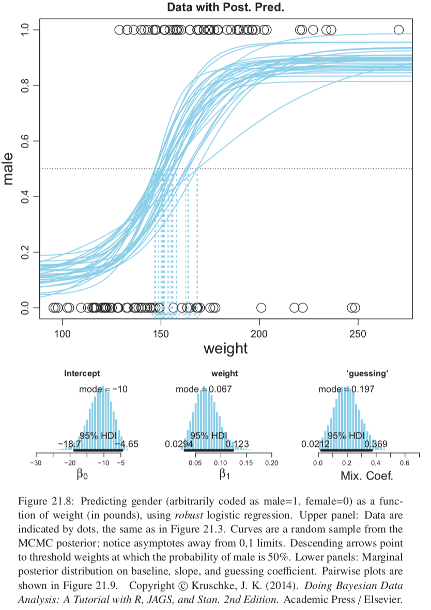
```

## 21.4. Nominal Predictors

### 21.4.1. Single group

$y \sim Bernoulli(\mu)$, $\mu = logistic(\beta_0)$, with prior $\beta_0 \sim normal(M_0,S_0)$; example is working out the bias of a coin by observing flips.

Non-intuitive mapping of how this prior looks in terms of a distribution on $\mu$

```{r, out.width = "400px", echo=FALSE}
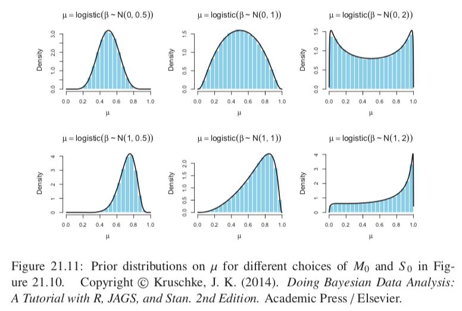
```

### 21.4.2 Multiple groups

* Baseball example

```{r, out.width = "400px", echo=FALSE}
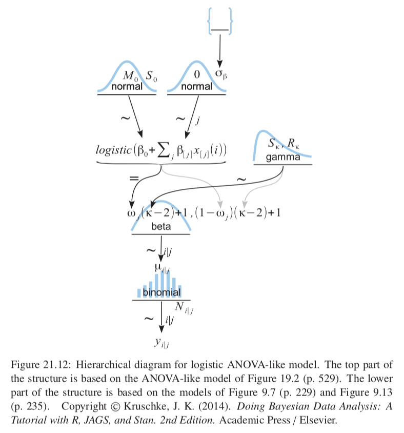
```
```{r, out.width = "400px", echo=FALSE}
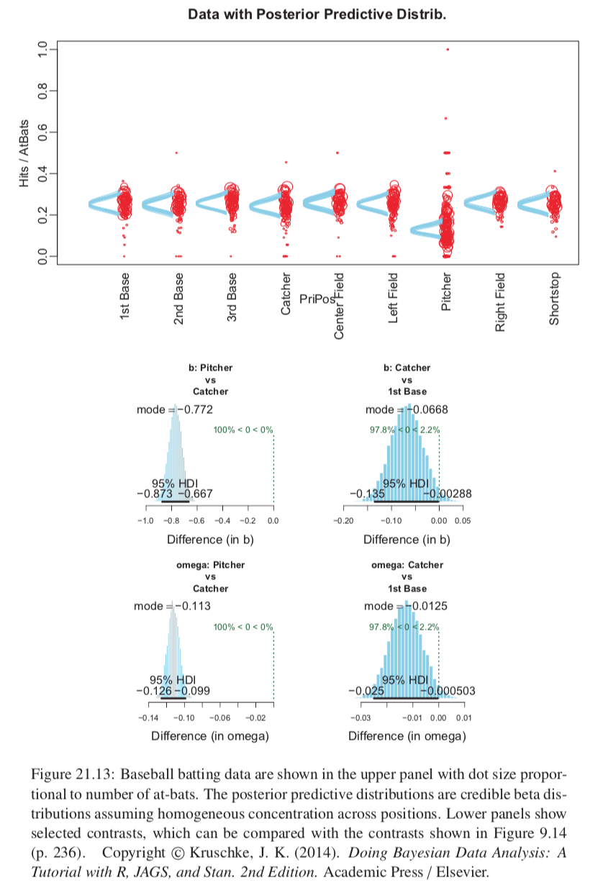
```

## 21.5 Exercises