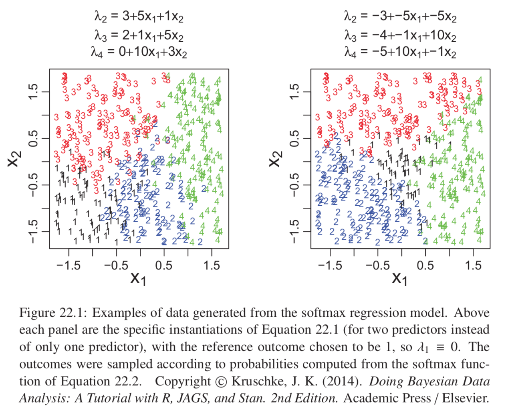
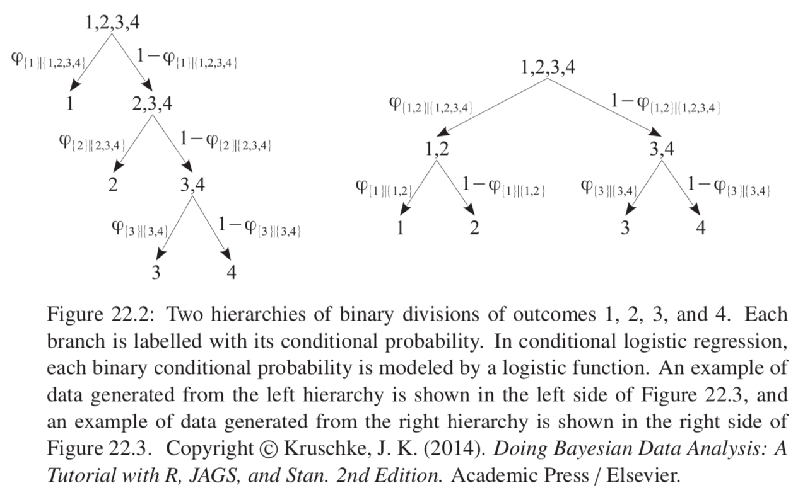
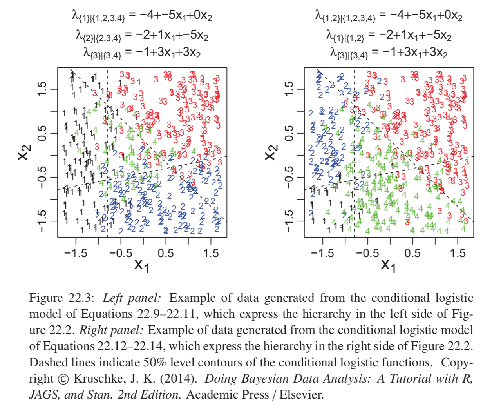
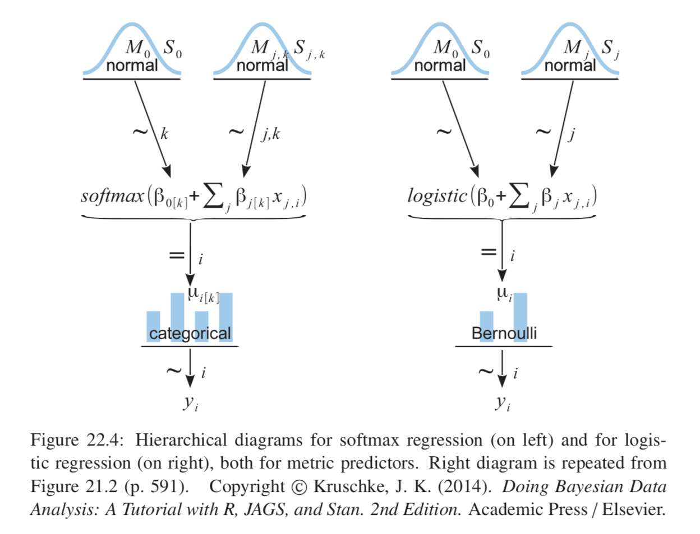
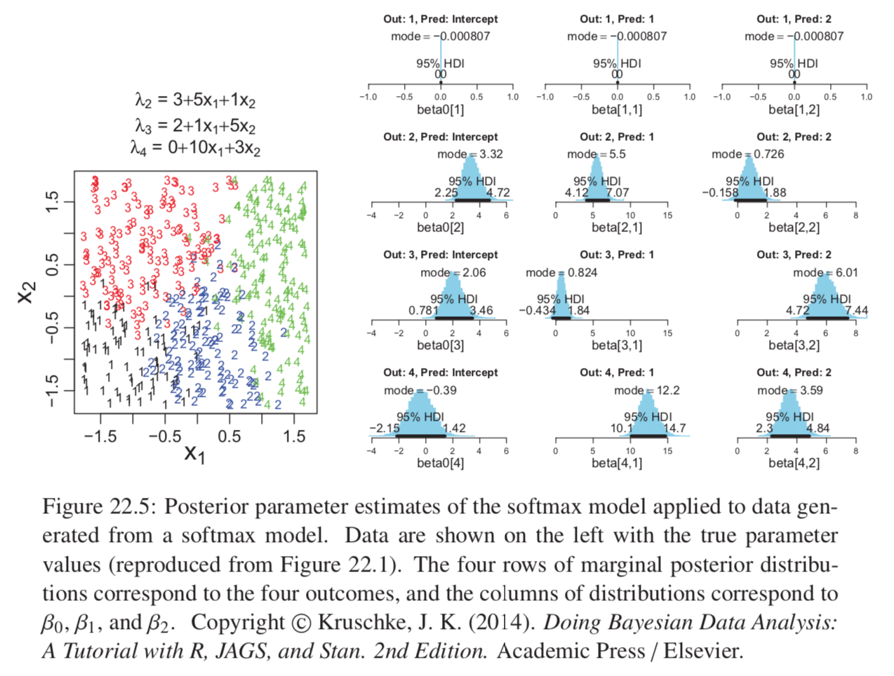
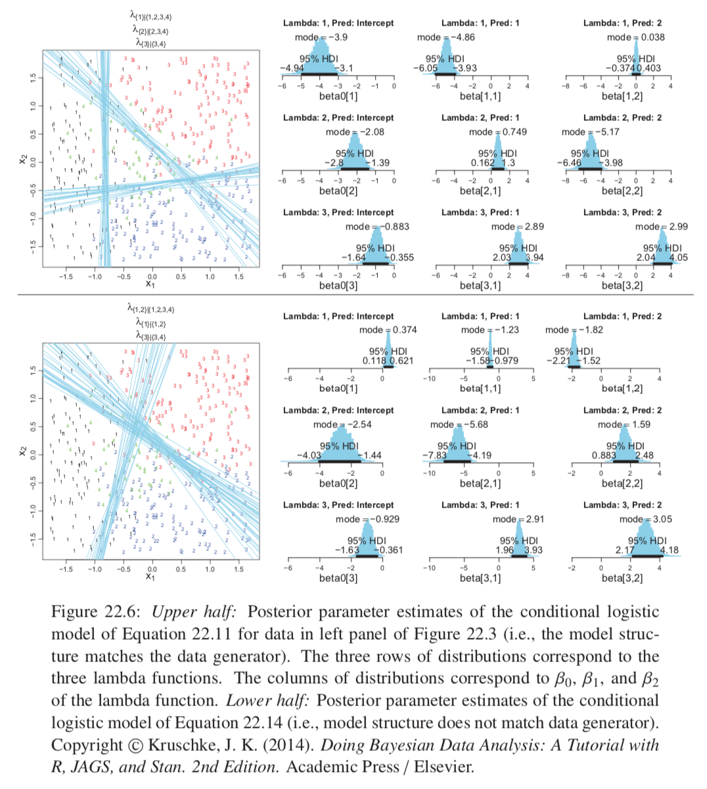
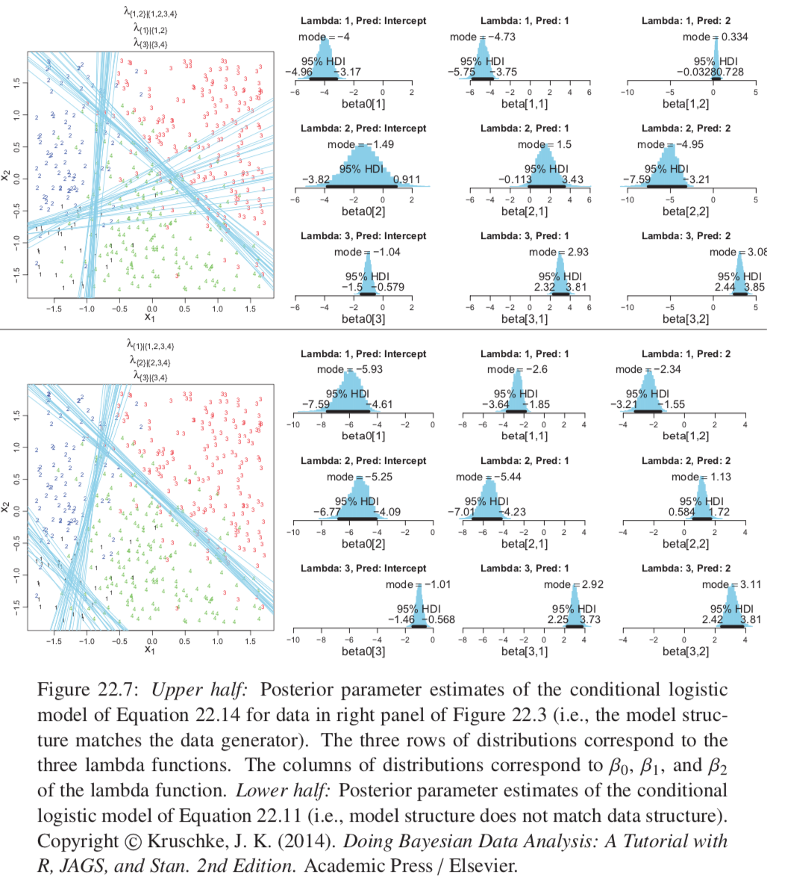
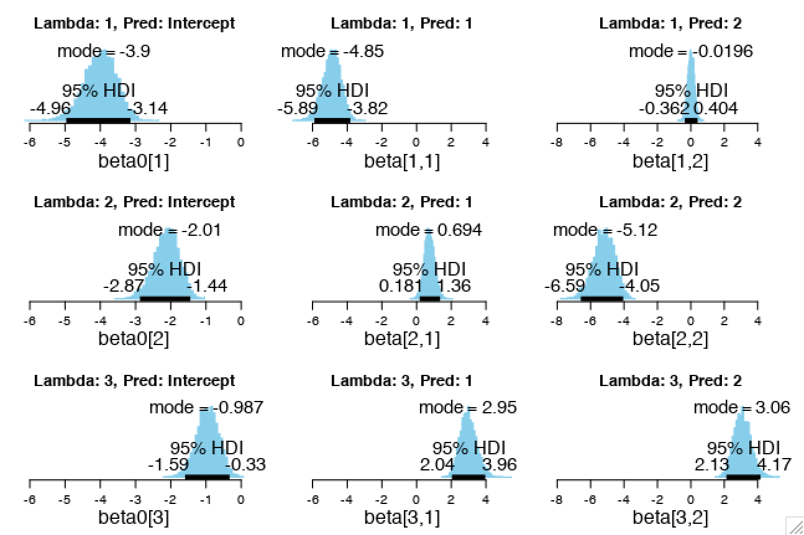

* Dicotomous generalized to when predicted variable has three or more categorical values.
* Traditional treatment: multinomial logistic regression
* Context of GLM
  + Link function is the softmax
  + Categorical distribution for describing noise in data

## 22.1 Softmax Regression

* Two usual types of generalization:
  + __Conditional logistic regression__ (later in the chapter)
  + Multinomial logistic regression (this section). We refer to this method as __softmax regression__ because logistic is a misnomer as doesn't use the logistic function per se, also all the models in this chapter describe multinomial data so multinomial isn't informative.

Suppose we have a single metric predictor $x$. Underlying linear propensity of outcome k is denoted $\lambda_k = \beta_{0,k} + \beta_{1,k}x$. The probability of outcome k is then given by:
$$\phi_k = softmax_S(\{\lambda_k\}) = \frac{exp(\lambda_k)}{\sum_{c\in S}exp(\lambda_c)}$$
Why exponentiate? Authors explanation: need to have non-negative and preserve order. __BB: this is not sufficient explanation! How can we really call this a probability when there is not more theoretical backing because surely this greatly distorts how how larger larger propensities seem compared to smaller ones.__ __Important to note that for any logistic regression we are just making a model of probabilities and these models aren't really necessarily very accurate; the accuracy of probability estimates is often actually far worse than the accuracy of the class predictions__.

$$\text{As } \gamma \rightarrow \infty, \frac{exp(\gamma\lambda_k)}{\sum_{c\in S}exp(\gamma\lambda_c)} \rightarrow \begin{cases}
  1 & \text{if  } \lambda_k = max(\{\lambda_c\}) \\
  0 & \text{otherwise}
\end{cases} $$

With very high gamma, softmax just assigns maximum input. Useful for applications that use the derivative to optimize as it is smooth and differentiable.

There are indeterminancies in the system of equations: we can add a constant $C_0$ to every $\beta_{0,k}$ and $C_1$ to every $\beta_{1,k}$ and get the same probabilities. Therefore we can set the baseline and slope of one of the categories to arbitrary convenient constants. We will set the constants of one response category, called the reference category $r$, to zero.

Because of the indeterminacy of the regression coefficents we can interpret the regression coefficientso nly relative to the reference category. The regression coefficients can be conceived in terms of the log odds of each outcome relative to the reference outcome. $log(\frac{\phi_k}{\phi_r})=\beta_{0,k}+\beta_{1,k}x$

```{r, out.width = "400px", echo=FALSE}

```

### 22.1.1 Softmax reduces to logistic for two outcomes

### 22.1.2 Independence from irrelevant attributes

This is an important property of the softmax function: it implies that the ratio of probabilities of two outcomes is the same regardless of what other possible outcomes are included in the set. Can show this in one line of algebra.

Suppose our preference is 3:2:1 walking:cycling:busing. If suddenly we couldn't cycle it's intuitive we would still like to keep a 3:1 ratio of walking to busing.

This doesn't accurately describe all situations. Suppose we prefer 3:1 walking to bussing but there are two types of bus (red and blue) in a 1:1 ratio, so 6:1 walking:red ratio. if blue bus breaks down we wouldn't want to keep that 6:1 ratio but we would instead now have a ratio of 3:1 walking:red.

## 22.2 Conditional logistic regression

We can divide the set of outcomes into a hierarchy of two-set divisions, then use a logistic to describe the probability of each branch of the two-set divisions. See figure 22.2 for best demonstration.

```{r, out.width = "400px", echo=FALSE}

```

Remember that each $\phi$ is a conditional probability so we get structures such as: $\phi_2 = \phi_{[2]|[2,3,4]} (1-\phi_{[1]|[1,2,3,4]})$.

Results in boundaries that definitely demarcate based on the order of divisions chosen to make up the hierarchy.

In general, conditional logistic regression requires that there is a linear division between two subsets of the outcomes, and then within each of those subsets there is a linear division of smaller subsets, and so on. This sort of division is not required of the softmax regression model.

With many predictors can be virtually impossible to visually ascertain which sort of model is most appropriate; choice of model is driven primarily by theoretical meaningfulness.

```{r, out.width = "400px", echo=FALSE}

```

## 22.3 Implementation in JAGS


```{r, out.width = "400px", echo=FALSE}

```
```{r, out.width = "400px", echo=FALSE}

```

### 22.3.1 Softmax model

Categorical distribution is just like Bernoulli but with several outcomes instead of only two. Outcomes typically labeled as consecutive integers however this does not connote ordering or distance. Each outcomes probability is given by the softmax function.

JAGS implementation much like logistic except need to compute softmax as JAGS does not have it built in (Stan does). dcat distribution in JAGS automatically nomralizes its argument vector, so we needent explicitly prenormalize.

### 22.3.2 Conditional logistic model

Every different outcome-partition hierarchy yields a different conditional logistic model. Would be difficult to make a diagram of as its lots of layers. Easy to do in JAGS though, we should specify each category of mu explicity in terms of which phi values are needed (probabilities of outcomes in terms of appropriate combinations of conditional probabilities), everything else as normal.`

### 22.3.3 Results: Interpreting the regression coefficients

#### 22.3.3.1 Softmax model

Interpreting regression coefficients in softmax model is very different to in linear regression; in linear regression a positive coefficient implies that y increases when the predictor increases. Not the case in softmax regression, where a positive regression coefficient is only positive with respect to a particular reference outcome.

#### 22.3.3.2 Conditional logistic model

* Best results (sometimes by far) when structure of model fits structure of data generation process.
* Can do model comparison for which model fits best, but often can be many models to compare and hard to choose between the better performers.
* Often need to only choose between models selected as meaningful for the application.
* May get high autocorrelation in MCMC chains so need very long chain for adequate ESS in JAGS. Stan tends to do better.

```{r, out.width = "400px", echo=FALSE}

```
```{r, out.width = "400px", echo=FALSE}

```

## 22.4 Generalizations and Variations of the Models

## 22.5 Exercises

### Ex 22.1

1 then 2 then 3 in a line. BB: lets suppose middle of the predictor range is 0.

If outcome 2 is the reference outcome:

* sign of baseline for outcome 1: negative
* sign of slope for outcome 1: negative
* sign of baseline for outcome 3: negative
* sign of slope for outcome 3: positive

If outcome 1 is the reference outcome:

* is slope of outcome 2 greater or less than slope of outcome 3? Explain. Slope of outcome 3 is greater (but intercept will be lower).

```{r, out.width = "400px", echo=FALSE}

```

```{r, eval=FALSE, message=FALSE, warning=FALSE, results=FALSE}
setwd("./DBDA2Eprograms")
source("DBDA2E-utilities.R") # Load definitions of graphics functions etc.
source("Jags-Ynom-XmetMulti-McondLogistic1-Example.R")
```