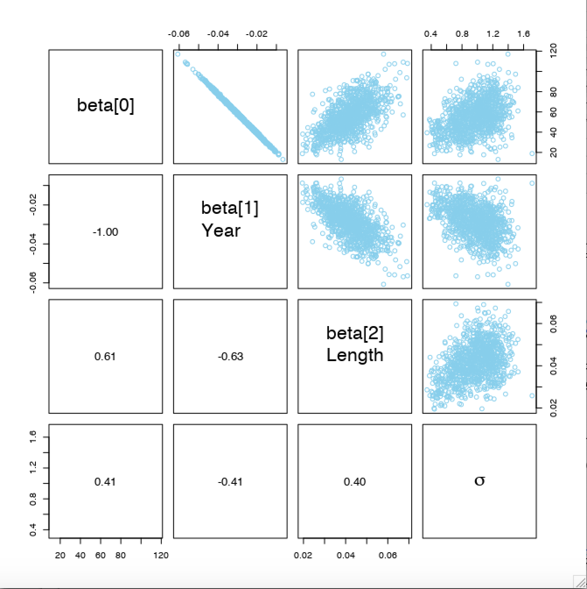

Examples: 

* Happiness ratings on 1-7 scale as a function of their total financial assets.
* Movie ratings as a function of the year they were made.

Traditional method: ordinal regression / ordered probit regression

Bayesian GLM approach:

* Inverse-link function is a thresholded _cumulative normal_ (probit_.)
* Noise distribution is a categorical distribution

## 23.1 Modelling Ordinal Data with an Underlying Metric Variable

* Ordinal data is often a bracketing/bucketing of an underlying metric value (which may be normally distributed)
* Even if the underlying data is normally distributed the ordinal values may not resemble a normal distribution (Fig 23.1)
* The probability of a particular ordinal outcome is the area under the normal curve between the thresholds of that outcome.
  + Can be calculated using differences in the cumulative normal distribution: $p(y=k|\mu,\sigma,\{ \theta_j \})=\Phi((\theta_k-\mu)/\sigma)-\Phi((\theta_{k-1}-\mu)/\sigma)$ where $\theta_k$ are the thresholds of the outcomes.
* __Takeaway__: we might be able to model a distribution of ordinal values as consecutive intervals of a normal distribution on an underlying metric scale with appropriately partitioned thresholds.
  + __BB: this doesn't really help you in modelling if the thresholds can be chosen freely? If they cannot be chosen freely then we are applying some strange constraints and we usually would not really have much information on how to apply these or why they would be a good model of the data?__
  
```{r, out.width = "400px", echo=FALSE}

```

## 23.2 The Case of a Single Group

* If there are K ordinal values, the model has K+1 parameters: $\theta_1,...,\theta_{K-1},\mu,\sigma$.
  + If we increase all the thresholds by $a$ that gives the same result as decreasing $\mu$ by $a$
  + Similar with expanding or contracting the thresholds and varying $\sigma$
  + No uniquely correct choice of how to "pin down" the axis by setting two of the parameters, we choose:
    + $\theta_1 = 1 + 0.5$
    + $\theta_{K-1} = K - 0.5$
    + _BB: end up with mean and standard deviation effectively being controlled by amount of data in the edge groups, then the middle groups fit themselves around what's left..?_

### 23.2.1 Implementaion in JAGS

```{r, eval=FALSE}
"
model {
  for (i in 1:Ntotal) {
    y[i] ~ dcat(pr[i,1:nYlevels])
    pr[i,1] <- pnorm(thresh[1], mu, 1/sigma^2)
    for (k in 2:(nYlevels-1)) {
      pr[i,k] <- max(0, pnorm(thresh[k], mu, 1/sigma^2) - pnorm(thresh[k-1], mu, 1/sigma^2))
    }
    pr[i,nYlevels] <- 1 - pnorm(thresh[nYlevels-1], mu, 1/sigma^2)
  }
}
"
```
Notes: 

* cumulative normal in JAGS is called pnorm
* max(0,...) needed because thresholds randomly generated by MCMC chain so possible to get nonsensical result without max

Priors _BB: again note uniform prior over log range; I think people should be more careful about this..._:
```{r, eval=FALSE}
"
mu ~ dnorm((1_nYlevels)/2, 1/(nYlevels)^2)
sigma ~ dunif(nYlevels/1000, nYlevels*10)
for (k in 2:(nYlevels-2)) {
  thresh[k] ~ dnorm(k+0.5, 1/2^2)
}
"
```

### 23.2.2 Examples: Bayesian estimation recovers true parameter values

Figure 23.2 and 23.3. Goals is to show that Bayesian estimation can accurately recover our parameter values even when $\mu$ is extreme and the thresholds are not evenly spaced. Figure 23.2 data generated using $\mu=1,\ \sigma=2.5,\ \theta_1=1.5,\ \theta_2=2.5,\ \theta_3=3.5,\ \theta_4=4.5,\ \theta_5=5.5,\ \theta_6=6.5$.

Remember parameter values need to be _jointly_ credible: if we have a higher $\theta_2$ threshold and want to maintain the likelihood of outcome 3 then we need to also increase $\theta_3$. Causes a domino effect through all the thresholds.

```{r, out.width = "400px", echo=FALSE}

```
```{r, out.width = "400px", echo=FALSE}

```

#### 23.2.2.1 Not the same results as pretending the data are metric

If instead we treat the data as though it were metric and normally distributed we get very different results:

* Mean of 1.95 instead of 0.966 (data generated using mean of 1.0).
* Sometimes the mean is ok but the predictions of individual outcome probabilities are terrible

_BB: is it really that this special way of treating ordinal data is good and treating it as metric is bad, or is it really that when they were assuming the data was metric they assumed it was normally distributed when it clearly wasn't, how would other metric data models compare?_

#### 23.2.2.2 Ordinal outcomes versus Likert scales

Likert scales are from 1=strongly disagree to 5=strongly agree.
Remember for this chapter we are interested in describing the ordinal outcomes themselves, not the arithmetic average of several ordinal responses. If there are many related items on a questionnaire then the model of the ordinal data can use latent factors to express relations among the items.

## 23.3 The Case of Two Groups

Example: ask about Happiness for two groups - one after watching sports car ads, one after watching charity ads. _Assume that both groups access the same underlying metric scale and thresholds, what differs is the mean and variance of the feeling._

### 23.3.1 Implementation in JAGS

Simple extention of the specification for one group.

### 23.3.2 Examples: Not funny

Again showing that comparison of means and std deviations of likert values for two groups are much better made through this Bayesian method than a traditional method that assumes the data is normal.

## 23.4 The Case of Metric Predictors

```{r, out.width = "400px", echo=FALSE}

```

Figure 23.6 for important explanation of how we do linear regression to predict the underlying metric variable, then we apply our same model to convert underlying metric variable to ordinal predicted variable. Ordinal probit regression.

Figures 23.7 to 23.10 interesting examples.

### 23.4.1 Implementation in JAGS

Combination of linear regression models seen previously and the model we just illustrated above in this chapter. Predictors were standardized to improve MCMC efficiency, as we have also seen before. Predicted values are just categories and don't need to be standardized so it is more similar to logistic regression in a way.

### 23.4.2 Examples: Happiness and money

Data fall mostly in the middle of the response scale (Fig 23.7 and Fig 23.8)
Underlying regression is linear but it should asymptote so this is not a good model of the underlying value: there should be diminishing returns.

```{r, out.width = "400px", echo=FALSE}
knitr::include_graphics("images/chapter23/dbda_fig23_7.png")
```
```{r, out.width = "400px", echo=FALSE}

```

### 23.4.3 Example: Movies - They don't make 'em like they used to

Have threshold lines that are level contours of the underlying metric planar surface (Fig 23.9)

However, the region the threshold lines bound as reserved for categories 7 and 1 don't have any datapoints in.

### 23.4.4 Why are some thresholds outside the data?

Compare to artificial data (Fig 23.10) as an example; has many more data points that span the entire range. 

Fig 23.11 is good for showing outcomes for noisy data. Y axis is probability of each outcome (different line for each outcome). Most probable outcome within interval is not necessarily the outcome centered on that interval

```{r, out.width = "400px", echo=FALSE}

```
```{r, out.width = "400px", echo=FALSE}

```
```{r, out.width = "400px", echo=FALSE}

```

## 23.5 Posterior Prediction

How are posterior predicted probabilities with 95% HDI computed? At each step in MCMC chain compute predicted outcome probabilities using equations given and explained. From the full chain of credible posterior predicted outcome probabilities the central tendency and 95% HDI are then computed. Brief example how to do this below: use the MCMC chain coda object returned from JAGS (codaSample) then do the processing of it in R.

```{r, eval=FALSE, message=FALSE, warning=FALSE, results=FALSE}
mcmcMat = as.matrix(codaSamples)
chainLength = nrow(mcmcMat)
beta0 = mcmcMat[,"beta0"]
beta1 = mcmcMat[,"beta"]
thresh = mcmcMat[,grep("^thresh",colnames(mcmcMat))]
sigma = mcmcMat[,"sigma"]

outProb = matrix(NA,nrow=chainLength,ncol=max)
for (stepIdx in 1:chainLength) {
  mu = beta0[stepIdx] + beta1[stepIdx] * xProbe
  threshCumProb = pnorm((thres[stepIdx, ] - mu)/sigma[stepIdx])
  outProb[stepIdx, ] = c(threshCumProb,1) - c(0,threshCumProb)
}
outMed = apply(outProb, 2, median, na.rm=True)
outHdi = apply(outProb, 2, HDIofMCMC)
```

## 23.6 Generalizations and Extensions

Approaches to outliers:

* Use heavy-tailed distribution instead of normal distribution to describe noise. Can use cumulative t function which is build into JAGS as pt (analogous to pnorm).
* Model the data as being from two different sources as we did in Robust Logistic Regression; one source is our cumulative normal model and the other is "guessing"; so we mix our models predicted probabilities with some random guessing probability.

Variable selection: just as predictors in linear regression or logistic regression can be given inclusions parameters, so can our predictors in thresholded cumulative-normal regression.

Nominal predictors: works just fine, look back to Figure 21.12 to see how this might work. The only change is putting thresholds on the normal noise distribution to create probabilities for the ordinal outcomes.

## 23.7 Exercises

### Exercise 23.2 [Purpose: Modifying the program to ]

```{r, eval=FALSE, message=FALSE, warning=FALSE, results=FALSE}
setwd("./DBDA2Eprograms")
source("DBDA2E-utilities.R") # Load definitions of graphics functions etc.
source("Jags-Yord-XmetMulti-Mnormal-Guessing-Example.R")
```
```{r, eval=FALSE, message=FALSE, warning=FALSE, results=FALSE}
setwd("./DBDA2Eprograms")
source("DBDA2E-utilities.R") # Load definitions of graphics functions etc.
source("Jags-Yord-XmetMulti-Mnormal-tDist-Example.R")
```

#### A

__i.) Posterior distribution of the guessing parameter (alpha).__ Recall guessing parameter is $\frac{1}{7}=0.1429$; this gets multiplied by alphas itself to get the probability added into each category.

```{r, out.width = "400px", echo=FALSE}

```

Interesting (and expected) sigma is definitely reduced compared to not using a guessing parameter.

__ii.) Are the regression coefficients a little more extreme?__ Yes. __Why?__

```{r, out.width = "400px", echo=FALSE}

```
```{r, out.width = "400px", echo=FALSE}

```
```{r, out.width = "400px", echo=FALSE}

```

__iii.) Is there anything unusual about the posterior distribution on the thresholds (see Figure 23.12), and why? Hint: even if the thresholds are randomly inverted in the MCMC chain, and the outcome probabilities from that component are zero, the random component still gives the outcomes a nonzero probability.__ Thresholds can get inverted; thresholds are generated randomly by the MCMC chain so sometimes it's possible they become the wrong way around. 

Normally (without random guessing mixture) when this happens we model that the probability of any data occuring in the category between the thresholds is 0. Therefore when we use the data to work out the likelihood and find there is some data in that category we get the likelihood of that to be 0, which indicates that parameters when the thresholds are the wrong way around are not credible, and this will be reflected in the posterior as well. Now the way MCMC Gibbs sampling works is that it spends time at particular parameters proportional to their posterior probabilities; if the posterior probabilities are 0 then those parameter combinations won't be explored and won't show up in the figure.

When we include the guessing mixture then the model now has some nonzero probability for data to be in any category no matter what the thresholds are, so suddenly the MCMC chain is now able to explore all these values.

```{r, out.width = "400px", echo=FALSE}

```

#### B

Now change model to a thresholded cumulative-t-distribution model (with no random guessing mixture)

__i.) Are the regression coefficients a little more extreme?__  Seem a little less extreme, sigma is somewhere between part A and the original example where the modal value was about 1.25.

```{r, out.width = "400px", echo=FALSE}

```
```{r, out.width = "400px", echo=FALSE}

```
```{r, out.width = "400px", echo=FALSE}

```
```{r, out.width = "400px", echo=FALSE}

```

__ii.) Is there anything unusual about the posterior distribution on the thresholds (see Figure 23.12), and why?__ Thresholds no longer get inverted; simply using a slightly different distribution to the normal and nothing more fundamental about the model changes as we had before.

```{r, out.width = "400px", echo=FALSE}
knitr::include_graphics("images/chapter23/tDist/dbda_ex_23_2_14.png")
```