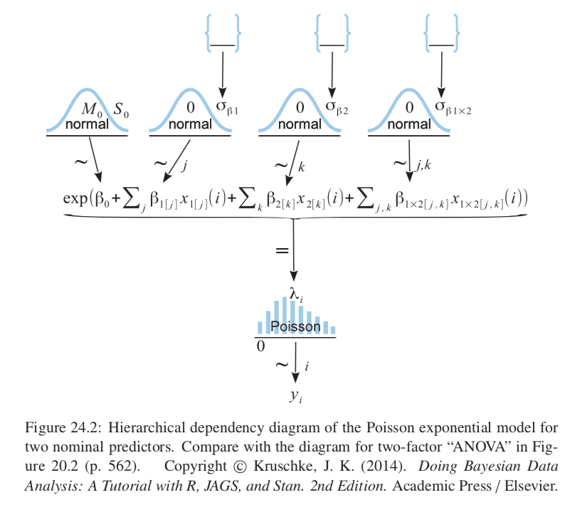
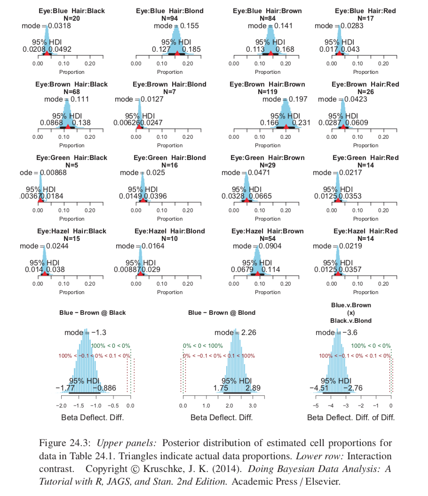
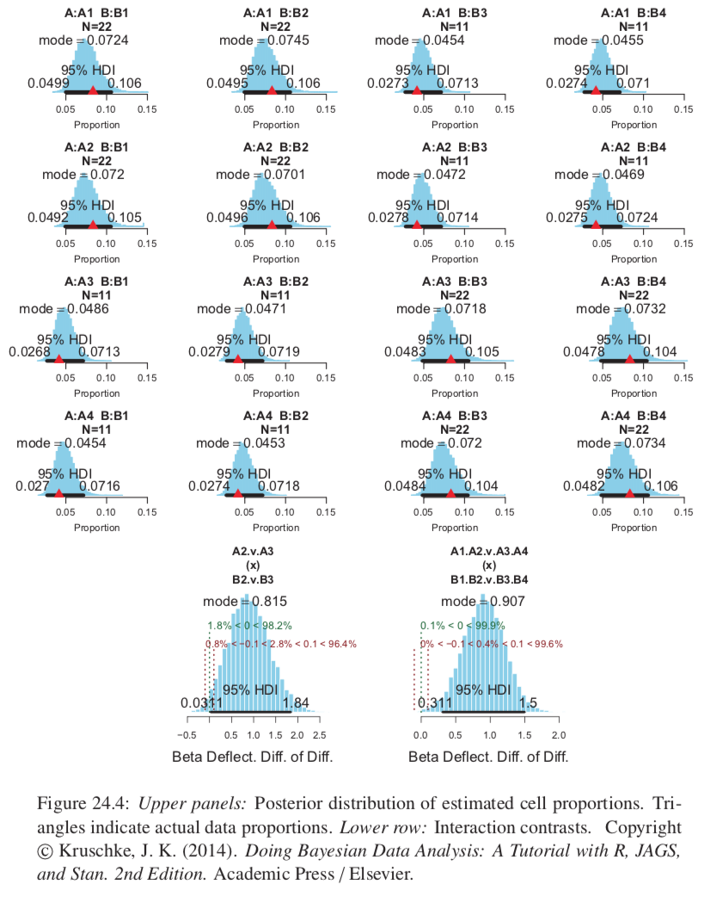
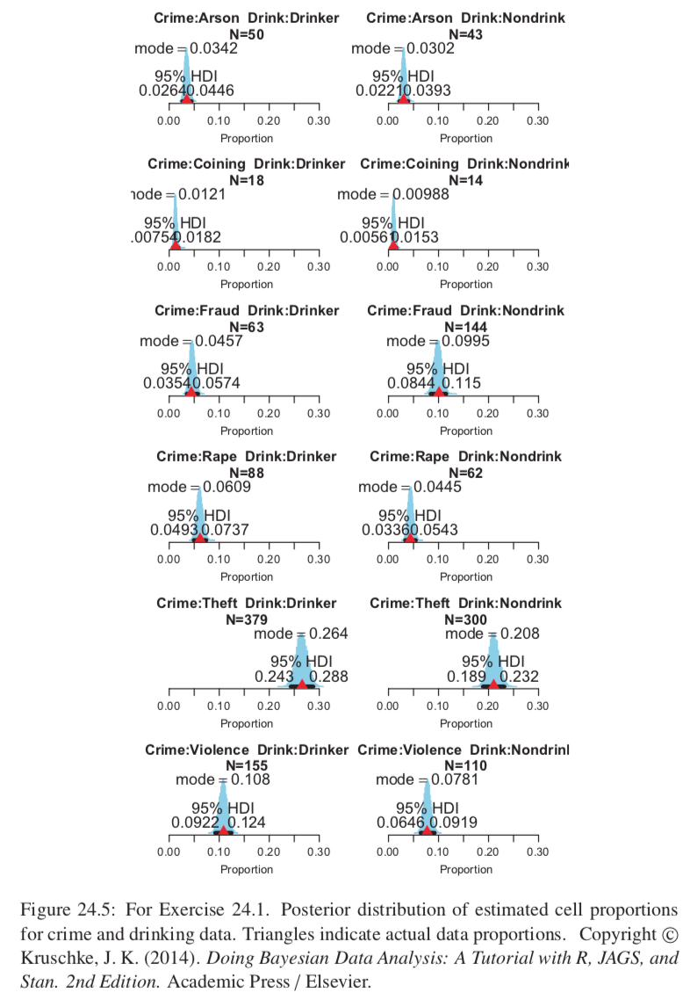
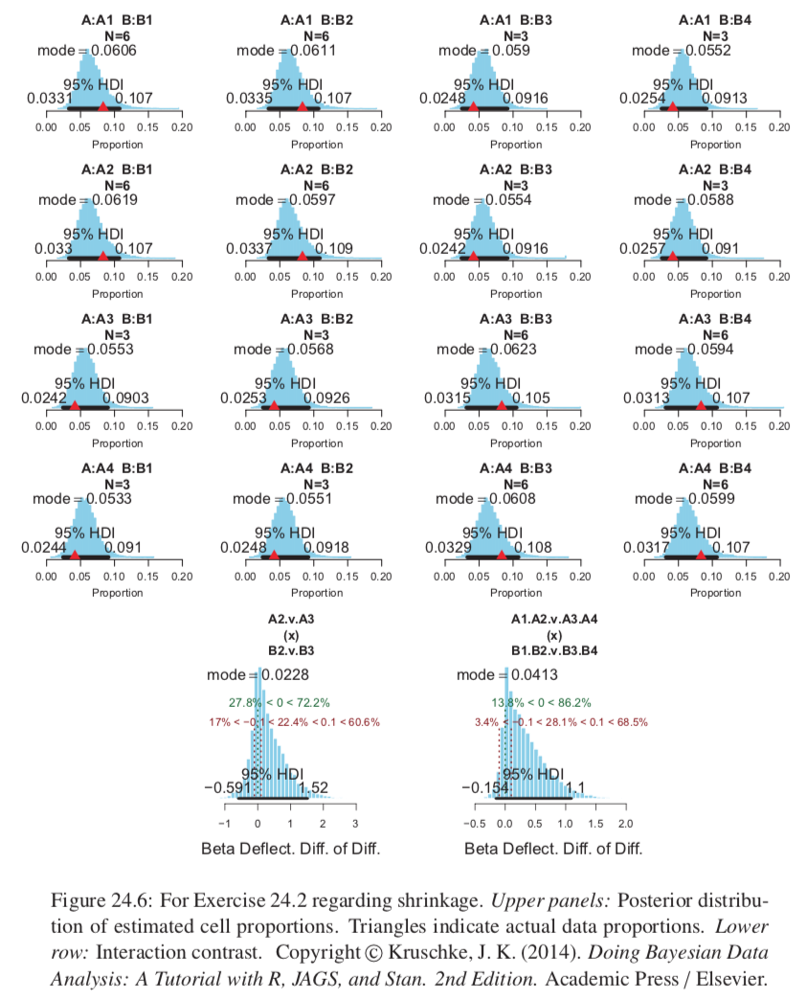

Example: poll people on political party affiliation (nominal) and candidate preference (nominal). Every person increases the count of one particular combination of party affiliation and candidate preference. Result is a table of counts. We want to predict the counts provided the nominal variables.

Traditionally would do chi-square test of independence.

Context of GLM: 

* predicted value is a count
* inverse-link function is exponential
* noise distribution is Poisson

## 24.1 Poisson Exponential Model

### 24.1.1 Data structure

Our example data will be hair color and eye color from a poll of students.

Structure is analogous to two-way ANOVA, but that had several metric values in each cell instead of a single count.

Want to know if distribution of hair color depends on eye color and vice versa; analogous to interaction contrasts in ANOVA

### 24.1.2 Exponential link function

Two ways of motivating:

* 1.) start with two-way ANOVA for nominal predictors and find a way to map predicted value to count data.
  + Exponential transform will get us to positive-only while preserving order; a continuous predicted value not a probability of discrete counts.
  + Natural candidate for the needed likelihood distribution is the Poisson
* 2.) treat the cell counts as representative of underlying cell probabilities then ask whether the two nominal variables contribute independent influences to the cell probabilities

$$ p(r,c) = p(r)p(c) $$
$$ y_{r,c}/N = (y_r / N) (y_c / N) $$
$$ \lambda_{r,c}  = y_{r,c} = exp(log(1/N) + log(y_r) + log(y_c)) = exp(\beta_0 + \beta_r + \beta_c) $$

Whatever the values of the $\beta$s, the resulting $\lambda$s will obey multiplicative independence. Interaction terms indicated violations of additivity in standard ANOVA; they indicate violations of multiplicative independence in exponentiated ANOVA. We can add in interaction terms to this model.
$$ \lambda_{r,c} = exp(\beta_0 + \beta_r + \beta_c + \beta_{r,c}) $$
Specific interaction contrasts can be investigated to determine in more detail where nonindependence is arising.

We still have sum-to-zero conditions applied on the terms which are important.

### 24.1.3 Poisson noise distribution

$\lambda_{r,c}$ is actually a cell tendency, not a predicted count per se. To map this value to possible counts we use the Poisson distribution: $p(y|\lambda) = \frac{\lambda^y e^{-\lambda}}{y!}$

### 24.1.4 The complete model and implementation in JAGS

Very similar to two-factor ANOVA except now we have an exponential inverse-link function and a Poisson noise distribution instead of Normal.

```{r, out.width = "400px", echo=FALSE}

```

Prior on baseline and deflections should be broad on the scale of the logarithm of the data, because it is $log(\lambda)$ that they are describing. Use circumstances when data are perfectly evenly distributed between cells and alll only in one cell as bounds to define the range of the prior.

## 24.2 Example: Hair Eye Go Again

Independence refers to ratios of proportions, which corresponds to differences of underlying deflection parameters; therefore we want to consider the interaction contrasts of deflection parameters (not proportions)

```{r, out.width = "400px", echo=FALSE}

```

## 24.3 Example: Interaction Contrasts, Shrinkage, and Omnibus Test

Ficticious data; we see some shrinkage.

Model presented here has no way to conduct an "omnibus" test of interaction, however it is easy to extend the model so it has an inclusion coefficient on the interaction deflections. This is fine in principle but in practice MCMC chain can be highly autocorrelated, and pseudo-priors may be helpful (Section 10.3.2.1). We still must consider specific interaction contrasts to determine where the interaction "lives" in the data.


```{r, out.width = "400px", echo=FALSE}

```
```{r, out.width = "400px", echo=FALSE}

```
```{r, out.width = "400px", echo=FALSE}

```

## 24.4 Log-Linear Models for Contingency Tables

There can be more than two predictors and models are generalized in the same way ANOVA is generalized to more than two predictors.

The equation $\lambda_{r,c} = exp(\beta_0 + \beta_r + \beta_c + \beta_{r,c})$ can equivalently be written as $log(\lambda_{r,c}) = \beta_0 + \beta_r + \beta_c + \beta_{r,c}$ which is known as a _log linear model for contingency tables_.

Aagresti and Hitchcock (2005)
Bayesian: Gelman (2005,2006), Marin and Robert (2007 pp 109-118), Congdon (2005, p134 and p202)

## 24.5 Exercises