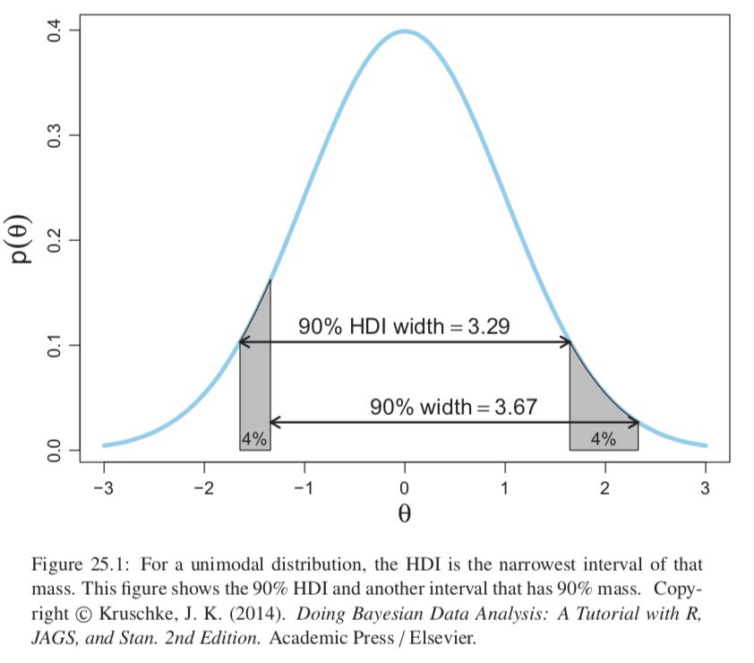
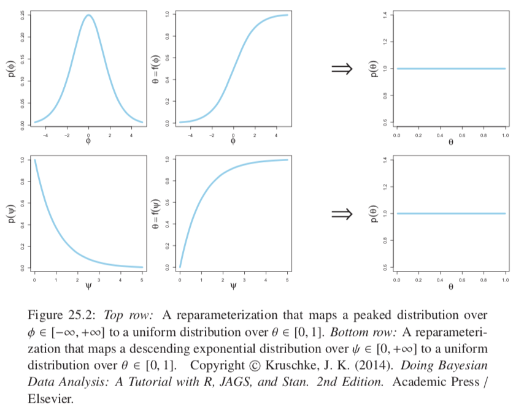
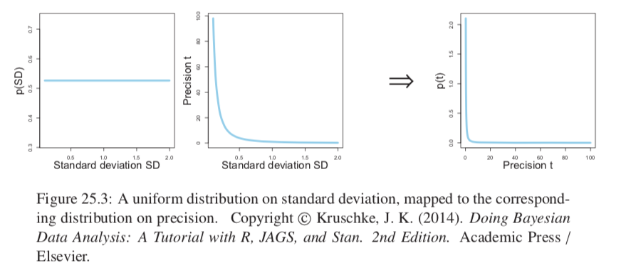
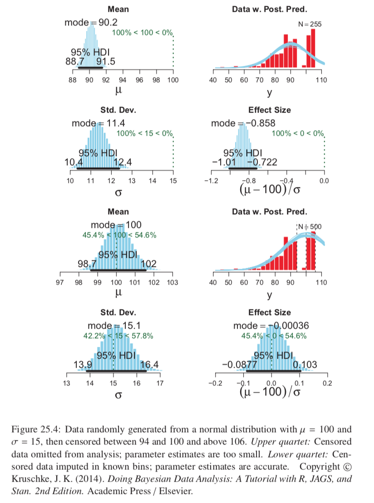

## 25.1 Reporting a Bayesian analysis

* Not standard procedure in most research: no conventional format.
* Important to be sensitive to the background audience of specific audience

### 25.1.1 Essential points

* Motivate use of Bayesian (non-NHST) analysis.
  + Editors and reviewers appreciate this explanation.
  + No need for assumptions typical in NHST, e.g.:
    + homogeneity of variances across groups
    + normally distributed noise
  + Inferences richer and more informative (posterior reveals join probabilities of combinations of parameters)
  + No reliance on sampling distribution and p values
* Clearly describe data structure, the model, and model parameters.
* Clearly describe and justify the prior
* Report the MCMC details; evidence the chains converged and sufficiently long
* Interpret the posterior
  + Meaningful parameters and contrasts
  + Central tendencies and HDI
  + Histograms (may not be necessary in a concise report)
  + Shrinkage if appropriate
  + If interactions, care in interpretation
  + If ROPE, justify limits

### 25.1.2 Optional points

* Robustness of the posterior to different priors.
* Posterior predictive check (generate simulated data from model and compare to real data)
* Power analysis

### 25.1.3 Helpful points

* Post the raw data
* Post the MCMC sample of the posterior

## 25.2 Functions for Computing Highest Density Intervals

Applies to any dimensionality and any shape distribution.

Except HDI of an MCMC sample for a mathematical function applies only to single parameters with unimodal distributions.

### 25.2.1 R code for computing HDI of a grid approximation

Stop when 95% of a mass of evenly spead poles is below a rising water level; this waterline defines the HDI. One trick: first the poles are sorted in order of height.

### 25.2.2 HDI of unimodal distribution is shortest interval

For a unimodal distribution, the HDI is the interval which has is the narrowest possible interval that accounts for the given mass.

```{r, out.width = "400px", echo=FALSE}

```

### 25.2.3 R code for computing HDI of a MCMC sample

Since MCMC sample is random and noisy so is the HDI.

### 25.2.4 R code for computing HDI of a function

Some code for any probability density function specified mathematically in R; does this by simply searching HDIs and converging to the shortest one. Makes use of inverse cumulative density function (e.g. qnorm(x)). R has an __optimize__ routine which is used here.

## 25.3 Reparameterization

E.g. when we reparameterized standard deviation as precision. For destination parameter $\theta$ and source parameter $\phi$ where we have some monotonic differentiable $f$ s.t. $\theta = f(\phi)$, then given the probability distribution of $\phi$ is $p(\phi)$ the corresponding probability distribution for $\theta$ is: $$p(\theta)=\frac{p(f^{-1}(\theta))}{|f'(f^{-1}(\theta))|}$$. Very simple algebraic derivation.

### 25.3.1 Examples

Interesting; show figures.

```{r, out.width = "400px", echo=FALSE}

```
```{r, out.width = "400px", echo=FALSE}

```

### 25.3.2 Reparameterization of two parameters

Can do two at the same time and not independently of each other (and not only two!). For example mapping from cartesian to spherical coordinates.

Remember the Jacobian: $J_{r,c}=\frac{df_r(\alpha_1,\alpha_2)}{d\alpha_c}$ and the area of the mapped-to region would be $|det(J)|d\alpha_1d\alpha_2$; setting masses equal and rearranging gives: $p(\beta_1,\beta_2) = p(\alpha_1,\alpha_2)/|det(J)|$.

## 25.4 Censored Data in JAGS

* Censored means values are known only with a certain range.
* Should not be discarded because remaining would then be biased. Very clearly shown in Figure 25.4
* We would assume that the censoring is independent of the variable being measured to deal with this (e.g. assume that 5s time limit of experimenter on the responders response time would not affect the underlying response time itself).
* Need to indicate with each observation not only the thresholds of the intervals of censorship but also the interval they belong to.
* JAGS can then simultaneously describe both y and ybin (which denotes the interval). This way we model the probability of something being in one of the censored intervals. Also JAGS will automatically impute missing data values, because missing data values are treated as if they were parameters and the whole model acts as a prior distribution for generating the missing parameter.
* The end result looks very simple in JAGS code, and is very easy to do.
* Do need to impute data and initialize explicitly to JAGS

```{r, out.width = "400px", echo=FALSE}

```

## 25.5 What Next?

Gelman et al. (2013) uses Stan and covers many advanced topics including nonparametric models such as Gaussian process and Dirichlet process models.